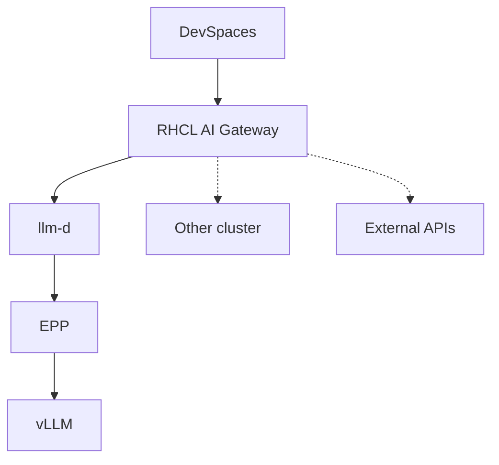

# Private AI Code Assistant

Deploy a private, self-hosted AI coding assistant on OpenShift so developers each get their own namespace with an AI-powered IDE — no code leaves the cluster.

## Inference request path (RHCL + llm-d)



## Charts (waves)

ArgoCD syncs these Helm charts in order (via `pca-app-of-apps`):

| Chart | Wave | What it deploys | Namespaces / where |
|-------|------|-----------------|-------------------|
| `pca-app-of-apps` | root | AppProject + child Applications; sync-wave ordering | `openshift-gitops` (no workloads) |
| `pca-operators` | 1 | Operator Subscriptions, cert-manager, LWS, RHCL (Kuadrant) | `redhat-ods-operator` (RHOAI), `nvidia-gpu-operator`, `openshift-devspaces`, `openshift-nfd`, cert-manager, LWS, `kuadrant-system` |
| `pca-platform-config` | 2 | Namespaces, HF token, DSC/DSCI, NFD, NVIDIA ClusterPolicy, CheCluster, OAuth HTPasswd, Maas gateway, LWS CR; optional `pca-guardrails` / `pca-mcp` | AI ns (default `ai-serving`); optional per-dev namespaces |
| `pca-ai-serving` | 3 | PVC, HardwareProfile, LLMInferenceService (llm-d/vLLM), llm-d gateway + HTTPRoute, RHCL AI Gateway (`pca-ai-gateway`) + AuthPolicy; `pca-observability` (Grafana; optional Langfuse/OTel) | AI ns |
| `pca-devspaces` | 4 | DevWorkspace, Roo/Continue/Cline ConfigMaps, per-ns API keys, RBAC; global DevSpaces ConfigMaps | Per-dev ns; globals in `openshift-devspaces` |

## Where each target deploys

| Target | Charts |
|--------|--------|
| **ROSA / ARO** | All five via ArgoCD |
| **Existing OpenShift** | `pca-platform-config`, `pca-ai-serving`, `pca-devspaces` only (Helm) |

Existing OpenShift uses the charts under `PCA_Deployment_ROSA/charts` with overrides in `deploy_existing_openshift/`.

ARO charts lag behind ROSA for most features; RHCL gateway pieces were mirrored for parity where practical. Full ARO migration to ROSA charts is still planned.

## ROSA / ARO — full from-scratch

Terraform provisions the cluster; GitOps (`pca-app-of-apps`) syncs the five charts.

- ROSA: [PCA_Deployment_ROSA/README.md](PCA_Deployment_ROSA/README.md)
- ARO: [PCA_Deployment_ARO/README.md](PCA_Deployment_ARO/README.md)

## Existing OpenShift — Helm-only

No infrastructure provisioning. Deploys onto a cluster that already has RHOAI, GPU operator, and DevSpaces installed. Uses ROSA charts via `make ai-serving-deploy-existing-openshift` (once) and `make devspace-deploy-existing-openshift` (one or more developers).

Deploy AI serving first, then each DevSpace into its own `DEV_NAMESPACE` (or the AI ns for a single-dev setup). The first DevSpace release owns the global ConfigMaps in `openshift-devspaces`; later ones must pass `HELM_ARGS='--set devspacesGlobalConfig.enabled=false'` or Helm conflicts.

Details: [deploy_existing_openshift/README.md](deploy_existing_openshift/README.md).

## Cluster smoke tests (developer-only)

After the stack is deployed, verify components against the live cluster (not CI):

```bash
make smoke                                              # full suite
make smoke AI_NAMESPACE=ai-serving DEV_NAMESPACE=dev1-devspaces   # ROSA/ARO
make smoke COMPONENT=vllm                               # one marker
make smoke COMPONENT=ai_gateway DEV_NAMESPACE=<dev-ns>  # RHCL front door + API keys
```

Package lives in `tests/cluster-smoke/` (see its README). Optional Langfuse / OTel / Guardrails / DevSpaces / AI Gateway checks auto-skip when those resources are absent. Set `DEV_NAMESPACE` for DevSpaces and AI Gateway key/config tests.

## Directory Structure

```
PCA_Deployment_ROSA/          # Full ROSA (AWS) deployment — source of truth for charts
├── terraform/                # Cluster provisioning (VPC, ROSA, GPU node pool)
└── charts/
    ├── pca-app-of-apps/      # Root ArgoCD AppProject + child Applications
    ├── pca-operators/        # Operator Subscriptions (RHOAI, GPU, DevSpaces, NFD, RHCL, …)
    ├── pca-platform-config/  # Namespace, RBAC, secrets, DSC (+ optional guardrails, pca-mcp)
    ├── pca-ai-serving/       # LLMInferenceService, llm-d + pca-ai-gateway, pca-observability
    │   └── charts/pca-observability/  # Grafana + optional Langfuse/OTel Collector
    └── pca-devspaces/        # Per-developer DevWorkspaces + Roo/Continue/Cline + API keys

PCA_Deployment_ARO/           # Full ARO (Azure) — charts lag; will migrate to ROSA charts
├── terraform/
└── charts/

deploy_existing_openshift/    # Helm value overrides (reuses ROSA charts)
├── README.md                 # Deploy steps + parameters (incl. RHCL prerequisite)
├── values-platform-config.yaml
├── values-ai-serving.yaml
└── values-devspaces.yaml

tests/cluster-smoke/          # Developer-only pytest smoke suite (`make smoke`)
```
