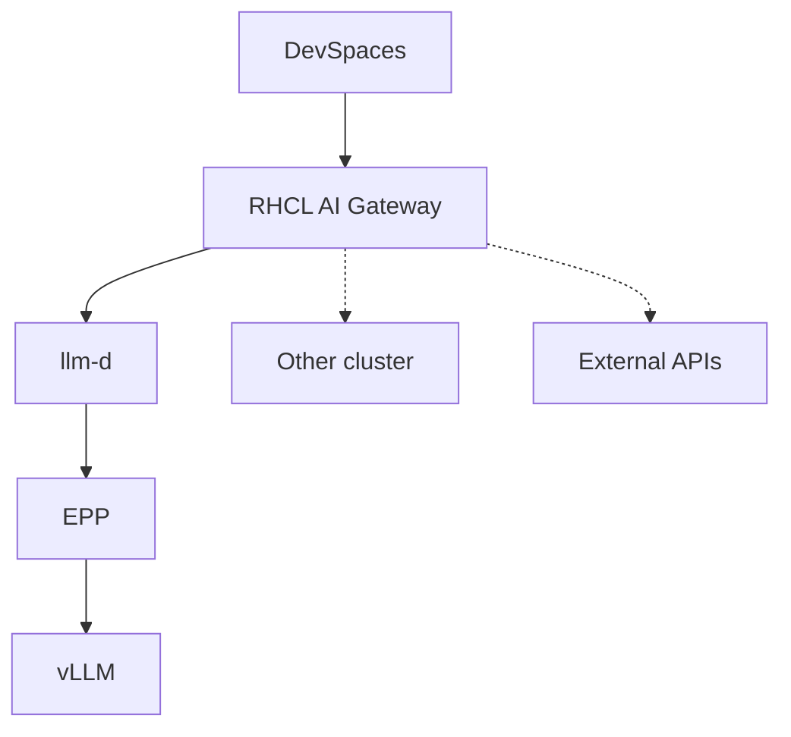

# Private AI Code Assistant

Deploy a private, self-hosted AI coding assistant on OpenShift so developers each get their own namespace with an AI-powered IDE — no code leaves the cluster.

## Inference request path (RHCL + llm-d)



## Charts (waves)

ArgoCD syncs these Helm charts in order (via `pca-app-of-apps`):

| Chart | Wave | What it deploys | Namespaces / where |
|-------|------|-----------------|-------------------|
| `pca-app-of-apps` | root | AppProject + child Applications; sync-wave ordering | `openshift-gitops` (no workloads) |
| `pca-operators` | 1 | Operator Subscriptions, cert-manager, LWS, RHCL (Kuadrant) | `redhat-ods-operator` (RHOAI), `nvidia-gpu-operator`, `openshift-devspaces`, `openshift-nfd`, cert-manager, LWS, `kuadrant-system` |
| `pca-platform-config` | 2 | Namespaces, HF token, DSC/DSCI, NFD, NVIDIA ClusterPolicy, CheCluster, OAuth HTPasswd, Maas gateway, LWS CR; optional `pca-guardrails` / `pca-mcp` | AI ns (default `ai-serving`); optional per-dev namespaces |
| `pca-ai-serving` | 3 | PVC, HardwareProfile, LLMInferenceService (llm-d/vLLM), llm-d gateway + HTTPRoute, RHCL AI Gateway (`pca-ai-gateway`) + AuthPolicy; `pca-observability` (Grafana; optional Langfuse/OTel) | AI ns |
| `pca-devspaces` | 4 | DevWorkspace, Roo/Continue/Cline ConfigMaps, per-ns API keys, RBAC; global DevSpaces ConfigMaps | Per-dev ns; globals in `openshift-devspaces` |
| `pca-benchmarks` | 5 | GuideLLM sweep Job (one-shot; **disabled by default — opt-in via cloud values files**) | AI ns |

## Where each target deploys

| Target | Charts | Cloud-specific config |
|--------|--------|-----------------------|
| **ROSA** | All six via ArgoCD (`charts/`) | `values-rosa.yaml` per chart |
| **ARO** | All six via ArgoCD (`charts/`) | `values-aro.yaml` per chart |
| **Existing OpenShift** | `pca-platform-config`, `pca-ai-serving`, `pca-devspaces` only (Helm) | `deploy_existing_openshift/values-*.yaml` |

Both ROSA and ARO use the same unified `charts/` directory at the repo root. Cloud-specific values (hardware, storage class, model, enabled features) are in `values-aro.yaml` / `values-rosa.yaml` within each chart. Terraform injects `gitops.cloud: aro|rosa` to select the right overlay via ArgoCD `valueFiles`. **`gitops.cloud` must be explicitly set — an empty or missing value causes a hard Helm render error in `pca-app-of-apps`.**

## ROSA / ARO — full from-scratch

Terraform provisions the cluster; GitOps (`pca-app-of-apps`) syncs the five charts.

- ROSA: [PCA_Deployment_ROSA/README.md](PCA_Deployment_ROSA/README.md)
- ARO: [PCA_Deployment_ARO/README.md](PCA_Deployment_ARO/README.md)

## Existing OpenShift — Helm-only

No infrastructure provisioning. Deploys onto a cluster that already has RHOAI, GPU operator, and DevSpaces installed. Uses the unified `charts/` via `make ai-serving-deploy-existing-openshift` (once) and `make devspace-deploy-existing-openshift` (one or more developers).

Deploy AI serving first, then each DevSpace into its own `DEV_NAMESPACE` (or the AI ns for a single-dev setup). The first DevSpace release owns the global ConfigMaps in `openshift-devspaces`; later ones must pass `HELM_ARGS='--set devspacesGlobalConfig.enabled=false'` or Helm conflicts.

Details: [deploy_existing_openshift/README.md](deploy_existing_openshift/README.md).

## Cluster smoke tests (developer-only)

After the stack is deployed, verify components against the live cluster (not CI):

```bash
make smoke                                              # full suite
make smoke AI_NAMESPACE=ai-serving DEV_NAMESPACE=dev1-devspaces   # ROSA/ARO
make smoke COMPONENT=vllm                               # one marker
make smoke COMPONENT=ai_gateway DEV_NAMESPACE=<dev-ns>  # RHCL front door + API keys
```

Package lives in `tests/cluster-smoke/` (see its README). Optional Langfuse / OTel / Guardrails / DevSpaces / AI Gateway checks auto-skip when those resources are absent. Set `DEV_NAMESPACE` for DevSpaces and AI Gateway key/config tests.

## Directory Structure

```
charts/                       # Unified Helm charts — single set for ROSA and ARO
├── pca-app-of-apps/          # Root ArgoCD AppProject + child Applications
├── pca-operators/            # Operator Subscriptions (RHOAI, GPU, DevSpaces, NFD, RHCL, …)
├── pca-platform-config/      # Namespace, RBAC, secrets, DSC (+ optional guardrails, pca-mcp)
├── pca-ai-serving/           # LLMInferenceService, llm-d + pca-ai-gateway; optional EPP, TLS job
│   └── charts/pca-observability/  # Grafana + optional Langfuse/OTel Collector
├── pca-devspaces/            # Per-developer DevWorkspaces + Roo/Continue/Cline + API keys
└── pca-benchmarks/           # GuideLLM sweep (optional; enabled in values-aro.yaml)

PCA_Deployment_ROSA/          # ROSA (AWS) — Terraform only
└── terraform/                # Cluster provisioning (VPC, ROSA HCP, GPU node pool)

PCA_Deployment_ARO/           # ARO (Azure) — Terraform only
└── terraform/                # Cluster provisioning (VNet, ARO cluster, GPU MachineSet)

deploy_existing_openshift/    # Helm value overrides for existing OpenShift (no Terraform)
├── README.md                 # Deploy steps + parameters (incl. RHCL prerequisite)
├── values-platform-config.yaml
├── values-ai-serving.yaml
└── values-devspaces.yaml

tests/cluster-smoke/          # Developer-only pytest smoke suite (`make smoke`)
```
