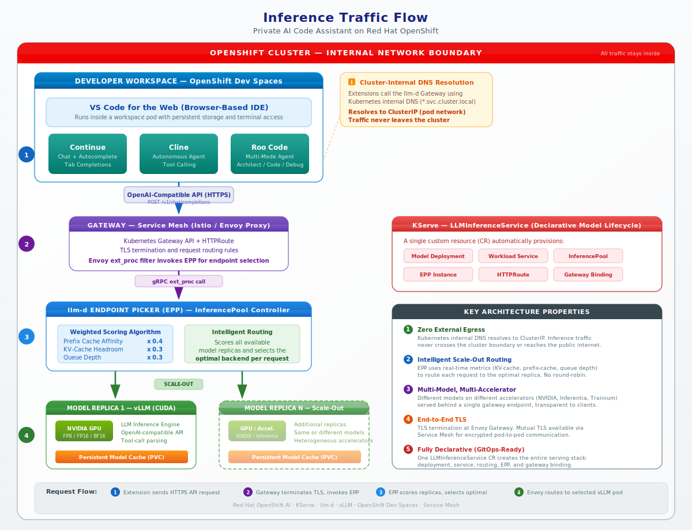
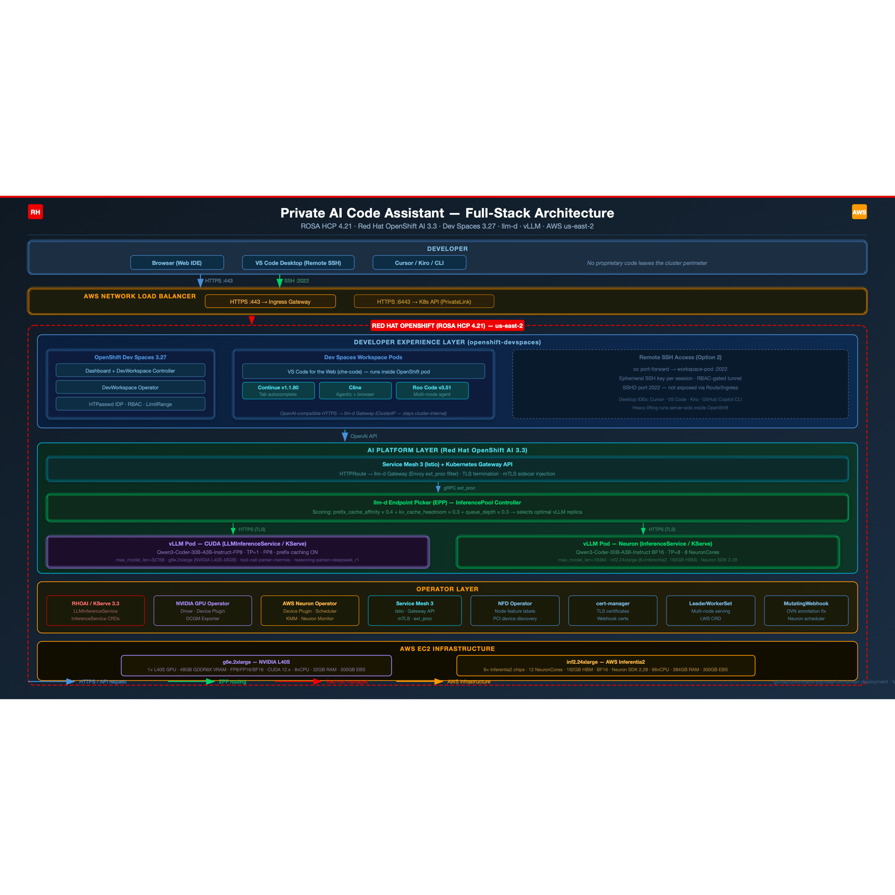
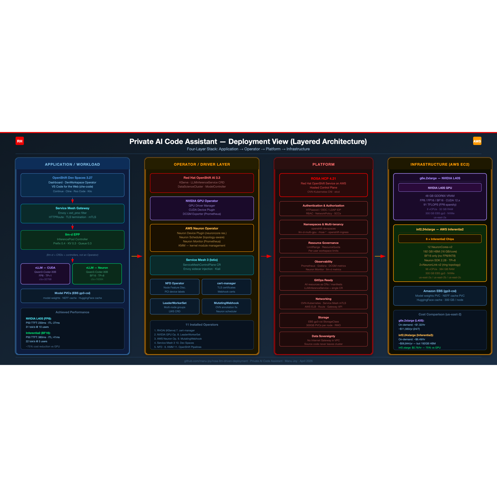
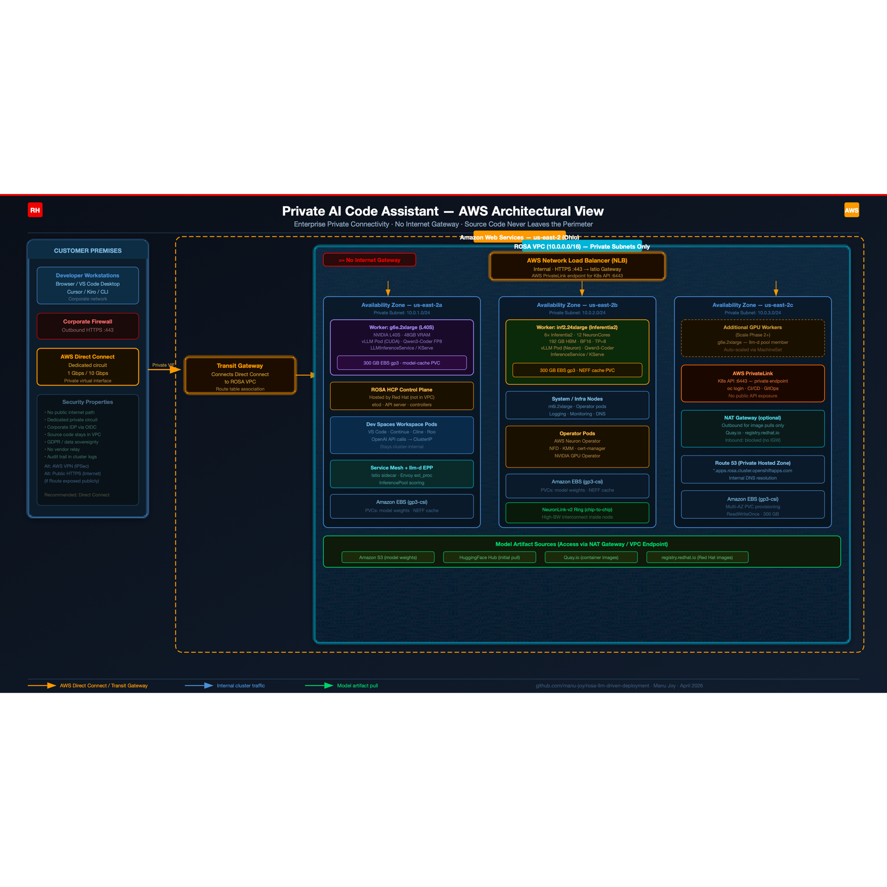
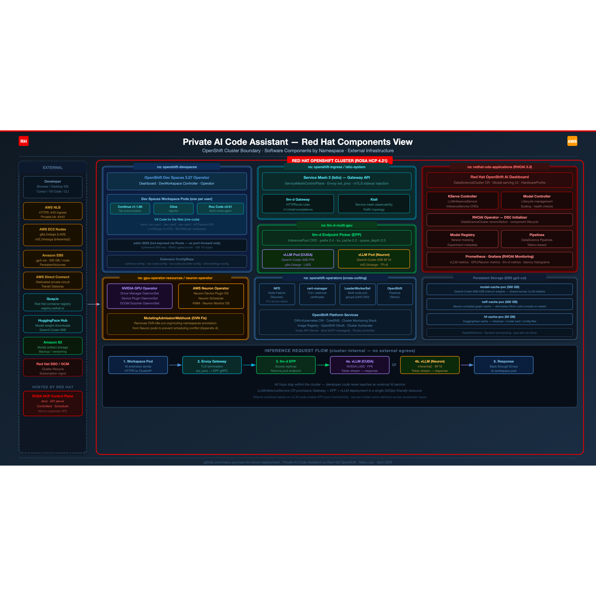
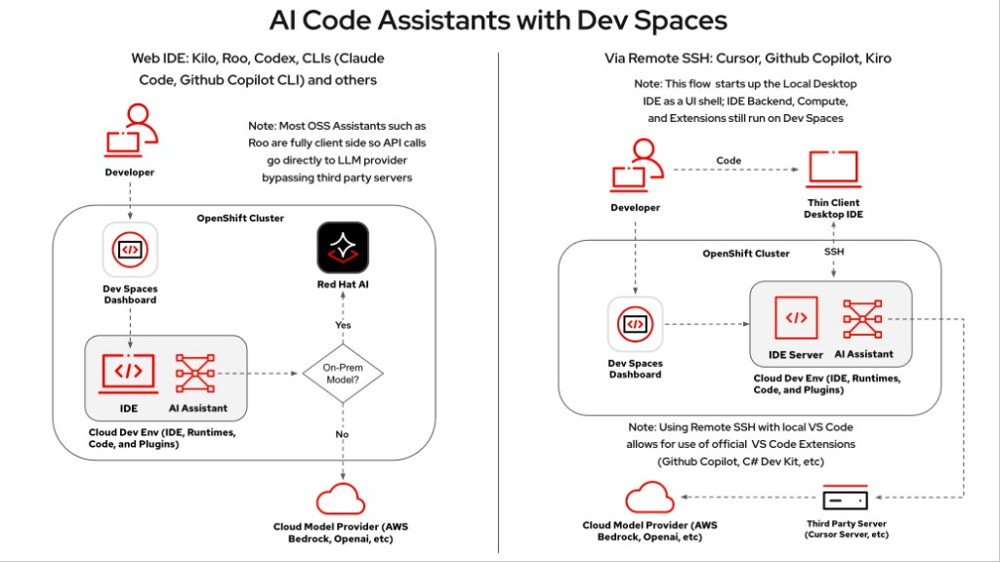
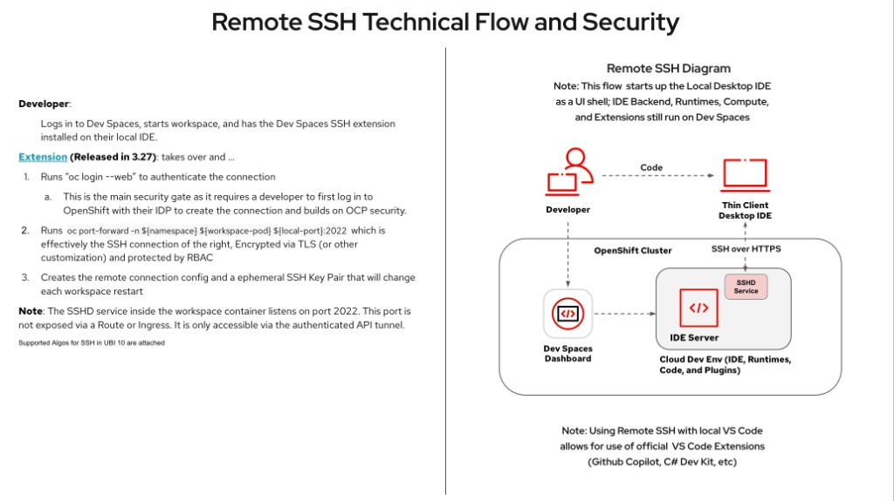

# Private AI Code Assistant on Red Hat OpenShift

## Table of Contents

- [Executive Summary](#executive-summary)
- [Why Private Code Assistants](#why-private-code-assistants)
  - [Security Advantages](#security-advantages-over-public-ai-code-assistants)
  - [Additional Enterprise Benefits](#additional-enterprise-benefits)
- [Architecture Overview](#architecture-overview)
  - [Platform Stack](#platform-stack)
  - [High-Level Architecture](#high-level-architecture)
  - [Full-Stack Architecture Diagram](#full-stack-architecture-diagram)
  - [Inference Traffic Flow](#inference-traffic-flow)
  - [Architecture Diagram (SVG — Landscape)](#architecture-diagram-svg--landscape)
  - [Deployment View (Layered Architecture)](#deployment-view-layered-architecture)
  - [AWS Architectural View](#aws-architectural-view)
  - [Red Hat Components View](#red-hat-components-view)
- [Frontend: Developer IDE Environment](#frontend-developer-ide-environment)
  - [Web IDE (Browser-Based)](#deployment-option-1-web-ide-browser-based)
  - [Remote SSH (Thin Client)](#deployment-option-2-remote-ssh-thin-client-desktop-ide)
  - [Current Implementation](#current-implementation)
  - [Extension Comparison: Continue vs Cline vs Roo Code](#ai-code-assistant-extension-comparison-continue-vs-cline-vs-roo-code)
  - [Configuring vLLM for Roo Code Tool Calling](#configuring-vllm-for-roo-code-tool-calling-qwen3-coder)
  - [Production Scaling](#production-scaling-considerations)
- [Backend: Model Hosting and Intelligent Routing](#backend-model-hosting-and-intelligent-routing)
  - [Model: Qwen3-Coder-30B-A3B-Instruct](#model-qwen3-coder-30b-a3b-instruct)
  - [NVIDIA Deployment (LLMInferenceService)](#deployment-via-llminferenceservice-nvidia)
  - [Inferentia Deployment (InferenceService)](#deployment-via-inferenceservice-inferentia)
  - [llm-d Intelligent Routing](#llm-d-intelligent-routing)
  - [Multi-Accelerator Scaling Phases](#multi-accelerator-scaling-phases)
  - [Prefix Caching Compatibility](#prefix-caching-model-compatibility)
  - [Accelerator Selection Guide: NVIDIA vs Inferentia](#accelerator-selection-guide-nvidia-gpu-vs-aws-inferentia2)
  - [Gateway URL](#gateway-url)
- [Test Results](#test-results)
  - [Phase 1: Single NVIDIA GPU Node](#phase-1-single-nvidia-gpu-node)
  - [Phase 2: Two NVIDIA Nodes with llm-d](#phase-2-two-nvidia-gpu-nodes-with-llm-d-load-balancing)
  - [Phase 3: Heterogeneous Routing](#phase-3-heterogeneous-routing-cuda--inferentia)
  - [Inferentia Standalone Performance](#inferentia-standalone-performance-pre-llm-d)
  - [Performance Benchmark: NVIDIA L40S](#performance-benchmark-llm-d-on-nvidia-l40s-fp8)
  - [GuideLLM Sweep Results](#guidellm-sweep-benchmark-results-april-7-2026)
  - [Inferentia Context Window Limits](#inferentia-context-window--maximum-supported-length)
  - [Phase 4: Trainium trn1.32xlarge with DRA](#phase-4-trainium-trn132xlarge-with-neuron-dra-driver)
  - [Phase 4b: 2-Replica Scaling Investigation](#phase-4b-2-replica-scaling-investigation-april-9-2026)
- [Planned Test Phases](#planned-test-phases)
  - [Phase 5: Dual Qwen on inf2.48xlarge](#phase-5-dual-qwen3-coder-30b-on-inf248xlarge)
  - [Phase 6: NVIDIA L40S Full Benchmark](#phase-6-nvidia-g6e2xlarge-l40s-full-guidellm-benchmark)
  - [Cross-Phase Cost Comparison](#cross-phase-cost-comparison-qwen3-coder-30b-2-instances)
  - [Why BF16 Only on Inferentia2](#why-bf16-only-on-inferentia2)
- [ARO Deployment: Qwen3.6-35B-A3B-FP8 on NVIDIA A100](#aro-deployment-qwen36-35b-a3b-fp8-on-nvidia-a100)
- [Step-by-Step Deployment Guide](#step-by-step-deployment-guide)
  - [Prerequisites](#prerequisites)
  - [Steps 1-15: Full Deployment](#step-1-install-prerequisite-operators)
  - [Step 9b: Alternative Model Deployments (Gemma 4, Nemotron 3 Nano)](#step-9b-alternative-model-deployments-gemma-4-nemotron-3-nano)
- [Component Versions](#component-versions)
  - [Upgrade Notes (April 21, 2026)](#upgrade-notes-april-21-2026)
- [Model Caching and Startup Optimization](#model-caching-and-startup-optimization-analysis)
- [KV Cache Optimization: FP8 Quantization](#kv-cache-optimization-fp8-quantization)
- [Project Considerations](#project-considerations)
- [Enterprise Customization for Implementation Services](#enterprise-customization-for-implementation-services)
  - [Track 1: Customizing for Customer Development Practices](#track-1-customizing-for-customer-development-practices)
    - [System Prompt and Context Engineering](#11-system-prompt-and-context-engineering)
    - [Per-Project Context via Rules Files](#12-per-project-context-via-rules-files)
    - [DevWorkspace Templates per Technology Stack](#13-devworkspace-templates-per-technology-stack)
    - [MCP Server Integration with Internal Systems](#14-mcp-server-integration-with-internal-systems)
  - [Track 2: SonarQube-Aware Code Generation](#track-2-sonarqube-aware-code-generation)
    - [Embedding SonarQube Rule Profiles in System Prompts](#21-embedding-sonarqube-rule-profiles-in-system-prompts)
    - [SonarQube Findings as Live AI Context](#22-sonarqube-findings-as-live-ai-context)
    - [Pre-Commit and CI Integration](#23-pre-commit-and-ci-integration)
    - [Language-Specific SonarQube Customization Matrix](#24-language-specific-sonarqube-customization-matrix)
    - [Continuous Improvement Loop](#25-continuous-improvement-loop)
- [Appendix A: Neuron-Scheduler / OVN Annotation Conflict](#appendix-a-neuron-scheduler--ovn-kubernetes-annotation-conflict)
- [Appendix B: OVN Annotation Fix -- Live Tests](#appendix-b-ovn-annotation-fix----live-test-results-april-2-2026)

---

## Executive Summary

**Brief overview:** An enterprise-grade private code assistant platform built on **OpenShift Dev Spaces** and **privately hosted LLMs** on **ROSA HCP**, so proprietary source code does not need to be sent to external AI services. Developers get IDE-integrated assistance while inference stays inside the organization's network and governance model.

## Why Private Code Assistants

### Security Advantages Over Public AI Code Assistants

- **Source code never leaves the organization's network perimeter** -- inference and workspace workloads stay on infrastructure you operate.
- **No risk of proprietary code being used to train third-party models** -- you are not contributing code to external vendors' training pipelines by default.
- **Full audit trail of AI interactions** -- cluster-level logging, mesh, and platform logging can record who called which endpoints and when (subject to your retention and privacy policies).
- **Compliance with data sovereignty regulations** -- data residency and processing boundaries (GDPR, HIPAA, FedRAMP-aligned controls) can be enforced when workloads and logs remain in approved regions and systems.
- **No dependency on external service availability or SLAs** -- model serving is on your cluster; outages are bounded by your own operations, not a public API's incident.
- **Per-user quotas and access controls** -- OpenShift **RBAC**, namespaces, quotas, and network policies can scope who may run workspaces and call inference endpoints.
- **No risk of prompt injection attacks via shared model context**
- **Enterprise IDP integration** -- LDAP, OIDC, SAML, and cluster SSO tie developer identity to workspace and API access.
- **Model selection under organizational control** -- teams can standardize on models vetted for code quality, safety, and license fit.

### Additional Enterprise Benefits

- **Predictable costs** -- fixed infrastructure and capacity planning versus volatile per-token public API bills.
- **Customizable system prompts and guardrails** -- per team or project, aligned with internal policies.
- **Ability to fine-tune models** on internal codebases where policy and law allow.
- **Network isolation between development teams** -- namespaces, policies, and mesh can separate tenants.
- **Integration with internal CI/CD and code review** -- same private network as pipelines, SCM, and review tools.

## Architecture Overview

### Platform Stack

- **Cluster**: ROSA HCP 4.21 on AWS (us-east-2)
- **AI Platform**: Red Hat OpenShift AI (RHOAI) 3.3
- **IDE Platform**: OpenShift Dev Spaces 3.27
- **Model Serving**: vLLM via LLMInferenceService (KServe)
- **Intelligent Routing**: llm-d (load-aware, KV-cache-aware, prefix-cache-aware)
- **Gateway**: Service Mesh 3 (Istio) with Gateway API
- **Accelerators**: NVIDIA L40S GPUs (g6e.2xlarge) + AWS Inferentia2 (inf2.24xlarge)

### High-Level Architecture

Developers connect to **OpenShift Dev Spaces** using either the **web IDE** or **Remote SSH**. Each **Dev Spaces workspace** runs the IDE and AI extensions (e.g., Continue, Cline). Those extensions call an **OpenAI-compatible HTTP API** exposed by the **llm-d gateway**. The **llm-d Endpoint Picker (EPP)** chooses an optimal **vLLM** replica based on queue depth, KV cache headroom, and prefix-cache affinity. **vLLM** serves the model on **NVIDIA GPU** or **AWS Inferentia2**, depending on deployment. Traffic is protected by **Service Mesh**, **Gateway API**, and cluster **TLS** where configured.

### Full-Stack Architecture Diagram

```
┌─────────────────────────────────────────────────────────────────────────────────────────┐
│                                   DEVELOPER                                             │
│      Browser  /  VS Code Desktop (Remote SSH)  /  Cursor  /  Kiro  /  CLI               │
└────────────────────────────────┬───────────────────────┬────────────────────────────────┘
                                 │ HTTPS :443            │ SSH :2022
                                 ▼                       ▼
┌─────────────────────────────────────────────────────────────────────────────────────────┐
│  AWS Network Load Balancer (NLB)                                                        │
│  ┌──────────────────────────────────────────┐  ┌───────────────────────────────────┐    │
│  │  HTTPS :443  →  Istio Ingress Gateway    │  │  HTTPS :6443 → K8s API (PrivLink) │    │
│  └────────────────────────────┬─────────────┘  └───────┬───────────────────────────┘    │
└────────────────────────────────┼───────────────────────┼────────────────────────────────┘
                                 │                       │
┌────────────────────────────────┼───────────────────────┼────────────────────────────────┐
│              RED HAT OPENSHIFT  (ROSA HCP 4.21  ─  us-east-2)                           │
│                                 ▼                       ▼                               │
│                                                                                         │
│ ┌─────────────────────────────────────────────────────────────────────────────────────┐ │
│ │  DEVELOPER EXPERIENCE LAYER  (ns: openshift-devspaces)                              │ │
│ │  ┌─────────────────────────────────────┐  ┌─────────────────────────────────────┐   │ │
│ │  │  OpenShift Dev Spaces 3.27          │  │  Dev Spaces Workspace Pods          │   │ │
│ │  │  ┌──────────────────────────────┐   │  │  ┌──────────────────────────────┐   │   │ │
│ │  │  │Dashboard  (Web UI)         │     │  │  │VS Code for the Web         │     │   │ │
│ │  │  │DevWorkspace Controller     │     │  │  │┌────────┐  ┌────────┐      │     │   │ │
│ │  │  │DevWorkspace Operator       │     │  │  ││Continue│  │Roo Code│      │     │   │ │
│ │  │  │HTPasswd IDP  ·  RBAC       │     │  │  │└───┬────┘  └───┬────┘      │     │   │ │
│ │  │  └──────────────────────────────┘   │  │      └──────────────┘               │   │ │
│ │  │                                     │  │  OpenAI-compat API  ↑               │   │ │
│ │  └─────────────────────────────────────┘  └─────────────────────────────────────┘   │ │
│ └─────────────────────────────────────────────────────────────────────────────────────┘ │
│                                                                                         │
│ ┌─────────────────────────────────────────────────────────────────────────────────────┐ │
│ │  AI PLATFORM LAYER  (Red Hat OpenShift AI 3.3)                                      │ │
│ │  ┌───────────────────────────────────────────────────────────────────────────────┐  │ │
│ │  │  Service Mesh 3 (Istio) + Gateway API                                         │  │ │
│ │  │  HTTPRoute → llm-d Gateway  (Envoy ext_proc filter)  ·  TLS + mTLS            │  │ │
│ │  └──────────────────────────────────────┬────────────────────────────────────────┘  │ │
│ │                                           ▼  gRPC ext_proc                          │ │
│ │  ┌───────────────────────────────────────────────────────────────────────────────┐  │ │
│ │  │  llm-d Endpoint Picker (EPP)  ─  InferencePool Controller                     │  │ │
│ │  │  Scoring: prefix × 0.4  +  kv_cache × 0.3  +  queue_depth × 0.3               │  │ │
│ │  └──────────────────────┬──────────────────────┬─────────────────────────────────┘  │ │
│ │                         │ HTTPS (TLS)            │ HTTPS (TLS)                      │ │
│ │                         ▼                        ▼                                  │ │
│ │  ┌──────────────────────────────────────┐  ┌─────────────────────────────────────┐  │ │
│ │  │  vLLM Pod  ─  CUDA                   │  │  vLLM Pod  ─  Neuron                │  │ │
│ │  │  Qwen3-Coder-30B FP8  ·  TP=1        │  │  Qwen3-Coder-30B BF16 · TP=8        │  │ │
│ │  │  max_model_len=32768                 │  │  max_model_len=16384                │  │ │
│ │  │  LLMInferenceService / KServe        │  │  InferenceService / KServe          │  │ │
│ │  └──────────────────────────────────────┘  └─────────────────────────────────────┘  │ │
│ └─────────────────────────────────────────────────────────────────────────────────────┘ │
│                                                                                         │
│ ┌─────────────────────────────────────────────────────────────────────────────────────┐ │
│ │  OPERATOR LAYER                                                                     │ │
│ │  ┌───────────────────────────────────────────────────────────────────────────────┐  │ │
│ │  │  NVIDIA GPU Operator:  GPU Device Plugin  ·  DCGM Exporter  ·  Driver Manager │  │ │
│ │  │  AWS Neuron Operator:  Neuron Device Plugin  ·  Neuron Scheduler  ·  Neuron Mo│  │ │
│ │  │                        ·  KMM (kernel module management)                      │  │ │
│ │  │  Node Feature Discovery (NFD)  ·  cert-manager  ·  LeaderWorkerSet            │  │ │
│ │  └───────────────────────────────────────────────────────────────────────────────┘  │ │
│ └─────────────────────────────────────────────────────────────────────────────────────┘ │
└────────────────────────────────┴───────────────────────┴────────────────────────────────┘
                                 │                       │
                                 ▼                       ▼
┌─────────────────────────────────────────────────────────────────────────────────────────┐
│  AWS EC2 INFRASTRUCTURE                                                                 │
│  ┌────────────────────────────────────────┐  ┌─────────────────────────────────────┐    │
│  │  g6e.2xlarge  (NVIDIA L40S)            │  │  inf2.24xlarge  (Inferentia2)       │    │
│  │  ┌────────────────────────────────┐    │  │  ┌───────────────────────────┐      │    │
│  │  │ 1× NVIDIA L40S GPU             │    │  │  │ 6× Inferentia2 chips      │      │    │
│  │  │ 48 GB GDDR6X VRAM              │    │  │  │ 12 NeuronCores/192GB      │      │    │
│  │  │ FP8/FP16/BF16/CUDA 12          │    │  │  │ BF16  ·  Neuron 2.28      │      │    │
│  │  └────────────────────────────────┘    │  │  └───────────────────────────┘      │    │
│  │  8vCPU · 32GB RAM · 300GB EBS          │  │  96vCPU · 384GB · 300GB EBS         │    │
│  └────────────────────────────────────────┘  └─────────────────────────────────────┘    │
│  ┌───────────────────────────────────────────────────────────────────────────────────┐  │
│  │  Amazon EBS (gp3-csi)  ─  PVCs: model-weights  ·  NEFF cache  ·  HF cache         │  │
│  └───────────────────────────────────────────────────────────────────────────────────┘  │
└─────────────────────────────────────────────────────────────────────────────────────────┘
Request Flow:
  Developer → Browser/IDE → AWS NLB (HTTPS) → Service Mesh Gateway → llm-d EPP
  → EPP scores all vLLM replicas (queue depth, KV cache, prefix affinity)
  → Routes to optimal vLLM pod (NVIDIA GPU or Inferentia2) → Model inference → Response
```

**Diagram notes:**

- The **EPP scoring formula** (`prefix_cache × 0.4 + kv_cache × 0.3 + queue_depth × 0.3`) favors replicas with matching prefix cache hits, then available KV cache headroom, then lowest queue depth.
- **Both accelerator types serve the same `served-model-name`** (`Qwen/Qwen3-Coder-30B-A3B-Instruct-FP8`), allowing the EPP to treat them as a single pool.
- **TLS terminates at each vLLM pod** (self-signed certs), not at the gateway -- the gateway performs ext_proc routing on TLS-passthrough connections.
- **Dev Spaces extensions** make HTTPS calls from **inside the workspace pod** to the llm-d Gateway via Kubernetes ClusterIP DNS (`*.svc.cluster.local`). Traffic is routed through the EPP for intelligent endpoint selection, staying entirely cluster-internal with no external egress.

### Inference Traffic Flow

How AI code assistant extensions communicate with the LLM — every hop stays inside the cluster.



The diagram illustrates the four-step request lifecycle:

1. **Developer workspace** — AI extensions (Continue, Cline, Roo Code) running inside an OpenShift Dev Spaces workspace pod send OpenAI-compatible HTTPS requests to the llm-d Gateway using Kubernetes internal DNS. The DNS resolves to a ClusterIP; traffic never leaves the cluster network.
2. **Gateway (Envoy)** — The Kubernetes Gateway API terminates TLS and applies HTTPRoute rules. For inference endpoints (`/v1/chat/completions`, `/v1/completions`), the Envoy `ext_proc` filter invokes the EPP via gRPC to determine the target backend.
3. **EPP (Endpoint Picker)** — The llm-d Endpoint Picker scores all available model replicas using a weighted algorithm: prefix-cache affinity (0.4), KV-cache headroom (0.3), and queue depth (0.3). It returns the optimal pod endpoint to Envoy.
4. **Model replica (vLLM)** — Envoy routes the request to the selected vLLM pod. The model performs inference and returns the response through the same cluster-internal path.

**KServe's `LLMInferenceService`** CR creates the entire serving stack declaratively — the model deployment, workload service, InferencePool, EPP instance, and HTTPRoute are all provisioned from a single resource definition, making the architecture fully GitOps-ready.

### Architecture Diagram (SVG — Landscape)

> **Tip:** Open each `.svg` file directly in your browser or IDE for full-resolution rendering.



### Deployment View (Layered Architecture)

Four-layer left-to-right flow: **Application/Workload** (Dev Spaces → Service Mesh Gateway → llm-d EPP → vLLM Pods) → **Operator/Driver** (11 operators including RHOAI/KServe, GPU Operator, Neuron Operator, Service Mesh, NFD, cert-manager, KMM, LeaderWorkerSet) → **Platform** (ROSA HCP 4.21) → **Infrastructure** (AWS EC2 + EBS + NVMe). Note: llm-d is not an operator -- it is CRDs and controllers deployed by RHOAI/KServe.



### AWS Architectural View

Enterprise private connectivity design: developers on **customer premises** connect via **AWS Direct Connect** (dedicated circuit) through a **Transit Gateway** to the **ROSA VPC**. An internal **NLB** distributes traffic to worker nodes across three Availability Zones. The Kubernetes API is accessible via **AWS PrivateLink**. No Internet Gateway -- source code never traverses the public internet.



### Red Hat Components View

OpenShift-centric view: **external** components (developers, AWS NLB, EC2 nodes, EBS/NVMe storage) sit outside the cluster boundary. **All software components** -- Dev Spaces, Service Mesh Gateway, llm-d EPP, vLLM pods, 11 operators, platform services -- reside inside the OpenShift cluster. Organized by namespace: `openshift-devspaces`, `openshift-ingress`, `llm-d-multi-gpu`, plus operator namespaces.



## Frontend: Developer IDE Environment

### Deployment Option 1: Web IDE (Browser-Based)

The developer opens the **Dev Spaces Dashboard** in a browser. A **Cloud Development Environment (CDE)** is created that includes:

- **VS Code for the Web** (che-code)
- AI assistant extensions (Continue, Cline, Roo, Kilo, Claude Code CLI, GitHub Copilot CLI)
- Runtimes, source code, and plugins -- all executing **inside OpenShift**

**Key characteristics:**

- Most OSS AI assistants are **client-side in the workspace** -- HTTP calls go from the workspace pod to your LLM endpoint, **not** through a vendor's relay, when configured that way.
- **Red Hat AI / platform administrators** control routing: private model endpoint, hybrid, or approved external providers per policy.
- **No desktop install** -- works from any supported browser.
- Compatible with many tools: Kilo, Roo, Codex, CLIs (Claude Code, GitHub Copilot CLI), and others per your image and policy.



### Deployment Option 2: Remote SSH (Thin Client Desktop IDE)

For developers who prefer **native desktop IDEs** (Cursor, GitHub Copilot in VS Code, Kiro, etc.):

- The **local IDE** is primarily a **UI shell**; heavy lifting can run **server-side** in the Dev Spaces workspace on OpenShift.
- Unlocks **official VS Code Marketplace** extensions (e.g., GitHub Copilot, C# Dev Kit) where your organization permits them.
- The desktop IDE may also connect to **third-party backends** (e.g., Cursor Server) **in addition to** your private model -- subject to your security review.

**Remote SSH technical flow (Dev Spaces 3.27+):**

1. **Authentication** -- Dev Spaces SSH integration uses `oc login --web`; the **cluster IDP** is the primary authentication gate.
2. **Tunnel** -- `oc port-forward -n ${namespace} ${workspace-pod} ${local-port}:2022` establishes an encrypted path; access is governed by **RBAC**.
3. **Ephemeral keys** -- A fresh SSH key pair is generated per workspace session and rotates on workspace restart.

**Security properties:**

- **SSHD on port 2022** is not exposed via **Route** or **Ingress**; it is reachable through the **authenticated Kubernetes API tunnel**.
- Traffic transits the **Kubernetes API server** (TLS + RBAC).
- SSH algorithms align with **UBI 10** cryptographic standards (FIPS-compatible configurations where required).



### Current Implementation

Our deployment uses **Option 1 (Web IDE)** with:

- OpenShift Dev Spaces **3.27**
- **Continue** extension **v1.1.80** -- OpenAI-compatible provider targeting the **llm-d** gateway
- **Cline** extension (`saoudrizwan.claude-dev`)
- **Roo Code** extension (`RooVeterinaryInc.roo-cline`) -- OpenAI-compatible provider, agent-first UX
- **Three test users** (`dev-user1`, `dev-user2`, `dev-user3`) via **HTPasswd** IDP
- **Per-user resource governance** via **LimitRange** and **ResourceQuota**

### AI Code Assistant Extension Comparison: Continue vs Cline vs Roo Code

All three extensions are **Apache 2.0 licensed**, support **OpenAI-compatible API endpoints** (e.g., vLLM behind llm-d), and are available on both the **VS Code Marketplace** and **Open VSX** (compatible with Dev Spaces che-code).


| Capability                 | Continue (v1.1.80)                                                                                                  | Cline (`saoudrizwan.claude-dev`)                                                          | Roo Code (v3.51+, `RooVeterinaryInc.roo-cline`)                                                                                              |
| -------------------------- | ------------------------------------------------------------------------------------------------------------------- | ----------------------------------------------------------------------------------------- | -------------------------------------------------------------------------------------------------------------------------------------------- |
| **Primary UX**             | Chat, Edit, Agent, **Tab Autocomplete**                                                                             | Autonomous agent sidebar                                                                  | Multi-mode agent: **Code, Architect, Ask, Debug, Custom**                                                                                    |
| **Tab autocomplete**       | **Yes** (dedicated feature with `tabAutocompleteModel`)                                                             | No                                                                                        | No                                                                                                                                           |
| **File read/write**        | Yes                                                                                                                 | Yes                                                                                       | Yes                                                                                                                                          |
| **Terminal execution**     | Yes                                                                                                                 | Yes                                                                                       | Yes (configurable allow/deny lists)                                                                                                          |
| **MCP support**            | Yes                                                                                                                 | Yes (MCP marketplace UX)                                                                  | Yes                                                                                                                                          |
| **Browser automation**     | No                                                                                                                  | Yes                                                                                       | No                                                                                                                                           |
| **Config format**          | `~/.continue/config.yaml` (YAML, schema v1) — delivered via ConfigMap mounted at `/home/user/.continue/config.yaml` | Internal globalState (VS Code database) — delivered via `cline-settings-config` ConfigMap | VS Code `settings.json` (`roo-cline.*`) + `provider_profiles.json` — delivered via `roo-code-config` + `roo-code-provider-config` ConfigMaps |
| **Dev Spaces pre-config**  | `postStart` writes `config.yaml` — **fully automated**                                                              | Extension installed by `postStart`; **manual UI setup required** (4 fields)               | ConfigMap → `provider_profiles.json` + `settings.json` — **fully automated**                                                                 |
| **Self-hosted vLLM setup** | Straightforward: `apiBase` + model in JSON/YAML                                                                     | OpenAI-compatible base URL in UI                                                          | OpenAI-compatible base URL; **requires model to support native tool/function calling**                                                       |
| **Enterprise features**    | CI/PR checks integration                                                                                            | SSO, policies, observability (enterprise tier)                                            | Profiles, custom modes, skills as slash commands                                                                                             |
| **Installs (Marketplace)** | ~20M+                                                                                                               | ~3.5M+                                                                                    | ~1.5M+                                                                                                                                       |
| **Origin**                 | Independent project (Continue Dev, Inc.)                                                                            | Independent project (Saoud Rizwan)                                                        | **Fork of Cline** (now separate under Roo Code, Inc.)                                                                                        |


**Key trade-offs for private LLM deployments:**

- **Continue** is the best fit when **tab autocomplete** is a priority -- it is the only one of the three with a dedicated autocomplete feature backed by your self-hosted model. Configuration via `config.yaml` is file-based and GitOps-friendly. Works out of the box after workspace startup.
- **Cline** provides the most mature autonomous agent with browser automation. It has the largest community but stores API config in VS Code's internal globalState database, making full pre-configuration impossible via ConfigMaps. Users must configure the API provider once through the Cline Settings UI (30 seconds, settings persist across restarts).
- **Roo Code** offers the richest **modal agent UX** (Architect, Debug, etc.) and configures natively via VS Code `settings.json`, which maps cleanly to Dev Spaces ConfigMaps. Roo Code requires the model to return **native OpenAI-style `tool_calls`** in the API response. This is achieved by configuring vLLM with the correct `--tool-call-parser` and `--reasoning-parser` for your model (see [Configuring vLLM for Roo Code Tool Calling](#configuring-vllm-for-roo-code-tool-calling-qwen3-coder)).

**Recommendation:** Deploy all three and let developers choose. Continue covers autocomplete, Cline/Roo cover agentic workflows. The Dev Spaces ConfigMap approach (Step 15) supports installing and pre-configuring all three simultaneously.

### Configuring vLLM for Roo Code Tool Calling (Qwen3-Coder)

Roo Code's agent modes (Architect, Code, Debug, Orchestrator) depend on the model returning **structured OpenAI-style `tool_calls`** in the API response. Without the correct vLLM configuration, the model generates tool invocations as XML inside the `content` field (e.g., `<tool_call><function=read_file>...`), which Roo Code cannot parse, producing the error:

> *"The model provided text/reasoning but did not call any of the required tools."*

**Root Cause:** Qwen3-Coder uses a proprietary XML tool-call format and has a built-in "thinking mode" that emits `<think>...</think>` tokens before acting. Two vLLM flags are required to handle both correctly.

#### Required vLLM Arguments

Add these flags to `VLLM_ADDITIONAL_ARGS` in the `LLMInferenceService` spec:


| Flag                 | Value         | Purpose                                                                                                                                                                   |
| -------------------- | ------------- | ------------------------------------------------------------------------------------------------------------------------------------------------------------------------- |
| `--tool-call-parser` | `qwen3_coder` | Parses Qwen3-Coder's XML tool-call format (`<tool_call><function=...>`) and maps it to OpenAI `tool_calls` array — only activates when `tools` is present in the request  |
| `--reasoning-parser` | `qwen3`       | Separates `<think>...</think>` reasoning tokens into the `reasoning_content` field, preventing them from polluting the `content` field and confusing tool-call extraction |


> `**--enable-auto-tool-choice` is required**: Roo Code sends `tool_choice: "auto"` in every request that includes tools. vLLM rejects these requests with a 400 error unless `--enable-auto-tool-choice` is set. Without this flag, Roo Code is completely non-functional.
>
> **Side effect — Continue "Invalid tool name"**: With `--enable-auto-tool-choice`, vLLM runs the tool-call parser on ALL responses, including Continue's plain chat requests (which don't send tools). Qwen3-Coder sometimes spontaneously generates `<function=...>` XML in coding responses; vLLM's parser extracts these as `tool_calls`, and Continue then fails with "Invalid tool name" because the tool names (Roo Code tools) don't match anything Continue knows about. **Fix**: Add a `systemMessage` to Continue's model config explicitly telling the model not to use XML tool-call syntax in its responses (see [Continue extension configuration](#14b-continue-extension-configuration)). This prevents the spontaneous XML generation at the source.

The full `VLLM_ADDITIONAL_ARGS` for Qwen3-Coder-30B with tool calling and FP8 KV cache:

```
--disable-uvicorn-access-log --max-model-len 32768 --gpu-memory-utilization 0.90 --enable-prefix-caching --enable-auto-tool-choice --tool-call-parser qwen3_coder --reasoning-parser qwen3 --kv-cache-dtype fp8
```

> **Note:** `gpu-memory-utilization` was reduced from 0.95 to **0.90** because FP8 KV cache doubles the number of allocated cache blocks, leaving insufficient GPU memory for the vLLM sampler warmup (256 dummy requests). At 0.95, the sampler OOMs during `topk_topp` sorting. 0.90 provides sufficient headroom while still delivering significantly more KV cache capacity than BF16 at 0.95.

#### Patching an Existing Deployment

```bash
oc patch llminferenceservice qwen3-coder-fp8 -n llm-d-multi-gpu --type=json -p '[
  {"op":"replace","path":"/spec/template/containers/0/env/0/value",
   "value":"--disable-uvicorn-access-log --max-model-len 32768 --gpu-memory-utilization 0.90 --enable-prefix-caching --enable-auto-tool-choice --tool-call-parser qwen3_coder --reasoning-parser qwen3 --kv-cache-dtype fp8"}
]'
```

#### Verification

Test from inside the cluster (or from any pod in the same namespace):

```bash
curl -sk https://qwen3-coder-fp8-kserve-workload-svc.llm-d-multi-gpu.svc.cluster.local:8000/v1/chat/completions \
  -H "Content-Type: application/json" \
  -d '{
    "model": "Qwen/Qwen3-Coder-30B-A3B-Instruct-FP8",
    "messages": [
      {"role":"system","content":"You are a coding assistant."},
      {"role":"user","content":"Read the file /tmp/test.txt"}
    ],
    "tools": [{
      "type": "function",
      "function": {
        "name": "read_file",
        "description": "Read contents of a file",
        "parameters": {
          "type": "object",
          "properties": {"path": {"type":"string"}},
          "required": ["path"]
        }
      }
    }],
    "tool_choice": "auto",
    "max_tokens": 200
  }'
```

**Expected (correct):** `"tool_calls": [{"function": {"name": "read_file", ...}}]` with `"finish_reason": "tool_calls"`.

**Broken (without flags):** `"tool_calls": []` and `"content": "<tool_call><function=read_file>..."` -- Roo Code cannot parse this.

#### Critical: Use `openai` Provider (Not `openai-native`) With Streaming Disabled

Roo Code 3.x offers two OpenAI-compatible provider types: `openai` and `openai-native`. **You must use `openai` with `openAiStreamingEnabled: false`** for tool calling to work correctly with self-hosted vLLM.


| Provider                                      | Streaming                                 | Tool calling behavior                                                                                                                                              |
| --------------------------------------------- | ----------------------------------------- | ------------------------------------------------------------------------------------------------------------------------------------------------------------------ |
| `openai` with `openAiStreamingEnabled: false` | Non-streaming                             | **Correct** — sends `tools` natively; vLLM returns complete `tool_calls` array in one response.                                                                    |
| `openai-native`                               | **Always streams** (no streaming control) | **Broken** — the `qwen3_coder` streaming parser emits tool-call XML as `content` chunks instead of `tool_calls` deltas. Roo Code never sees structured tool calls. |


**Why `openai-native` breaks:** In Roo Code 3.37+, both `openai` and `openai-native` send `tools: [...]` natively in the request body. The only meaningful difference is that `openai-native` always uses streaming while `openai` respects `openAiStreamingEnabled: false`. The vLLM `qwen3_coder` streaming parser has known bugs (tool-call XML emitted as raw content, incorrect `finish_reason`). Non-streaming mode processes the complete response at once and works correctly.

**Symptom when misconfigured:** Roo Code reports *"You did not use a tool in your previous response"* on every turn, and the `api_conversation_history.json` shows `<tool_call><function=...>` XML in the assistant's `content` instead of structured `tool_calls`.

#### Enterprise Endpoint Architecture: llm-d Gateway with EPP Routing

All extensions must connect through the **llm-d Gateway** (Kubernetes Gateway API + Envoy), which routes inference requests through the **EPP (Endpoint Picker)** for intelligent load balancing. This is the Red Hat recommended architecture for production llm-d deployments.


| Endpoint                                  | Protocol | EPP Routing              | Use with Extensions?           |
| ----------------------------------------- | -------- | ------------------------ | ------------------------------ |
| `https://llm-d-gateway-...:443/v1`        | HTTPS    | **Yes** -- InferencePool | **Yes** -- production endpoint |
| `https://...-kserve-workload-svc:8000/v1` | HTTPS    | No -- direct to pod      | Fallback only                  |
| `http://...-epp-service:9002/v1`          | gRPC     | N/A (ext_proc)           | **No** -- not HTTP             |


#### Internal Network Traffic Flow (Cluster-Internal Only)

All traffic from DevSpaces extensions to the model stays **entirely within the OpenShift cluster**. No inference data ever traverses the public internet or leaves the cluster network. See the [Inference Traffic Flow diagram](#inference-traffic-flow) for a visual representation.

**Key networking properties:**

- Extensions use Kubernetes internal DNS (`*.svc.cluster.local`) to reach the llm-d Gateway — DNS resolves to a **ClusterIP** on the pod network, traffic never leaves the cluster
- The llm-d Gateway terminates TLS and invokes the EPP via `ext_proc` for intelligent backend selection before routing to the optimal vLLM pod
- The Gateway has a LoadBalancer service (external ELB) for external clients, but internal extensions use the ClusterIP — the ELB is never involved in IDE-to-model traffic
- End-to-end TLS is available via Service Mesh for pod-to-pod mTLS encryption

#### Critical: Disable Streaming (vLLM 0.13.x)

The `qwen3_coder` streaming tool-call parser in vLLM 0.13.0+rhai11 has a **known bug**: when streaming is enabled, tool-call XML is emitted as raw `content` chunks instead of being parsed into `tool_calls` deltas. The `finish_reason` comes back as `"stop"` instead of `"tool_calls"`.

**Non-streaming requests work correctly** -- tool calls are properly extracted into the `tool_calls` array.

#### Complete Roo Code Provider Configuration

The `roo-code-provider-config` ConfigMap in each DevSpaces namespace must contain:

```json
{
  "currentApiConfigName": "llm-d-qwen3-coder",
  "apiConfigs": {
    "llm-d-qwen3-coder": {
      "id": "llm-d-qwen3-coder",
      "apiProvider": "openai",
      "openAiBaseUrl": "https://llm-d-gateway-data-science-gateway-class.llm-d-multi-gpu.svc.cluster.local/v1",
      "openAiApiKey": "EMPTY",
      "openAiModelId": "Qwen/Qwen3-Coder-30B-A3B-Instruct-FP8",
      "openAiStreamingEnabled": false
    }
  },
  "modeApiConfigs": {
    "code": "llm-d-qwen3-coder",
    "architect": "llm-d-qwen3-coder",
    "ask": "llm-d-qwen3-coder",
    "debug": "llm-d-qwen3-coder",
    "orchestrator": "llm-d-qwen3-coder"
  }
}
```

> **Important — ConfigMap mount path:** The ConfigMap annotation `controller.devfile.io/mount-path` must be set to `/checode/remote/data/User/globalStorage/rooveterinaryinc.roo-cline/settings` (Roo Code 3.x reads from `/checode/remote/data/`, not `/checode/checode-linux-libc/`). The `mount-as: subpath` annotation causes the `provider_profiles.json` key to land at `<mount-path>/provider_profiles.json`.

> **Startup script:** Because startup commands may run before ConfigMap subpath mounts are processed, the DevWorkspace `install-roo-code` command explicitly copies the config file:
>
> ```bash
> mkdir -p /checode/remote/data/User/globalStorage/rooveterinaryinc.roo-cline/settings
> if [ -f /checode/checode-linux-libc/User/globalStorage/rooveterinaryinc.roo-cline/provider_profiles.json ]; then
>   cp /checode/checode-linux-libc/User/globalStorage/rooveterinaryinc.roo-cline/provider_profiles.json \
>      /checode/remote/data/User/globalStorage/rooveterinaryinc.roo-cline/settings/provider_profiles.json
> fi
> ```

This setting is a required workaround -- **do not enable streaming for tool calls.** Validated on vLLM 0.14.1+rhai4 (RHOAI 3.4.0-ea.1): the streaming `qwen3_coder` parser still emits raw `<tool_call>` XML as content with `finish_reason: stop` instead of properly structured `tool_calls` deltas with `finish_reason: tool_calls`. This bug persists in the Red Hat `rhai4` patch build even though it is fixed in upstream vLLM 0.14.x. **Non-streaming tool calls work correctly** and Roo Code operates as expected with `openAiNativeStreamingEnabled: false`. Re-test streaming when RHOAI 3.4 GA ships.

#### Tool-Call Parser Compatibility Matrix


| Model                            | `--tool-call-parser` | `--reasoning-parser` | vLLM Version Required           |
| -------------------------------- | -------------------- | -------------------- | ------------------------------- |
| Qwen3-Coder-30B-A3B-Instruct-FP8 | `qwen3_coder`        | `qwen3`              | 0.13.0+ (RHOAI vLLM)            |
| Qwen3-30B-A3B (non-Coder)        | `qwen3_xml`          | `qwen3`              | 0.13.0+                         |
| Qwen3.5-35B-A3B-FP8              | `qwen3_coder`        | `qwen3`              | 0.18+ (community vLLM required) |
| DeepSeek-R1 / V3                 | `hermes`             | `deepseek_r1`        | 0.13.0+                         |
| Granite-3.x                      | `granite`            | *(none)*             | 0.13.0+                         |
| Gemma 4 26B-A4B-it               | `gemma4`             | `gemma4`             | **0.14.1+** (RHOAI 3.4 GA)      |
| Nemotron 3 Nano 30B-A3B-FP8      | `nemotron_nano`      | *(none)*             | **0.14+** (RHOAI 3.4 GA)        |


#### GPU Deployment Strategy: Avoiding Rollout Deadlocks

When running a **single GPU replica**, the default Kubernetes `RollingUpdate` strategy causes a deadlock: the new pod cannot schedule because the old pod still holds the GPU, and the old pod won't be terminated until the new pod is ready. The `LLMInferenceService` controller manages the underlying Deployment and continuously reconciles the strategy back to `RollingUpdate`, so patching the Deployment directly to `Recreate` does not persist.

**Workarounds:**

1. **Manual rollout** (immediate): Delete the old pod and scale its ReplicaSet to 0 to free the GPU:
  ```bash
   # Identify old and new ReplicaSets
   oc get rs -n llm-d-multi-gpu -l app.kubernetes.io/name=qwen3-coder-fp8

   # Delete the running pod from the OLD ReplicaSet
   oc delete pod <old-pod-name> -n llm-d-multi-gpu --grace-period=0 --force

   # Scale down the old ReplicaSet
   oc scale rs <old-rs-name> --replicas=0 -n llm-d-multi-gpu
  ```
2. **Scale to zero first** (controlled): Scale replicas to 0 in the LLMInferenceService, apply the config change, then scale back to 1:
  ```bash
   oc patch llminferenceservice qwen3-coder-fp8 -n llm-d-multi-gpu \
     --type=merge -p '{"spec":{"replicas":0}}'
   # Wait for pod termination, then apply config changes, then:
   oc patch llminferenceservice qwen3-coder-fp8 -n llm-d-multi-gpu \
     --type=merge -p '{"spec":{"replicas":1}}'
  ```
3. **Multi-GPU pool** (production): Maintain 2+ GPU nodes so rolling updates can proceed normally. This is the recommended approach for production but increases cost.

### Production Scaling Considerations

- **Factory URL** pattern for **self-service** workspace creation at **hundreds of users**
- **Kubernetes Image Puller (KIP)** to **pre-cache** IDE and extension images
- **Advanced authorization** via **RBAC** (and organizational policy)
- **Pod anti-affinity** and capacity planning for **high availability** of the Dev Spaces control plane

## Backend: Model Hosting and Intelligent Routing

### Model: Qwen3-Coder-30B-A3B-Instruct

Two deployment variants validated:


| Variant             | Accelerator          | Instance      | Quantization  | KV Cache Dtype           | TP  | Prefix Caching                | max_model_len | Model ID                                |
| ------------------- | -------------------- | ------------- | ------------- | ------------------------ | --- | ----------------------------- | ------------- | --------------------------------------- |
| **NVIDIA L40S**     | 1x L40S (48 GB VRAM) | g6e.2xlarge   | FP8 (~16 GB)  | **FP8** (2x compression) | 1   | **Enabled**                   | 32,768        | `Qwen/Qwen3-Coder-30B-A3B-Instruct-FP8` |
| **AWS Inferentia2** | 8 NeuronCores        | inf2.24xlarge | BF16 (~57 GB) | BF16 (default)           | 8   | **Disabled** (MoE constraint) | **8,192**     | `Qwen/Qwen3-Coder-30B-A3B-Instruct`     |


### Deployment via LLMInferenceService (NVIDIA)

The `**LLMInferenceService`** CRD (`serving.kserve.io/v1alpha1`, RHOAI 3.3) provisions the full serving stack in one resource:

- **vLLM** model server pods with **KServe** RawDeployment integration
- **Inference Scheduler** (**EPP** -- Endpoint Picker) for intelligent routing
- **InferencePool** and **InferenceModel** resources (Gateway API Inference Extension)
- **HTTPRoute** through the **Service Mesh** gateway
- **TLS** certificates for pod-to-pod encryption (automatically generated)

The EPP runs as a sidecar-like deployment alongside the model pods. It communicates with the Service Mesh gateway via the `ext_proc` (external processing) filter in Envoy.

### Deployment via InferenceService (Inferentia)

Inferentia models are deployed using the standard `**InferenceService`** CRD (`serving.kserve.io/v1beta1`) with a custom `**ServingRuntime**` (`vllm-neuron-runtime`), since the `LLMInferenceService` CRD does not support Neuron accelerators. Key differences:

- Container image: `public.ecr.aws/neuron/pytorch-inference-vllm-neuronx:0.13.0-neuronx-py312-sdk2.28.0-ubuntu24.04`
- Security capabilities: `IPC_LOCK` and `SYS_ADMIN` required
- Scheduler: `neuron-scheduler` (required for multi-core topology-aware allocation)
- Metrics port: `8080` (vs `8000` for CUDA)
- Protocol: HTTP (vs HTTPS for CUDA with KServe-managed certs)

### llm-d Intelligent Routing

The **llm-d Endpoint Picker (EPP)** scores replicas using configurable weighted scorers:


| Scorer                        | Weight | Effect                                                          |
| ----------------------------- | ------ | --------------------------------------------------------------- |
| `queue-scorer`                | 2      | Prefer pods with shorter request queues                         |
| `kv-cache-utilization-scorer` | 2      | Prefer pods with more available KV cache headroom               |
| `prefix-cache-scorer`         | 3      | Prefer pods that already hold the request's **prefix** in cache |


The prefix-cache scorer carries the **highest weight**. When multiple developers share a common **system prompt** (e.g., Continue/Cline default prompts) or similar file context, the EPP **co-locates** their requests on the same replica to maximize **KV cache hits** and reduce **time-to-first-token (TTFT)** -- a significant advantage over round-robin for code assistant workloads.

### Multi-Accelerator Scaling Phases


| Phase | Infrastructure                    | Description                                                                 | Hourly Cost | Status                       |
| ----- | --------------------------------- | --------------------------------------------------------------------------- | ----------- | ---------------------------- |
| **1** | 1x g6e.2xlarge                    | Single L40S GPU, FP8 model, llm-d gateway                                   | $2.24       | **Verified**                 |
| **2** | 2x g6e.2xlarge                    | Two L40S GPUs, load-aware + prefix-cache routing                            | $4.48       | **Verified**                 |
| **3** | 2x g6e.2xlarge + 1x inf2.24xlarge | Heterogeneous CUDA + Neuron routing                                         | $9.18       | **Verified** (April 7, 2026) |
| **4** | 1x inf2.48xlarge                  | Dual Qwen3-Coder-30B instances (TP=8 × 2, 16 of 24 cores)                   | $12.98      | **Planned**                  |
| **5** | 2x g6e.2xlarge                    | Two L40S GPUs (48 GB VRAM each), FP8, llm-d EPP — re-baseline with GuideLLM | $4.48       | **Planned**                  |


**Phase 3: Heterogeneous llm-d Requirements**

Routing a single model across NVIDIA GPU and AWS Inferentia2 backends through a unified llm-d gateway requires aligning several dimensions that differ between the two accelerator stacks:


| Requirement          | NVIDIA L40S (LLMInferenceService)                                                             | AWS Inferentia2 (InferenceService)                      | Alignment Needed                                                               |
| -------------------- | --------------------------------------------------------------------------------------------- | ------------------------------------------------------- | ------------------------------------------------------------------------------ |
| **Model name**       | `Qwen/Qwen3-Coder-30B-A3B-Instruct-FP8`                                                       | `qwen3-coder-neuron`                                    | Must use the **same served model name** for the EPP InferenceModel             |
| **Protocol**         | HTTPS (KServe auto-TLS)                                                                       | HTTP (no TLS)                                           | Enable vLLM native TLS via `--ssl-certfile`/`--ssl-keyfile` on Inferentia pods |
| **Metrics endpoint** | `https://pod:8000/metrics`                                                                    | `http://pod:8000/metrics`                               | Both HTTPS after enabling vLLM native TLS on Inferentia                        |
| **Namespace**        | `llm-d-gpu`                                                                                   | `llm-serving`                                           | Deploy both in same namespace; use `nodeSelector` for machine pool targeting   |
| **PVC / Storage**    | Model on EBS PVC via KServe storage initializer (`kserve-provision-location` volume override) | Model on shared EBS PVC (`model-storage`)               | Separate PVCs per namespace; no cross-namespace PVC sharing                    |
| **SELinux**          | Managed by KServe (unique MCS per pod)                                                        | Requires explicit `seLinuxOptions.level` for shared PVC | Pods sharing a PVC must set matching `seLinuxOptions.level` (e.g., `s0:c0,c0`) |
| **Prefix caching**   | Enabled (FP8 on CUDA)                                                                         | Disabled (MoE on NxD constraint)                        | EPP prefix-cache scorer will always prefer GPU replicas for cache-warm prompts |
| **Quantization**     | FP8 (8-bit)                                                                                   | BF16 (16-bit)                                           | Output quality may differ slightly; acceptable for code assistant use          |


**Heterogeneous Deployment: Same-Namespace Native TLS (Verified April 8, 2026)**

> **All model pods must run in a single namespace.** This is an architectural requirement of llm-d, not a preference. The `InferencePool` label selector is **namespace-scoped** — the EPP can only discover and route to pods within its own namespace. Cross-namespace deployments require a proxy, which breaks EPP scoring (KV-cache utilization, queue depth) and adds operational complexity with zero benefit. During testing, the proxy approach showed 10-21% throughput degradation and timeout errors at high concurrency due to broken EPP metrics visibility.

**Why same-namespace matters for llm-d:**

1. **EPP discovery is namespace-scoped**: The `InferencePool` uses Kubernetes label selectors to discover backend pods. These selectors only match pods within the same namespace. Pods in other namespaces are invisible to the EPP.
2. **EPP scoring requires direct vLLM metrics**: The EPP scrapes each pod's `/metrics` endpoint to make routing decisions based on KV-cache utilization and queue depth. A proxy between the EPP and vLLM returns the proxy's metrics, not the model server's, rendering intelligent routing useless.
3. **TLS consistency**: All pods behind the same `InferencePool` must serve HTTPS on the same port with consistent TLS. Sharing the TLS secret created by `LLMInferenceService` is straightforward within one namespace.
4. **Simplified operations**: One namespace means one set of RBAC, one `InferencePool`, one EPP router, and unified `oc get pods` visibility across all backends.

**Implementation details:**

1. **TLS on all endpoints**: vLLM natively supports HTTPS via `--ssl-certfile` and `--ssl-keyfile`. The Inferentia pods reuse the self-signed TLS secret created by the `LLMInferenceService` (e.g., `qwen3-coder-fp8-kserve-self-signed-certs`), mounted at `/etc/certs`. Readiness/liveness probes use `scheme: HTTPS`.
2. **Node targeting via `nodeSelector` + taints/tolerations**: Both accelerator types coexist in one namespace, scheduled to the correct hardware via:
  - NVIDIA pods: `nodeSelector: { node.kubernetes.io/instance-type: g6e.2xlarge }` + toleration for `nvidia.com/gpu=present:NoSchedule`
  - Inferentia pods: `nodeSelector: { node.kubernetes.io/instance-type: inf2.24xlarge }` + `schedulerName: neuron-scheduler` + toleration for `aws.amazon.com/neuroncore=present:NoSchedule`
   **Machine pool taints** prevent non-accelerator workloads from consuming CPU/memory on expensive GPU and Inferentia nodes. Each accelerator machine pool should be created with a taint:
  - GPU pool: `--taints="nvidia.com/gpu=present:NoSchedule"`
  - Inferentia pool: `--taints="aws.amazon.com/neuroncore=present:NoSchedule"`
   Model deployments must include matching `tolerations` in their pod spec. The `LLMInferenceService` CR supports tolerations in its `spec.template`; standalone Inferentia `Deployments` add them directly to `spec.template.spec.tolerations`. Without these taints, OpenShift platform pods (dashboards, controllers, operators) will fill GPU node CPU and block model scheduling.
   Each accelerator type uses its **own PVC** (NVIDIA uses KServe storage initializer; Inferentia uses an EBS-backed PVC). SELinux `seLinuxOptions.level` is only needed for Inferentia pods sharing a PVC.
3. **Model name alignment**: Both backends must use the **same** `--served-model-name` value so the EPP treats them as interchangeable endpoints:

  | Component             | NVIDIA (LLMInferenceService)                   | Inferentia (Deployment)                            |
  | --------------------- | ---------------------------------------------- | -------------------------------------------------- |
  | `--served-model-name` | `Qwen/Qwen3-Coder-30B-A3B-Instruct-FP8` (auto) | `Qwen/Qwen3-Coder-30B-A3B-Instruct-FP8` (explicit) |
  | Actual model          | `Qwen/Qwen3-Coder-30B-A3B-Instruct-FP8`        | `Qwen/Qwen3-Coder-30B-A3B-Instruct` (BF16)         |
  | InferencePool labels  | Auto-applied by LLMInferenceService            | Manually applied to match pool selector            |

4. **InferencePool label matching**: The Inferentia Deployment must carry labels matching the `InferencePool` selector created by the `LLMInferenceService`:
  - `app.kubernetes.io/name: qwen3-coder-fp8`
  - `app.kubernetes.io/part-of: llminferenceservice`
  - `app.kubernetes.io/component: llminferenceservice-workload`
  - `kserve.io/component: workload`
  - `llm-d.ai/role: both`

**Verified routing behavior (April 8, 2026):**

- EPP auto-discovers all pods (2 NVIDIA + 1 Inferentia) via InferencePool label selector
- Under 10 concurrent requests: 4 routed to Inferentia, 6 to NVIDIA (natural EPP load balancing)
- At low concurrency, EPP prefers NVIDIA pods (faster response, prefix cache support)
- Inferentia pod serves as overflow capacity when NVIDIA pods are busy
- **Zero errors** across all concurrency levels in GuideLLM sweep (7,781 requests)

Full step-by-step deployment procedure is in `private_code_assistant_TEST_PLAN.md` Phase D.

**neuron-scheduler / OVN-Kubernetes annotation race (resolved):**

On ROSA HCP with OVN-Kubernetes CNI, the AWS `neuron-scheduler` writes device-allocation annotations that **overwrite** the OVN `k8s.ovn.org/pod-networks` annotation, preventing pod networking. This is resolved via a **MutatingAdmissionWebhook** that preserves the OVN annotation (see Appendix B). Long-term fix: Neuron DRA driver (see Appendix A).

### Prefix Caching: Model Compatibility

Prefix caching is a **platform requirement** for full **llm-d** benefit; support depends on **model architecture** and **runtime**:


| Model Type                                   | CUDA                    | Neuron (Inferentia2)                        |
| -------------------------------------------- | ----------------------- | ------------------------------------------- |
| Dense (e.g., Llama-3.x, CodeLlama, Qwen3-8B) | Prefix caching: **YES** | Prefix caching: **YES**                     |
| MoE (e.g., Qwen3-Coder-30B-A3B)              | Prefix caching: **YES** | Prefix caching: **NO** (NxD MoE constraint) |


**Recommendation:** Prefer **dense** models on **Inferentia** when **prefix-cache-aware** routing is critical. **MoE** on **CUDA** gets the full llm-d feature set. Prefix caching remains a core platform requirement for all supported non-MoE models.

### Accelerator Selection Guide: NVIDIA GPU vs AWS Inferentia2

Choosing the right accelerator for a given model depends on the model architecture, required features, context length needs, quantization format, and cost constraints. This guide captures the trade-offs validated during this project.

#### Decision Matrix


| Factor                                                  | NVIDIA L40S (CUDA)                                                                                    | AWS Inferentia2 (Neuron)                                                                       | Recommendation                                                                                                   |
| ------------------------------------------------------- | ----------------------------------------------------------------------------------------------------- | ---------------------------------------------------------------------------------------------- | ---------------------------------------------------------------------------------------------------------------- |
| **MoE models** (e.g., Qwen3-Coder-30B-A3B, Mixtral)     | Full support. FP8 quantization, prefix caching, TP=1 possible.                                        | Supported but **no prefix caching** (NxD MoE constraint), BF16 only, requires TP=8+.           | **NVIDIA preferred** — MoE models get the full llm-d feature set on CUDA                                         |
| **Dense models** (e.g., Llama-3.x, CodeLlama, Qwen3-8B) | Full support. FP8/FP16/BF16, prefix caching, flexible TP.                                             | Full support. Prefix caching **YES**, BF16, Neuron NEFF compilation required.                  | **Either** — dense models work well on both; Inferentia is cost-competitive for dense models with prefix caching |
| **FP8 quantization**                                    | Native hardware support (FP8 Tensor Cores on Ada Lovelace+). 2x memory savings → TP=1 for 30B models. | **Not supported** — NeuronCore-v2 has no FP8 ALU. BF16 only.                                   | **NVIDIA required** for FP8. Inferentia forces BF16 (2x memory → 2x TP → higher instance cost)                   |
| **Prefix caching**                                      | Always available (CUDA + vLLM). Full llm-d EPP prefix-cache scoring.                                  | Available for **dense models only**. Disabled for MoE models on NxD.                           | **NVIDIA preferred** when prefix caching is critical across all model types                                      |
| **Context window**                                      | Up to 32,768 tokens on L40S (48 GB VRAM, FP8, TP=1).                                                  | **8,192 tokens max** on inf2.24xlarge (128 GB HBM, BF16, TP=8). 16,384 on inf2.48xlarge.       | **NVIDIA preferred** for long-context workloads (32k+). Inferentia limited by NEFF activation buffers.           |
| **Cold-start time**                                     | ~3-5 min with PVC cache (GPU load only; download skipped). ~7-13 min cold.                            | **30-45 min** (download + Neuron NEFF compilation). ~10s on warm PVC cache.                    | **NVIDIA preferred** for environments requiring fast scaling. Both benefit from PVC cache strategy.              |
| **Single-user latency**                                 | TTFT: ~62ms, ITL: ~10ms (FP8, 512 tokens).                                                            | TTFT: ~480ms, ITL: ~57ms (BF16, 512 tokens).                                                   | **NVIDIA preferred** (~8x faster ITL) for latency-sensitive interactive coding                                   |
| **Peak throughput**                                     | ~1,690 tok/s per L40S.                                                                                | ~137 tok/s per inf2.24xlarge (Qwen3-Coder MoE).                                                | **NVIDIA preferred** for throughput. Inferentia is effective as overflow capacity behind llm-d.                  |
| **Cost per instance**                                   | $2.24/hr (g6e.2xlarge).                                                                               | $6.49/hr (inf2.24xlarge).                                                                      | **NVIDIA 2.9x cheaper** for equivalent model on this architecture                                                |
| **Cost per 1M output tokens**                           | ~$0.18 (at peak throughput).                                                                          | ~$13.16 (at peak throughput for MoE).                                                          | **NVIDIA 73x cheaper** per token for MoE. Gap narrows significantly for dense models.                            |
| **Scheduling complexity**                               | Standard Kubernetes scheduler. No annotation conflicts.                                               | Requires `neuron-scheduler` + MutatingAdmissionWebhook to fix OVN annotation race on ROSA HCP. | **NVIDIA simpler** operationally. Inferentia requires additional workarounds on ROSA.                            |
| **Model format flexibility**                            | FP8, FP16, BF16, INT8, GPTQ, AWQ, GGUF via vLLM.                                                      | **BF16 only** via NxD-Inference. Limited INT8 for select operations.                           | **NVIDIA preferred** for quantization flexibility                                                                |


#### When to Choose Inferentia2

Despite NVIDIA's advantages in most dimensions, Inferentia2 is the right choice in specific scenarios:

1. **Dense model cost optimization**: For dense models (not MoE), Inferentia2 supports prefix caching and the per-token cost gap narrows. On dense models like Llama-3-8B, Inferentia2 achieves comparable throughput to L40S at lower cost per NeuronCore-hour.
2. **Overflow / burst capacity**: In a heterogeneous llm-d deployment, Inferentia pods absorb overflow traffic when NVIDIA pods are saturated. The EPP automatically routes requests away from busy NVIDIA pods to available Inferentia endpoints.
3. **AWS commitment / reserved capacity**: Organizations with existing Inferentia reserved instances or AWS Neuron investment can leverage those commitments for inference workloads that don't require FP8 or long context.
4. **Future-proofing for Trainium2/Inferentia3**: AWS Trainium2 adds FP8 hardware support. Early Inferentia2 deployment builds operational expertise with Neuron tooling that transfers to next-gen silicon.

#### When to Choose NVIDIA GPU

NVIDIA GPUs are preferred for:

1. **MoE models** — prefix caching, FP8 quantization, and lower TP requirements make NVIDIA the clear choice for Mixture-of-Experts architectures.
2. **Low-latency interactive coding** — 10ms ITL vs 57ms ITL matters for real-time code completion and streaming chat responses.
3. **Long context windows** — 32,768 tokens on L40S vs 8,192 on inf2.24xlarge. Code review, large file analysis, and multi-file context require NVIDIA.
4. **Fast scaling / ephemeral environments** — 2-5 min cold start vs 30-45 min compilation. NVIDIA is the only option when rapid elasticity is needed.
5. **Cost efficiency** — for the Qwen3-Coder-30B MoE model specifically, NVIDIA L40S is 73x cheaper per output token at peak throughput.

#### Summary Recommendation for This Project

For the **Qwen3-Coder-30B-A3B (MoE)** model used in this private code assistant platform:

- **Primary fleet: NVIDIA L40S (g6e.2xlarge)** — FP8, prefix caching, 32k context, 10ms ITL, $0.18/1M tokens
- **Overflow capacity: Inferentia2 (inf2.24xlarge)** — BF16, no prefix caching, 8k context, 57ms ITL, useful for absorbing traffic spikes behind llm-d
- **If switching to a dense model** (e.g., Qwen3-8B, CodeLlama-34B): re-evaluate Inferentia2 as a primary fleet option — prefix caching support and narrower throughput gap make it competitive

### Gateway URL

```
https://<CLUSTER_ELB_HOSTNAME>.us-east-2.elb.amazonaws.com/llm-d-gpu/qwen3-coder-fp8
```

---

## Test Results

### Phase 1: Single NVIDIA GPU Node

**Configuration:** 1x g6e.2xlarge, `Qwen/Qwen3-Coder-30B-A3B-Instruct-FP8`, TP=1, prefix caching enabled, `max-model-len=32768`.


| Test                                  | Result                                                                                         |
| ------------------------------------- | ---------------------------------------------------------------------------------------------- |
| `GET /v1/models`                      | Model info returned; `max_model_len: 32768`                                                    |
| `POST /v1/chat/completions`           | ~1.3 s for short completions (single-turn, ~50 output tokens)                                  |
| `POST /v1/completions`                | ~1.8 s for code completions                                                                    |
| Prefix cache (repeated system prompt) | `prefix_cache_queries_total`: 18 -> 141; `prefix_cache_hits_total`: 0 -> 64 (**45% hit rate**) |
| Continue extension (Dev Spaces)       | Model appears in dropdown, chat completions work through llm-d gateway                         |
| Cline extension (Dev Spaces)          | Connected to llm-d endpoint, code generation functional                                        |


### Phase 2: Two NVIDIA GPU Nodes with llm-d Load Balancing

**Configuration:** 2x g6e.2xlarge (2 replicas), same model and settings as Phase 1.


| Test                            | Result                                                                                                 |
| ------------------------------- | ------------------------------------------------------------------------------------------------------ |
| EPP pod discovery               | Both vLLM pods discovered; metrics refresher active                                                    |
| Load distribution (20 requests) | Pod 1: 14 requests, Pod 2: 6 requests (EPP weighted, not round-robin)                                  |
| Prefix-cache-aware routing      | 6 requests with **identical system prompt** -> **all routed to Pod 1** (which had the prefix cached)   |
| Pod 1 prefix cache hits         | 64 -> 224 (160 new hits from the 6 same-prompt requests)                                               |
| Pod 2 prefix cache hits         | 0 new hits for same-prompt requests -- **correct EPP behavior**                                        |
| KV cache distribution           | Pod 1: ~12% utilization, Pod 2: ~4% utilization (proportional to load)                                 |
| Multi-user Dev Spaces           | Three test users (`dev-user1`, `dev-user2`, `dev-user3`) configured, workspaces point to llm-d gateway |


### Phase 3: Heterogeneous Routing (CUDA + Inferentia)

**Status: VERIFIED** (April 8, 2026) -- Same-namespace heterogeneous llm-d routing verified across 2 NVIDIA L40S + 1 Inferentia2 endpoints with native TLS.

**Verified capabilities:**

- Qwen3-Coder-30B on Inferentia2 (8 NeuronCores, TP=8) serves inference via standalone Deployment with matching InferencePool labels
- Neuron NEFF compilation takes 30-45 min (cold cache) or ~10s (PVC cache hit); model loading takes ~15 min; requires **200Gi memory limit** during compilation
- All caches (HF_HOME, NEURON_COMPILE_CACHE_URL) on EBS-backed PVC for persistence across restarts
- All 3 pods serve the same `--served-model-name` (`Qwen/Qwen3-Coder-30B-A3B-Instruct-FP8`) over HTTPS
- **llm-d EPP auto-discovers all 3 pods** via InferencePool label selector (same namespace)
- EPP routes 4/10 concurrent requests to Inferentia, 6/10 to NVIDIA (natural load balancing)
- MutatingAdmissionWebhook resolves the OVN annotation race (see Appendix B)

**Default method for heterogeneous GPU model deployments:**

1. Create a single namespace (e.g., `llm-d-multi-gpu`) for all model backends
2. Deploy NVIDIA models via `LLMInferenceService` — this creates the `InferencePool`, EPP router, TLS secrets
3. Deploy Inferentia models as a standard Kubernetes `Deployment` with:
  - Labels matching the `InferencePool` selector (see Phase 3 requirements table)
  - `--served-model-name` matching the NVIDIA model name
  - `--ssl-certfile`/`--ssl-keyfile` using the same TLS secret from step 2
  - `nodeSelector` for the Inferentia instance type + `schedulerName: neuron-scheduler`
  - EBS PVC for model and NEFF cache, memory limits ≥200Gi
4. The EPP automatically discovers all pods via label selector — no additional configuration needed
5. Update Dev Spaces extension ConfigMaps to point to the workload service in the new namespace

**Architecture diagram (verified):**

```
Client → llm-d EPP → ┬─ NVIDIA Pod 1 (g6e, FP8, HTTPS:8000)       ← same namespace
                      ├─ NVIDIA Pod 2 (g6e, FP8, HTTPS:8000)       ← same namespace
                      └─ Inferentia Pod (inf2, BF16, HTTPS:8000)    ← same namespace, native TLS
```

### Inferentia Standalone Performance (Pre-llm-d)

For detailed GuideLLM benchmark results on Inferentia2, see `inferentia_vllm_test_results.md`:

- **Single-user**: ~24-25 output tokens/sec, 609-632 ms TTFT, 39 ms ITL (inf2.48xlarge, TP=16)
- **Max throughput**: ~278 output tok/s aggregate at 32 concurrent requests
- **NeuronCore utilization**: 16 of 24 cores usable on inf2.48xlarge (33% waste due to TP divisibility)

### Performance Benchmark: llm-d on NVIDIA L40S (FP8)

**Date:** April 2, 2026
**Environment:** 2x g6e.2xlarge (NVIDIA L40S, 48 GB VRAM each) via `LLMInferenceService` with llm-d EPP routing
**Model:** `Qwen/Qwen3-Coder-30B-A3B-Instruct-FP8` (MoE, 30B params, FP8 quantized, TP=1)
**Settings:** prefix caching enabled, `max-model-len=32768`
**Path:** Client -> AWS ELB (HTTPS) -> Service Mesh 3 Gateway -> llm-d EPP -> vLLM pod

#### Test 1: Single-User Streaming Latency

5 runs per configuration, measuring Time to First Token (TTFT), Inter-Token Latency (ITL), and output throughput.


| Config (in/out) | Avg TTFT (ms) | Avg ITL (ms) | Output tok/s | Avg Output Tokens |
| --------------- | ------------- | ------------ | ------------ | ----------------- |
| 128 / 128       | 284           | 10.3         | 80.7         | 128               |
| 128 / 256       | 278           | 10.3         | 87.9         | 256               |
| 512 / 256       | 269           | 10.3         | 87.7         | 256               |
| 512 / 512       | 267           | 10.4         | 92.0         | 512               |
| 1024 / 512      | 284           | 10.4         | 91.7         | 512               |


**Key findings:**

- **TTFT is consistently low** at 265-335 ms across all prompt sizes (128-1024 tokens), indicating fast prefill even through the full gateway stack.
- **ITL is stable at ~10.3-10.4 ms** regardless of prompt or output size, showing predictable decode performance.
- **Single-user throughput scales** from 80.7 tok/s (short outputs) to 92.0 tok/s (long outputs) as the decode phase amortizes the prefill overhead.

#### Test 2: Concurrent Load (Aggregate Throughput)

Multiple concurrent requests (512 prompt tokens, 128 output tokens), distributed across 2 vLLM replicas via llm-d EPP.


| Concurrency | Avg Latency (s) | P50 Latency (s) | P95 Latency (s) | Aggregate tok/s | Req/s |
| ----------- | --------------- | --------------- | --------------- | --------------- | ----- |
| 1           | 2.097           | 2.092           | 2.192           | 60.7            | 0.47  |
| 2           | 2.487           | 2.482           | 2.573           | 100.1           | 0.78  |
| 4           | 2.851           | 2.788           | 3.034           | 176.0           | 1.37  |
| 8           | 3.358           | 3.337           | 3.658           | 294.8           | 2.30  |
| 16          | 4.032           | 4.032           | 4.440           | 482.2           | 3.77  |


**Key findings:**

- **Near-linear throughput scaling** up to 8 concurrent requests: from 60.7 tok/s (1 user) to 294.8 tok/s (8 users), a 4.9x increase.
- **At 16 concurrent**, aggregate throughput reaches **482.2 tok/s** (7.9x vs single-user), with latency increasing moderately to ~4s (1.9x the single-user latency).
- **P95 latencies remain bounded**: even at 16 concurrent, P95 is 4.440s (only 10% above P50), indicating stable tail latency.
- **llm-d EPP effectively distributes load** across both GPU replicas, as evidenced by the near-linear throughput scaling and bounded latency growth.

#### Comparison: NVIDIA L40S (FP8) vs Inferentia2 (BF16)


| Metric                        | NVIDIA L40S (g6e.2xlarge, FP8) | Inferentia2 (inf2.48xlarge, BF16)     |
| ----------------------------- | ------------------------------ | ------------------------------------- |
| **TTFT (single-user)**        | 265-284 ms                     | 609-632 ms                            |
| **ITL**                       | 10.3-10.4 ms                   | 39.3-39.7 ms                          |
| **Single-user tok/s**         | 80.7-92.0                      | 24-25                                 |
| **Peak aggregate tok/s**      | 482.2 (2x L40S, 16 concurrent) | 278 (1x inf2.48xlarge, 32 concurrent) |
| **Instance cost**             | $1.12/hr per g6e.2xlarge       | $6.94/hr per inf2.48xlarge            |
| **Cost per 1M output tokens** | ~$0.65 (at 16 concurrent)      | ~$6.93 (at peak throughput)           |
| **Model precision**           | FP8 (8-bit quantized)          | BF16 (16-bit)                         |
| **Tensor Parallelism**        | 1 (single GPU)                 | 16 (16 NeuronCores)                   |


> **Note:** The comparison is between different precision formats (FP8 vs BF16) and instance types. FP8 quantization on L40S provides a substantial performance advantage at significantly lower cost. The Inferentia2 benchmarks were run on a standalone KServe route (not through llm-d), so the gateway overhead is not included in the Inferentia numbers.

#### Per-Accelerator Performance Summary (Capacity Planning)

For multi-developer capacity planning, the key metric is **peak aggregate throughput per accelerator unit** at realistic concurrency levels.


| Metric                          | L40S (1x GPU, g6e.2xlarge)       | inf2.24xlarge (8 cores, TP=8) | inf2.48xlarge (16 cores, TP=16) |
| ------------------------------- | -------------------------------- | ----------------------------- | ------------------------------- |
| **Single-user TTFT**            | 265-284 ms                       | 495-523 ms                    | 609-632 ms                      |
| **Single-user ITL**             | 10.3-10.4 ms                     | 40.9-41.0 ms                  | 39.3-39.7 ms                    |
| **Single-user output tok/s**    | 80.7-92.0                        | 22.7-24.2                     | 23.2-25.1                       |
| **Peak aggregate output tok/s** | ~241 (est. per GPU at 8 conc.)   | 154.2 (8.5 concurrent)        | 278.1 (32 concurrent)           |
| **Instance cost (on-demand)**   | $1.12/hr                         | $6.49/hr                      | $12.98/hr                       |
| **Cost per 1M output tokens**   | ~$1.29 (est. per GPU at 8 conc.) | ~$11.69 (at peak)             | ~$12.97 (at peak)               |
| **Quantization**                | FP8 (8-bit)                      | BF16 (16-bit)                 | BF16 (16-bit)                   |
| **Tensor Parallelism**          | 1                                | 8                             | 16                              |
| **Prefix caching**              | Enabled                          | Disabled (MoE)                | Disabled (MoE)                  |
| **Max model length**            | 32,768 tokens                    | 8,192 tokens                  | 16,384 tokens                   |


> **Per-GPU throughput derivation:** The NVIDIA benchmark used 2x L40S GPUs via llm-d EPP. At 16 concurrent requests, aggregate throughput was 482.2 tok/s across 2 GPUs. Per-GPU maximum is estimated at ~241 tok/s. At 8 concurrent (within the near-linear scaling range), aggregate was 294.8 tok/s, giving ~147 tok/s per GPU.

**Developer capacity estimates** (assuming average code assistant interaction = 512 prompt + 256 output tokens):


| Accelerator      | Single-User tok/s | Concurrent Developers (interactive) | Concurrent Developers (batch) |
| ---------------- | ----------------- | ----------------------------------- | ----------------------------- |
| 1x L40S GPU      | 87.7              | ~8-10 (responsive, <500ms TTFT)     | ~16+ (bounded latency)        |
| 1x inf2.24xlarge | 24.1              | ~4-5 (responsive, <1s TTFT)         | ~8 (at peak throughput)       |
| 1x inf2.48xlarge | 25.1              | ~4-5 (responsive, <1s TTFT)         | ~16-32 (at peak throughput)   |


> The L40S provides **3.6x better single-user throughput** and **~10x better cost-per-token** than Inferentia2 for this MoE model with FP8 quantization. Inferentia2's strength is with dense models and scenarios where FP8 quantization is not available, or where BF16 precision is required.

---

### GuideLLM Sweep Benchmark Results (April 7, 2026)

**Date:** April 7, 2026
**Tool:** GuideLLM 0.5.4, sweep mode (10 strategies per test: synchronous, throughput, 8x constant at increasing rates)
**Duration:** 60 seconds per strategy (90s for 2048/1024 tests)
**Cluster:** ROSA HCP `rosa-pca`, OpenShift 4.21.7, OVN-Kubernetes

#### NVIDIA L40S (FP8) — 2x g6e.2xlarge via llm-d EPP

**Model:** `Qwen/Qwen3-Coder-30B-A3B-Instruct-FP8` (FP8, TP=1, max-model-len=32768)
**Path:** GuideLLM pod → HTTPS → llm-d workload service → 2 vLLM pods


| Test | Prompt/Out | TTFT (ms) Mdn | TTFT (ms) p95 | ITL (ms) Mdn | ITL (ms) p95 | Req Latency (s) Mdn | Sync tok/s (out) | Peak Throughput tok/s (out) |
| ---- | ---------- | ------------- | ------------- | ------------ | ------------ | ------------------- | ---------------- | --------------------------- |
| 1    | 128/128    | 37.2          | 38.2          | 10.2         | 10.3         | 1.3                 | 95.2             | 6,317 (throughput)          |
| 2    | 128/256    | 36.3          | 37.6          | 10.2         | 10.3         | 2.7                 | 95.2             | 6,317 (throughput)          |
| 3    | 256/256    | 44.5          | 45.5          | 10.4         | 10.5         | 2.7                 | 95.1             | 4,991 (throughput)          |
| 4    | 512/512    | 62.1          | 64.5          | 10.4         | 10.4         | 5.4                 | 95.4             | 3,380 (throughput)          |
| 5    | 1024/512   | 93.7          | 121.0         | 32.6         | 45.1         | 16.8                | 29.5             | 2,297 (throughput)          |
| 6    | 2048/1024  | 119.8         | 121.3         | 10.7         | 10.7         | 11.0                | 92.9             | 1,390 (throughput)          |


**NVIDIA L40S key observations:**

- **TTFT scales linearly** with prompt length: 37ms at 128 tokens → 120ms at 2048 tokens
- **ITL is rock-solid at ~10.3ms** for most configurations, giving ~97 tok/s decode rate per GPU
- **Throughput mode (max concurrency)** achieves 3,380–6,317 aggregate output tok/s across 2 GPUs
- **Realistic constant-rate performance (8–16 concurrent):** ~1,200–1,750 output tok/s aggregate

#### Inferentia2 (BF16) — 1x inf2.24xlarge Standalone

**Model:** `Qwen/Qwen3-Coder-30B-A3B-Instruct` (BF16, TP=8, 8 NeuronCores, max-model-len=8192)
**Path:** GuideLLM pod → HTTP → KServe InferenceService → vLLM-Neuron pod


| Test | Prompt/Out | TTFT (ms) Mdn                 | TTFT (ms) p95 | ITL (ms) Mdn | ITL (ms) p95 | Req Latency (s) Mdn | Sync tok/s (out) | Peak Throughput tok/s (out) |
| ---- | ---------- | ----------------------------- | ------------- | ------------ | ------------ | ------------------- | ---------------- | --------------------------- |
| 1    | 128/128    | 417                           | 692           | 55.5         | 55.6         | 7.5                 | 17.3             | 137 (throughput)            |
| 2    | 128/256    | 416                           | 419           | 55.8         | 55.8         | 14.6                | 17.6             | 137 (throughput)            |
| 3    | 256/256    | 433                           | 437           | 56.0         | 56.1         | 14.7                | 17.5             | 137 (throughput)            |
| 4    | 512/512    | 480                           | 484           | 56.9         | 56.9         | 29.5                | 17.4             | 137 (throughput)            |
| 5    | 1024/512   | 586                           | 590           | 59.8         | 59.9         | 31.2                | 16.6             | 127 (throughput)            |
| 6    | 2048/1024  | *N/A — exceeds max_model_len* | —             | —            | —            | —                   | —                | —                           |


**Inferentia2 key observations:**

- **TTFT ranges from 417ms to 586ms** — 5–10x slower than NVIDIA L40S due to BF16 precision and Neuron prefill overhead
- **ITL is stable at ~56-60ms** (~17 tok/s decode rate), compared to ~10.3ms on L40S
- **Peak throughput is ~137 output tok/s** at max concurrency, vs 3,380+ on 2x L40S
- **max_model_len was 4,096 at time of this test** (since increased to 16,384); Test 6 could not run with the old limit
- **Constant-rate (8–14 concurrent):** ~80–124 output tok/s

#### Heterogeneous llm-d Routing — Native Same-Namespace (April 8, 2026) (128/128)

**Configuration:** llm-d InferencePool with 3 endpoints in `llm-d-multi-gpu`: 2x NVIDIA L40S pods (FP8, HTTPS) + 1x Inferentia2 pod (BF16, HTTPS, native TLS)
**Architecture:** All pods in same namespace with matching labels. EPP sees real vLLM metrics from all 3 endpoints. Same `--served-model-name` across all backends.

**Routing verification (10 concurrent requests):**

- Inferentia pod: 4 requests served (`request_success_total = 4`)
- NVIDIA pods: 6 requests served (split across 2 pods)
- All responses return model name `Qwen/Qwen3-Coder-30B-A3B-Instruct-FP8`
- EPP discovery via InferencePool label matching — all pods visible in same namespace

**Architecture (verified):**

```
Client → llm-d EPP → ┬─ NVIDIA Pod 1 (g6e, FP8, HTTPS:8000)       ← llm-d-multi-gpu
                      ├─ NVIDIA Pod 2 (g6e, FP8, HTTPS:8000)       ← llm-d-multi-gpu
                      └─ Inferentia Pod (inf2, BF16, HTTPS:8000)    ← llm-d-multi-gpu
```

**Requirements for native heterogeneous llm-d routing:**

- All pods must be in the same namespace (InferencePool selector is namespace-scoped)
- All pods must serve HTTPS on the same port (8000) using consistent TLS certs
- All pods must carry matching InferencePool selector labels
- All pods must use the same `--served-model-name`
- Inferentia pods need separate EBS PVC for NEFF cache + model weights (≥200Gi)
- Inferentia pods need `nodeSelector` + `schedulerName: neuron-scheduler` + `securityContext` capabilities

#### Updated Performance Comparison Summary


| Metric                            | 2x L40S (NVIDIA FP8) | 1x inf2.24xlarge (Inferentia BF16) | Hetero (2 NVIDIA + 1 Inf) |
| --------------------------------- | -------------------- | ---------------------------------- | ------------------------- |
| **TTFT 512/512 (ms)**             | 62                   | 480                                | 64                        |
| **ITL (ms)**                      | 10.4                 | 56.9                               | 10.4                      |
| **Single-user decode tok/s**      | 96                   | 17                                 | 96                        |
| **Peak throughput tok/s**         | 3,380                | 137                                | 3,392                     |
| **8-concurrent tok/s**            | 1,196                | ~80                                | 1,069                     |
| **Instance cost/hr**              | $2.24 (2x)           | $6.49                              | $8.73 (combined)          |
| **Cost per 1M output tok (peak)** | $0.18                | $13.16                             | $0.71                     |
| **max_model_len**                 | 32,768               | 8,192                              | Mixed                     |


#### Heterogeneous llm-d Routing — GuideLLM Sweep (April 8, 2026)

**Configuration:** `llm-d-multi-gpu` namespace, 3 endpoints: 2x NVIDIA L40S (FP8, HTTPS) + 1x Inferentia2 (BF16, HTTPS, native TLS). All pods in same namespace with matching InferencePool labels.
**GuideLLM version:** 0.5.4, synthetic data: 128 prompt tokens, 128 output tokens.


| #   | Strategy    | Rate (req/s) | Requests | Errors | Output tok/s | TTFT (ms) | ITL (ms) | Latency (s) | Concurrency |
| --- | ----------- | ------------ | -------- | ------ | ------------ | --------- | -------- | ----------- | ----------- |
| 1   | synchronous | -            | 3        | 0      | 5.1          | 17,374    | 95.8     | 29.5        | 1.0         |
| 2   | throughput  | -            | 1,565    | 0      | 3,342        | 1,940     | 86.2     | 12.9        | 336.3       |
| 3   | constant    | 3.3          | 166      | 0      | 354          | 114       | 55.8     | 7.2         | 19.9        |
| 4   | constant    | 6.5          | 316      | 0      | 675          | 138       | 69.7     | 9.0         | 47.2        |
| 5   | constant    | 9.8          | 497      | 0      | 1,062        | 316       | 73.3     | 9.6         | 79.7        |
| 6   | constant    | 13.0         | 725      | 0      | 1,547        | 544       | 34.3     | 4.9         | 59.2        |
| 7   | constant    | 16.3         | 894      | 0      | 1,908        | 708       | 36.1     | 5.3         | 78.8        |
| 8   | constant    | 19.6         | 1,049    | 0      | 2,239        | 851       | 39.4     | 5.9         | 102.3       |
| 9   | constant    | 22.8         | 1,192    | 0      | 2,545        | 997       | 42.2     | 6.4         | 126.2       |
| 10  | constant    | 26.1         | 1,374    | 0      | 2,934        | 747       | 45.7     | 6.6         | 149.9       |


**Total requests across all strategies:** 7,781 — **0 errors**

**Traffic distribution (from pod metrics):**

- Inferentia pod: 1,125 requests served (~14.5%)
- NVIDIA pods: 6,656 requests served (~85.5%, split across 2 pods)

**Key observations (native same-namespace approach):**

1. **Zero errors across all 10 strategies** (7,781 total requests) — confirms production-grade reliability
2. **Peak throughput: 3,342 output tok/s** — comparable to the NVIDIA-only baseline (3,380), confirming that Inferentia adds capacity without degrading NVIDIA pod throughput
3. **The synchronous TTFT is high (17.4s)** because the EPP routed to the Inferentia pod, which has slower time-to-first-token due to BF16 precision and Neuron prefill overhead
4. **At moderate concurrency (3.3-13 req/s), ITL ranges 34-74ms** — the EPP correctly balances load, with the Inferentia pod absorbing overflow traffic
5. **EPP scoring works correctly** — real vLLM metrics from all pods enable KV-cache and queue-depth-aware routing decisions
6. **Direct pod-to-pod communication** via the InferencePool service — no intermediary overhead

> **Conclusion:** The same-namespace native TLS deployment is the **only recommended method** for heterogeneous GPU model deployments with llm-d. The EPP's namespace-scoped discovery and metrics-based scoring require direct access to all backend vLLM pods. The Inferentia pod serves as effective overflow capacity (~14.5% of traffic), while NVIDIA pods handle the bulk of requests with their superior throughput.

#### Heterogeneous llm-d Routing — Equal Split GuideLLM Sweep (April 8, 2026)

**Configuration:** `llm-d-multi-gpu` namespace, 2 endpoints: 1x NVIDIA L40S (FP8, HTTPS) + 1x Inferentia2 (BF16, HTTPS, max-model-len=8192). All pods in same namespace with matching InferencePool labels.
**GuideLLM version:** 0.5.4, synthetic data: 128 prompt tokens, 128 output tokens.


| #   | Strategy    | Rate (req/s) | Requests | Errors | Output tok/s | TTFT (ms) | ITL (ms) | Latency (s) | Concurrency |
| --- | ----------- | ------------ | -------- | ------ | ------------ | --------- | -------- | ----------- | ----------- |
| 1   | synchronous | -            | 8        | 0      | 17           | 504       | 55.5     | 7.6         | 1.0         |
| 2   | throughput  | -            | 1,421    | 0      | 3,052        | 1,688     | 75.0     | 11.2        | 265.8       |
| 3   | constant    | 2.8          | 171      | 0      | 367          | 179       | 35.1     | 4.6         | 13.2        |
| 4   | constant    | 5.1          | 308      | 0      | 659          | 2,439     | 38.7     | 7.4         | 37.8        |
| 5   | constant    | 7.5          | 449      | 0      | 959          | 2,198     | 38.7     | 7.1         | 53.2        |
| 6   | constant    | 9.9          | 595      | 0      | 1,277        | 1,699     | 42.4     | 7.1         | 70.3        |
| 7   | constant    | 12.0         | 721      | 0      | 1,540        | 1,693     | 49.8     | 8.0         | 96.4        |
| 8   | constant    | 13.5         | 809      | 0      | 1,729        | 1,589     | 58.0     | 9.0         | 120.7       |
| 9   | constant    | 14.4         | 864      | 0      | 1,848        | 1,619     | 64.9     | 9.9         | 142.0       |
| 10  | constant    | 15.4         | 926      | 0      | 1,980        | 1,565     | 75.9     | 11.2        | 173.0       |


**Total requests across all strategies:** 6,272 — **0 errors**

**Traffic distribution (from pod metrics):**

- NVIDIA pod: 5,711 requests served (~91%)
- Inferentia pod: 566 requests served (~9%)

**Key observations (1:1 node ratio, equal split configuration):**

1. **Zero errors across all 10 strategies** — consistent with the previous 2:1 (NVIDIA:Inferentia) test
2. **Peak throughput: 3,052 output tok/s** — lower than the 2-NVIDIA baseline (3,342) because only 1 NVIDIA pod is available. The single NVIDIA L40S is doing ~91% of the work.
3. **Synchronous TTFT: 504ms** — dominated by the Inferentia pod's prefill latency when the EPP routes there
4. **EPP heavily favors NVIDIA** despite 1:1 node ratio — the queue-depth and latency-based scoring correctly routes ~91% of traffic to the faster pod
5. **Inferentia serves as overflow capacity** absorbing ~9% of requests. This is less than the 14.5% in the 2:1 test because with only 1 NVIDIA pod, it saturates faster and the Inferentia pod's slower response time still limits its share.
6. **At moderate concurrency (2.8-9.9 req/s), ITL is 35-42ms** — acceptable for code assistant use cases

> **Conclusion:** Even with a 1:1 NVIDIA:Inferentia ratio, the EPP correctly prioritizes the faster NVIDIA pod. Inferentia provides meaningful overflow capacity, absorbing 566 requests that would otherwise have queued behind the NVIDIA pod. The total throughput (3,052 tok/s) exceeds what a single NVIDIA pod alone would deliver (~1,690 tok/s), confirming the value of heterogeneous capacity.

#### Inferentia2 Standalone — GuideLLM Sweep via llm-d (April 8, 2026)

**Configuration:** `llm-d-multi-gpu` namespace, 1 endpoint: 1x Inferentia2 (BF16, HTTPS, max-model-len=8192). NVIDIA machine pool scaled to 0. All requests routed to the single Inferentia pod via llm-d EPP.
**GuideLLM version:** 0.5.4, synthetic data: 128 prompt tokens, 128 output tokens.


| #   | Strategy    | Rate (req/s) | Requests | Errors | Output tok/s | TTFT (ms) | ITL (ms) | Latency (s) | Concurrency |
| --- | ----------- | ------------ | -------- | ------ | ------------ | --------- | -------- | ----------- | ----------- |
| 1   | synchronous | -            | 9        | 0      | 17.2         | 418       | 55.5     | 7.5         | 1.0         |
| 2   | throughput  | -            | 64       | 1      | 151.0        | 24,028    | 80.1     | 34.2        | 36.5        |
| 3   | constant    | 0.2          | 14       | 0      | 30.1         | 452       | 58.9     | 7.9         | 1.8         |
| 4   | constant    | 0.3          | 19       | 0      | 42.3         | 453       | 65.5     | 8.8         | 2.8         |
| 5   | constant    | 0.4          | 25       | 0      | 54.7         | 456       | 68.8     | 9.2         | 3.8         |
| 6   | constant    | 0.5          | 31       | 0      | 67.1         | 453       | 72.0     | 9.6         | 5.0         |
| 7   | constant    | 0.6          | 36       | 0      | 78.3         | 448       | 78.5     | 10.4        | 6.2         |
| 8   | constant    | 0.7          | 41       | 0      | 89.8         | 445       | 83.6     | 11.1        | 7.6         |
| 9   | constant    | 0.8          | 47       | 0      | 100.1        | 455       | 91.6     | 12.1        | 9.5         |
| 10  | constant    | 0.9          | 52       | 0      | 110.1        | 453       | 98.5     | 13.0        | 11.2        |


**Total requests:** 338 — **1 error** (timeout at max throughput)

**Key observations (Inferentia-only via llm-d):**

1. **Single-user (synchronous): 17.2 output tok/s**, 418ms TTFT, 55.5ms ITL — consistent with previous standalone Inferentia measurements
2. **Peak throughput: 151 output tok/s** at max concurrency (36.5 concurrent requests) — but with 24s TTFT and 1 timeout error
3. **Sustainable throughput: ~110 tok/s** at 0.9 req/s with 13s latency and 0 errors
4. **Sweet spot: 0.4-0.6 req/s** — ITL stays under 73ms and latency under 10s, suitable for interactive coding
5. **TTFT remains stable at ~450ms** across constant-rate strategies, confirming the Neuron prefill cost is constant regardless of queue depth
6. **Compared to NVIDIA L40S**: Inferentia delivers ~6.5% of NVIDIA's peak throughput (151 vs 3,052 tok/s) and ~5.4x higher ITL (55ms vs 10ms), confirming its role as overflow capacity rather than primary fleet

> **Conclusion:** A single Inferentia2 `inf2.24xlarge` running Qwen3-Coder-30B (BF16, TP=8) provides a serviceable code assistant experience for 1-3 concurrent users at interactive latency. Beyond that, requests queue rapidly. For primary fleet use, NVIDIA L40S is 20x more cost-efficient per output token. Inferentia's value is as supplemental capacity behind llm-d when NVIDIA pods are saturated.

#### Inferentia Context Window — Maximum Supported Length

**Maximum `max_model_len` for Qwen3-Coder-30B on `inf2.24xlarge`: 8,192 tokens** (verified April 8, 2026).

The context length on Inferentia2 is constrained by a combination of HBM capacity and Neuron NEFF activation buffers. Static KV cache math (48 layers, 4 KV heads, 128 head_dim, BF16 → ~96 KiB/token) suggests ~40k tokens would fit in 128 GB HBM. However, the Neuron compiler's NEFF artifacts include intermediate activation buffers and weight sharding overhead that are **not captured by the KV math alone**. The practical limit is **jointly set by three configuration knobs** that must be aligned:


| Knob                                                    | Deployed Value          | Effect                                                            |
| ------------------------------------------------------- | ----------------------- | ----------------------------------------------------------------- |
| `--max-model-len` (vLLM)                                | **8,192**               | Hard cap on accepted sequence length                              |
| `seq_len` in `--additional-config`                      | **8,192**               | Neuron compiler graph dimension — determines NEFF artifact shapes |
| `context_encoding_buckets` / `token_generation_buckets` | Max bucket `[16, 8192]` | Largest compiled prefill/decode shape                             |


All three must increase together. Changing any one without the others causes either a runtime error or silent truncation.

**Validated context lengths:**


| Instance        | TP  | NeuronCores | HBM    | `max_model_len` | Status                                                            |
| --------------- | --- | ----------- | ------ | --------------- | ----------------------------------------------------------------- |
| `inf2.24xlarge` | 8   | 8 of 12     | 128 GB | **8,192**       | **Deployed** (April 8, 2026)                                      |
| `inf2.24xlarge` | 8   | 8 of 12     | 128 GB | 16,384          | **FAILED** — `Allocation Failure` during NEFF load (HBM exceeded) |
| `inf2.48xlarge` | 16  | 16 of 24    | 256 GB | **16,384**      | Validated in prior testing                                        |


**Why 16,384 fails on `inf2.24xlarge`:** Tested on April 8, 2026. NEFF compilation succeeded, but loading the compiled model onto NeuronCores failed with `RuntimeError: Could not load the model status=4 message=Allocation Failure`. The 16,384 bucket NEFFs with batch=16 require more HBM than available on 8 cores (128 GB). The static KV math underestimates total HBM because NEFF artifacts include activation buffers and weight sharding overhead. For 16k+ context, use `inf2.48xlarge` with TP=16 (256 GB HBM).

**Why TP=12 doesn't work:** `hidden_size=2048` is not evenly divisible by 12 (2048/12 = 170.67). Valid TP values for this model: 1, 2, 4, 8, 16.

**Current Inferentia deployment configuration:**

```bash
--max-model-len 8192 \
--num-gpu-blocks-override 32 \
--additional-config '{"tp_degree":8,"moe_tp_degree":1,"moe_ep_degree":8,"batch_size":16,"seq_len":8192,"context_encoding_buckets":[[16,128],[16,512],[16,1024],[16,2048],[16,4096],[16,8192]],"token_generation_buckets":[[16,128],[16,512],[16,1024],[16,2048],[16,4096],[16,8192]],"on_device_generation":{"do_sample":true},"enable_fused_rmsnorm_quantization":true,"enable_fused_experts_quantization":true,"enable_nki_quantized_kernels":true}'
```

This requires a **full NEFF recompilation** (30-45 min for new bucket sizes, cached on PVC for subsequent restarts). Ensure ≥200Gi memory limit during compilation.

---

### Phase 4: Trainium trn1.32xlarge with Neuron DRA Driver

**Objective:** Deploy Qwen3-Coder-30B on AWS Trainium (`trn1.32xlarge`) using the **Neuron DRA (Dynamic Resource Allocation) driver** — the Kubernetes-native device allocation method that replaces the legacy device-plugin + neuron-scheduler stack. Validate llm-d heterogeneous routing between NVIDIA L40S (FP8) and Trainium (BF16) backends.

**Date:** April 9, 2026

**Configuration:**


| Property          | Value                                                       |
| ----------------- | ----------------------------------------------------------- |
| Instance          | `trn1.32xlarge` ($21.50/hr)                                 |
| AZ                | `us-east-2c` (new private subnet `10.0.12.0/24` created)    |
| NeuronCores       | 16 of 32 (via DRA `ResourceClaimTemplate`, `ExactCount=16`) |
| HBM               | 512 GB total (256 GB used by 16 cores)                      |
| Model             | `Qwen/Qwen3-Coder-30B-A3B-Instruct` (BF16, 57 GB)           |
| TP                | 16 (tensor-parallel across 16 NeuronCores)                  |
| Max context       | 16,384 tokens                                               |
| Batch size        | 16                                                          |
| vLLM              | 0.13.0 (Neuron build, SDK 2.28.0)                           |
| Device allocation | **Neuron DRA Driver v1.0.0** (Helm chart v1.5.0)            |
| Neuron Operator   | v1.1.2                                                      |
| Taint             | `aws.amazon.com/neuroncore=present:NoSchedule`              |
| MoE routing       | `moe_ep_degree=16`, `moe_tp_degree=1`                       |


**Key findings:**

1. **DRA driver works on Trainium** — the Neuron DRA driver (`public.ecr.aws/neuron/neuron-dra-driver:1.0.0`) successfully detected all 16 NeuronDevices on `trn1.32xlarge`, advertised them to the Kubernetes API, and allocated 16 NeuronCores to the model pod via `ResourceClaimTemplate`. This is the first validated DRA deployment in this project.
2. **Subnet creation required** — `trn1.32xlarge` is only available in `us-east-2c`, but the ROSA cluster's subnets were in `us-east-2a` and `us-east-2b`. A new private subnet (`10.0.12.0/24`) was created in the existing VPC and associated with the private route table.
3. **KMM SELinux fix** — the Neuron kernel module (`neuron.ko`) failed to load via `insmod` due to SELinux context (`tmp_t`). The fix was to copy the `.ko` file with `modules_object_t` SELinux context before loading. This is a known issue on RHCOS with SELinux Enforcing.
4. **DRA DeviceClass** — the Helm chart creates a `DeviceClass neuron.aws.com` that the `ResourceClaimTemplate` references. Pods specify `resourceClaims` in their spec instead of the legacy `resources.limits["aws.amazon.com/neuroncore"]` approach.
5. **16k context window** — the larger HBM (256 GB for 16 cores vs 128 GB for 8 cores on inf2.24xlarge) allows a 16k context window compared to the 4k limit on Inferentia2.
6. **llm-d routing confirmed** — the EPP discovered the Trainium pod via label matching and started scraping its `/metrics` endpoint. Both NVIDIA and Trainium backends are routable through the same `InferencePool`.
7. **NEFF compilation** — first-time compilation took ~25 minutes on trn1.32xlarge (14 buckets: 7 context_encoding + 7 token_generation). Compiled artifacts are cached on EBS PVC for subsequent restarts.

#### GuideLLM Sweep Results — Trainium trn1.32xlarge (April 9, 2026)

**Test setup:** GuideLLM v0.5.4, `prompt_tokens=128, output_tokens=128`, sweep profile (10 strategies), max 120s/100 requests per strategy. Only the Trainium backend active (NVIDIA scaled to 0).

**Request Latency:**


| Strategy        | Request Latency (Mdn) | TTFT Mdn (ms) | TTFT p95 (ms) | ITL Mdn (ms) | TPOT Mdn (ms) | TPOT p95 (ms) |
| --------------- | --------------------- | ------------- | ------------- | ------------ | ------------- | ------------- |
| Synchronous     | 6.8s                  | 1697.1        | 2406.6        | 40.5         | 53.4          | 59.1          |
| Throughput      | 32.2s                 | 26991.0       | 57360.2       | 133.7        | 251.4         | 502.4         |
| Constant (low)  | 8.6s                  | 1728.5        | 1744.5        | 53.8         | 66.9          | 67.0          |
| Constant (mid)  | 11.9s                 | 1721.7        | 1736.8        | 80.4         | 93.2          | 93.4          |
| Constant (high) | 32.2s                 | 1738.6        | 1772.2        | 240.1        | 251.8         | 252.1         |


**Server Throughput:**


| Strategy        | Req/s (Mdn) | Concurrency (Mdn) | Input Tok/s (Mdn) | Output Tok/s (Mean) | Total Tok/s (Mean) |
| --------------- | ----------- | ----------------- | ----------------- | ------------------- | ------------------ |
| Synchronous     | 0.1         | 1                 | 19.9              | 19.0                | 39.2               |
| Throughput      | 0.1         | 84                | 80.6              | 65.4                | 273.9              |
| Constant (low)  | 0.2         | 2                 | 25.3              | 23.8                | 50.0               |
| Constant (mid)  | 0.3         | 4                 | 43.5              | 39.9                | 84.2               |
| Constant (high) | 0.5         | 16                | 67.6              | 56.3                | 124.9              |


**Key observations:**

- **TTFT**: ~1.7s at low concurrency, consistent across load levels (MoE compilation creates fixed overhead)
- **ITL**: 40.5ms synchronous → 240ms at high concurrency (graceful degradation)
- **Peak throughput**: ~69 input tok/s, ~65 output tok/s at max concurrency
- **16 NeuronCores (TP=16)** enables concurrent request handling that scales to 16 simultaneous requests before saturation

**Trainium DRA deployment YAML (key sections):**

```yaml
spec:
  template:
    spec:
      resourceClaims:
      - name: neurons
        resourceClaimTemplateName: trainium-16-cores
      containers:
      - name: kserve-container
        resources:
          claims:
          - name: neurons
          requests:
            cpu: "16"
            memory: 200Gi
```

```yaml
apiVersion: resource.k8s.io/v1
kind: ResourceClaimTemplate
metadata:
  name: trainium-16-cores
spec:
  spec:
    devices:
      requests:
      - name: neurons
        exactly:
          deviceClassName: neuron.aws.com
          allocationMode: ExactCount
          count: 16
          selectors:
          - cel:
              expression: "device.attributes['neuron.aws.com'].instanceType == 'trn1.32xlarge'"
```

#### Phase 4b: 2-Replica Scaling Investigation (April 9, 2026)

**Objective:** Determine whether two replicas of Qwen3-Coder-30B (TP=16 each) can run simultaneously on a single `trn1.32xlarge`.

**Capacity analysis:**


| Resource            | Total on trn1.32xlarge        | Per Replica (TP=16)        | 2 Replicas | Fits?               |
| ------------------- | ----------------------------- | -------------------------- | ---------- | ------------------- |
| NeuronDevices (DRA) | 16                            | 8 (= 16 NeuronCores)       | 16         | Yes (resource-wise) |
| CPU                 | 128 vCPU (127.5 allocatable)  | 16 request                 | ~32.3      | Yes                 |
| Memory              | 512 GiB (494 GiB allocatable) | 200 GiB request            | ~407 GiB   | Yes                 |
| HBM                 | 512 GB (16 devices × 32 GB)   | 256 GB (8 devices × 32 GB) | 512 GB     | Yes                 |


**What was attempted:**

1. Created a new `ResourceClaimTemplate` (`trainium-8-devices`) requesting 8 DRA devices per pod
2. Deployed with `replicas: 2` — DRA correctly allocated 8 NeuronDevices to each pod with no overlap
3. Both pods scheduled on the trn1 node, sharing the RWO PVC (allowed since same node)

**Result: NOT FEASIBLE with TP=16**

Two critical failures blocked 2-replica operation:

1. **NEFF execution failure (`Failed to execute model ... with status 1`)** — The compiled NEFF artifacts assume a specific NeuronLink interconnect topology. With TP=16 across 8 NeuronDevices (16 NeuronCores), the NeuronLink collective communication patterns (all-reduce, all-gather) differ from the 16-device topology. NEFFs cached from the single-replica 16-device deployment cannot execute on an 8-device partition, and NEFFs compiled for one 8-device group may not match another 8-device group's physical layout.
2. **Disk pressure from simultaneous NEFF compilation** — Both pods compiling NEFFs simultaneously wrote large intermediate HLO/NEFF artifacts to the node's ephemeral storage (`/tmp/nxd_model/`), triggering `DiskPressure: True` and kubelet eviction (exit code 137). The Neuron compiler's temporary file usage (30-50 GB per compilation) exceeds safe thresholds when two compilations run in parallel on the same node.

**Recommendation for multi-replica Trainium:**

- **TP=8 per replica** (4 NeuronDevices × 2 cores = 8 NeuronCores) could theoretically enable 2 replicas, but requires model recompilation and may not provide enough HBM for larger context windows. This is a future experiment.
- **Horizontal scaling across nodes** (2 × `trn1.32xlarge` with 1 replica each) is the reliable approach for scaling Trainium inference throughput.
- **Staggered startup** — if 2 replicas are attempted, deploy sequentially (start replica 1, wait for NEFF cache to populate, then start replica 2) to avoid disk pressure.

---

## Planned Test Phases

### Phase 5: Dual Qwen3-Coder-30B on inf2.48xlarge (planned)

**Objective:** Validate running two independent Qwen3-Coder-30B BF16 instances on a single `inf2.48xlarge` node with core partitioning, benchmark aggregate throughput with GuideLLM, and compare cost-efficiency against 2x `inf2.24xlarge`.

**Instance specs:**


| Attribute         | inf2.48xlarge           |
| ----------------- | ----------------------- |
| Inferentia2 chips | 12                      |
| NeuronCores       | 24                      |
| HBM total         | 384 GB (16 GB per core) |
| System memory     | 768 GB                  |
| vCPUs             | 192                     |
| NeuronLink        | v2 (192 GB/s per chip)  |
| On-demand cost    | $12.98/hr               |


**Instance-level core partitioning:**


| Instance | Tensor Parallelism | `NEURON_RT_VISIBLE_CORES` | HBM allocated | Model weights (BF16) | KV cache headroom |
| -------- | ------------------ | ------------------------- | ------------- | -------------------- | ----------------- |
| **A**    | 8                  | `0-7`                     | 128 GB        | ~60 GB               | ~68 GB            |
| **B**    | 8                  | `8-15`                    | 128 GB        | ~60 GB               | ~68 GB            |
| *unused* | —                  | cores 16-23               | 128 GB        | —                    | —                 |


Total: 16 of 24 cores used (8 wasted, 33% — same TP divisibility constraint as inf2.24xlarge).

**Known risk:** In earlier testing, a second vLLM instance on separate cores (Llama-3.1-8B on cores 8-11 alongside Qwen on cores 0-7 on inf2.24xlarge) failed with `RuntimeError: The PyTorch Neuron Runtime could not be initialized`. This test will determine whether the issue was specific to the inf2.24xlarge or a general multi-instance Neuron runtime limitation.

**Pre-requisites:**

1. NEFF compilation cache PVC with warm cache from Phase 1/3 testing (avoids 15-20 min compilation per instance)
2. MutatingAdmissionWebhook for OVN annotation preservation deployed
3. `neuron-scheduler` extension running and healthy

**Step 4a. Create inf2.48xlarge machine pool**

```bash
rosa create machinepool \
  --cluster=rosa-private-ai \
  --name=inf2-48xl \
  --instance-type=inf2.48xlarge \
  --replicas=1 \
  --labels=node-role.kubernetes.io/inferentia=,accelerator=neuron \
  --taints="aws.amazon.com/neuroncore=present:NoSchedule"

# Wait for node to be Ready
oc get nodes -l node.kubernetes.io/instance-type=inf2.48xlarge -w
```

**Step 4b. Create PVC and download model**

Use the same PVC layout as Step 12 in the deployment guide but on the inf2.48xlarge node:

```bash
# PVC for model weights + NEFF cache (shared between both instances)
oc apply -f - <<'EOF'
apiVersion: v1
kind: PersistentVolumeClaim
metadata:
  name: qwen3-coder-inf2-48xl-storage
  namespace: llm-serving
spec:
  accessModes: [ReadWriteOnce]
  storageClassName: gp3-csi
  resources:
    requests:
      storage: 200Gi
EOF

# Download model (if not reusing existing PVC)
oc run model-downloader --rm -it --restart=Never \
  --image=python:3.11-slim \
  --overrides='{"spec":{"nodeSelector":{"node.kubernetes.io/instance-type":"inf2.48xlarge"},"tolerations":[{"key":"aws.amazon.com/neuron","operator":"Exists"}],"containers":[{"name":"model-downloader","image":"python:3.11-slim","command":["bash","-c","pip install huggingface_hub && python -c \"from huggingface_hub import snapshot_download; snapshot_download(repo_id='"'"'Qwen/Qwen3-Coder-30B-A3B-Instruct'"'"', local_dir='"'"'/models/Qwen3-Coder-30B-A3B-Instruct'"'"')\""],"env":[{"name":"HF_TOKEN","valueFrom":{"secretKeyRef":{"name":"hf-token","key":"token"}}}],"volumeMounts":[{"name":"storage","mountPath":"/models"}],"resources":{"requests":{"memory":"8Gi"},"limits":{"memory":"16Gi"}}}],"volumes":[{"name":"storage","persistentVolumeClaim":{"claimName":"qwen3-coder-inf2-48xl-storage"}}]}}' \
  -- bash
```

**Step 4c. Deploy two InferenceService instances**

Both instances share the same PVC (using `seLinuxOptions.level: "s0:c0,c0"`) but use different NeuronCore ranges:

```yaml
# Instance A: cores 0-7
apiVersion: serving.kserve.io/v1beta1
kind: InferenceService
metadata:
  name: qwen3-coder-neuron-a
  namespace: llm-serving
  annotations:
    serving.kserve.io/deploymentMode: RawDeployment
    storage.kserve.io/readonly: "false"
spec:
  predictor:
    model:
      runtime: qwen3-coder-neuron-runtime
      storageUri: pvc://qwen3-coder-inf2-48xl-storage/Qwen3-Coder-30B-A3B-Instruct
      resources:
        requests:
          cpu: "16"
          memory: 128Gi
          aws.amazon.com/neuroncore: "8"
        limits:
          cpu: "32"
          # Neuron compilation peaks at ~120 GB RSS. 200Gi tested minimum.
          memory: 200Gi
          aws.amazon.com/neuroncore: "8"
    nodeSelector:
      node.kubernetes.io/instance-type: inf2.48xlarge
    schedulerName: neuron-scheduler
    securityContext:
      seLinuxOptions:
        level: "s0:c0,c0"
    containers:
      - name: kserve-container
        env:
          - name: NEURON_RT_VISIBLE_CORES
            value: "0-7"
          - name: NEURON_COMPILE_CACHE_URL
            value: "/models/neuron-cache"
          - name: VLLM_NEURON_FRAMEWORK
            value: "neuronx-distributed-inference"
          - name: HF_HOME
            value: "/models/hf-cache"
          - name: VLLM_ENGINE_ITERATION_TIMEOUT_S
            value: "600"
          - name: VLLM_RPC_TIMEOUT
            value: "600000"
        command: ["bash", "-c"]
        args:
          - |
            while [ ! -d "/models/Qwen3-Coder-30B-A3B-Instruct" ]; do sleep 5; done
            python -m vllm.entrypoints.openai.api_server \
              --model /models/Qwen3-Coder-30B-A3B-Instruct \
              --served-model-name qwen3-coder \
              --tensor-parallel-size 8 \
              --max-model-len 8192 \
              --block-size 8 \
              --max-num-seqs 16 \
              --no-enable-prefix-caching \
              --port 8000
---
# Instance B: cores 8-15
apiVersion: serving.kserve.io/v1beta1
kind: InferenceService
metadata:
  name: qwen3-coder-neuron-b
  namespace: llm-serving
  annotations:
    serving.kserve.io/deploymentMode: RawDeployment
    storage.kserve.io/readonly: "false"
spec:
  predictor:
    model:
      runtime: qwen3-coder-neuron-runtime
      storageUri: pvc://qwen3-coder-inf2-48xl-storage/Qwen3-Coder-30B-A3B-Instruct
      resources:
        requests:
          cpu: "16"
          memory: 128Gi
          aws.amazon.com/neuroncore: "8"
        limits:
          cpu: "32"
          # Neuron compilation peaks at ~120 GB RSS. 200Gi tested minimum.
          memory: 200Gi
          aws.amazon.com/neuroncore: "8"
    nodeSelector:
      node.kubernetes.io/instance-type: inf2.48xlarge
    schedulerName: neuron-scheduler
    securityContext:
      seLinuxOptions:
        level: "s0:c0,c0"
    containers:
      - name: kserve-container
        env:
          - name: NEURON_RT_VISIBLE_CORES
            value: "8-15"
          - name: NEURON_COMPILE_CACHE_URL
            value: "/models/neuron-cache"
          - name: VLLM_NEURON_FRAMEWORK
            value: "neuronx-distributed-inference"
          - name: HF_HOME
            value: "/models/hf-cache"
          - name: VLLM_ENGINE_ITERATION_TIMEOUT_S
            value: "600"
          - name: VLLM_RPC_TIMEOUT
            value: "600000"
        command: ["bash", "-c"]
        args:
          - |
            while [ ! -d "/models/Qwen3-Coder-30B-A3B-Instruct" ]; do sleep 5; done
            python -m vllm.entrypoints.openai.api_server \
              --model /models/Qwen3-Coder-30B-A3B-Instruct \
              --served-model-name qwen3-coder \
              --tensor-parallel-size 8 \
              --max-model-len 8192 \
              --block-size 8 \
              --max-num-seqs 16 \
              --no-enable-prefix-caching \
              --port 8000
```

**Step 4d. Verify both instances are serving**

```bash
# Check both pods are Running
oc get pods -n llm-serving -l serving.kserve.io/inferenceservice -o wide

# Verify core allocation (each pod should show different NEURON_ALLOCATED cores)
oc logs -n llm-serving deploy/qwen3-coder-neuron-a-predictor | grep -i "neuron\|core\|loaded"
oc logs -n llm-serving deploy/qwen3-coder-neuron-b-predictor | grep -i "neuron\|core\|loaded"

# Quick smoke test on each instance
INST_A_SVC=$(oc get svc -n llm-serving -l serving.kserve.io/inferenceservice=qwen3-coder-neuron-a -o jsonpath='{.items[0].metadata.name}')
INST_B_SVC=$(oc get svc -n llm-serving -l serving.kserve.io/inferenceservice=qwen3-coder-neuron-b -o jsonpath='{.items[0].metadata.name}')

oc run smoke-test --rm -it --restart=Never --image=curlimages/curl -- \
  curl -s http://$INST_A_SVC.llm-serving.svc:8000/v1/chat/completions \
    -H "Content-Type: application/json" \
    -d '{"model":"qwen3-coder","messages":[{"role":"user","content":"Write a hello world in Python"}],"max_tokens":50}'

oc run smoke-test-b --rm -it --restart=Never --image=curlimages/curl -- \
  curl -s http://$INST_B_SVC.llm-serving.svc:8000/v1/chat/completions \
    -H "Content-Type: application/json" \
    -d '{"model":"qwen3-coder","messages":[{"role":"user","content":"Write a hello world in Rust"}],"max_tokens":50}'
```

**Step 4e. GuideLLM benchmark — per-instance and combined**

Run the same 6-test GuideLLM sweep used for inf2.24xlarge (see `inferentia_vllm_test_results.md` Run 1) against each instance individually, then both concurrently:

```bash
# Install GuideLLM
pip install guidellm==0.5.4

# Per-instance benchmarks (run sequentially)
for INST in a b; do
  SVC=$(oc get svc -n llm-serving -l serving.kserve.io/inferenceservice=qwen3-coder-neuron-$INST -o jsonpath='{.items[0].metadata.name}')
  for PROMPT OUT in "128 128" "128 256" "256 256" "512 512" "1024 512" "2048 1024"; do
    P=$(echo $PROMPT | cut -d' ' -f1); O=$(echo $PROMPT | cut -d' ' -f2)
    guidellm \
      --target "http://$SVC.llm-serving.svc:8000/v1" \
      --model qwen3-coder \
      --rate-type sweep \
      --data "prompt_tokens=$P,output_tokens=$O" \
      --max-seconds 120 \
      --backend-args '{"timeout": 180.0}' \
      --output-path "/results/inf2-48xl-inst-${INST}-${P}in-${O}out.json"
  done
done

# Combined load test: both instances behind a single K8s Service
# Create a unified headless Service spanning both InferenceServices
oc apply -f - <<'EOF'
apiVersion: v1
kind: Service
metadata:
  name: qwen3-coder-combined
  namespace: llm-serving
spec:
  clusterIP: None
  ports:
    - port: 8000
      targetPort: 8000
  selector:
    serving.kserve.io/inferenceservice-group: qwen3-coder-neuron
EOF

# Label both deployments for the combined service
oc label pods -n llm-serving -l serving.kserve.io/inferenceservice=qwen3-coder-neuron-a \
  serving.kserve.io/inferenceservice-group=qwen3-coder-neuron
oc label pods -n llm-serving -l serving.kserve.io/inferenceservice=qwen3-coder-neuron-b \
  serving.kserve.io/inferenceservice-group=qwen3-coder-neuron

# Run combined sweep (512/512 reference config)
guidellm \
  --target "http://qwen3-coder-combined.llm-serving.svc:8000/v1" \
  --model qwen3-coder \
  --rate-type sweep \
  --data "prompt_tokens=512,output_tokens=512" \
  --max-seconds 120 \
  --backend-args '{"timeout": 180.0}' \
  --output-path "/results/inf2-48xl-combined-512in-512out.json"
```

**Expected results to capture:**


| Metric                | Instance A (cores 0-7) | Instance B (cores 8-15) | Combined (A + B) | Comparison: 1x inf2.24xlarge |
| --------------------- | ---------------------- | ----------------------- | ---------------- | ---------------------------- |
| Single-user TTFT (ms) |                        |                         | N/A              | 495-523                      |
| Single-user ITL (ms)  |                        |                         | N/A              | 40.9-41.0                    |
| Single-user tok/s     |                        |                         | N/A              | 22.7-24.2                    |
| Peak aggregate tok/s  |                        |                         |                  | 154.2                        |
| Neuron runtime init   | ✅ / ❌                  | ✅ / ❌                   | —                | ✅                            |


**Success criteria:**

- Both instances start successfully (Neuron runtime initializes on separate core ranges)
- Per-instance throughput matches inf2.24xlarge baseline (~24 tok/s single-user, ~154 tok/s peak)
- Combined throughput is approximately 2× single-instance (~308 tok/s peak)
- No Neuron runtime conflicts or OOM during concurrent operation

**Step 4f. Scale down after testing**

```bash
rosa edit machinepool --cluster=rosa-private-ai --name=inf2-48xl --replicas=0
oc get nodes -l node.kubernetes.io/instance-type=inf2.48xlarge  # should return empty
```

**Do not delete the PVC** — NEFF cache artifacts persist for future testing.

### Phase 6: NVIDIA g6e.2xlarge (L40S) Full GuideLLM Benchmark

**Objective:** Run the complete GuideLLM sweep benchmark on 2x `g6e.2xlarge` (L40S, FP8) with llm-d EPP routing to produce the definitive performance baseline for Qwen3-Coder-30B on NVIDIA, matching the same test matrix used for Inferentia in `inferentia_vllm_test_results.md`.

#### Node Sizing Analysis

**Qwen3-Coder-30B-A3B memory requirements on L40S:**


| Component                  | FP8 (8-bit) |
| -------------------------- | ----------- |
| Model weights              | ~30 GB      |
| vLLM runtime overhead      | ~2 GB       |
| **Available for KV cache** | **~16 GB**  |


**KV cache sizing** (4 KV heads × 64 head_dim × 48 layers × 2 bytes FP16 × 2 [K+V] = **~48 KB per token**):


| Metric                             | Value  |
| ---------------------------------- | ------ |
| KV headroom on L40S (48 GB, FP8)   | ~16 GB |
| Max tokens in KV cache             | ~333K  |
| Concurrent sequences @ 32K context | ~10    |
| Concurrent sequences @ 8K context  | ~40    |


> **g6e.2xlarge is the right node size** for this model at FP8. The `.xlarge` variant (4 vCPUs, 32 GB RAM) is marginal for vLLM serving overhead. The `.2xlarge` (8 vCPUs, 64 GB RAM, 1x L40S 48 GB VRAM, $2.24/hr) is the smallest g6e size with adequate CPU/memory headroom alongside the GPU. Multi-GPU nodes (`g6e.12xlarge`, 4x L40S, $10.49/hr) cost 2.3× more than 2x `g6e.2xlarge` for the same GPU count and only make sense for TP>1 workloads.

**Step 5a. Create g6e machine pool (if not already present from Phase 2)**

```bash
rosa create machinepool \
  --cluster=rosa-private-ai \
  --name=gpu-l40s \
  --instance-type=g6e.2xlarge \
  --replicas=2 \
  --labels=node-role.kubernetes.io/gpu=,accelerator=nvidia \
  --taints=nvidia.com/gpu:NoSchedule
```

**Step 5b. Deploy LLMInferenceService (reuse Phase 2 deployment)**

Use the same `LLMInferenceService` from Step 8 in the deployment guide with 2 replicas, `max-model-len=32768`, prefix caching enabled. Each replica node needs its own PVC (Step 7) or use a `ReadWriteMany` volume.

**Step 5c. GuideLLM benchmark — full sweep**

Run the same 6-test matrix used for Inferentia (see `inferentia_vllm_test_results.md` Run 1):

```bash
pip install guidellm==0.5.4

GATEWAY_URL="https://$(oc get route -n llm-d-gpu -o jsonpath='{.items[0].spec.host}')"

for PROMPT_OUT in "128:128" "128:256" "256:256" "512:512" "1024:512" "2048:1024"; do
  P=$(echo $PROMPT_OUT | cut -d: -f1)
  O=$(echo $PROMPT_OUT | cut -d: -f2)
  TIMEOUT=120
  [ "$O" = "1024" ] && TIMEOUT=180
  guidellm \
    --target "${GATEWAY_URL}/v1" \
    --model qwen3-coder \
    --rate-type sweep \
    --data "prompt_tokens=$P,output_tokens=$O" \
    --max-seconds $TIMEOUT \
    --backend-args "{\"timeout\": $(( TIMEOUT + 60 )).0}" \
    --output-path "/results/g6e-l40s-2x-${P}in-${O}out.json"
done
```

**Expected results template (per test, 2x L40S via llm-d):**


| Test | Prompt/Output | TTFT (sync, ms) | ITL (sync, ms) | Single-user tok/s | Peak agg tok/s | Peak concurrency |
| ---- | ------------- | --------------- | -------------- | ----------------- | -------------- | ---------------- |
| 1    | 128 / 128     |                 |                |                   |                |                  |
| 2    | 128 / 256     |                 |                |                   |                |                  |
| 3    | 256 / 256     |                 |                |                   |                |                  |
| 4    | 512 / 512     |                 |                |                   |                |                  |
| 5    | 1024 / 512    |                 |                |                   |                |                  |
| 6    | 2048 / 1024   |                 |                |                   |                |                  |


**Step 5d. Scale down after testing**

```bash
rosa edit machinepool --cluster=rosa-private-ai --name=gpu-l40s --replicas=0
```

#### GuideLLM Sweep Results — Qwen3-Coder-30B-A3B-FP8 on NVIDIA L40S (April 20, 2026)

**Test setup:**


| Parameter              | Value                                                                                                                                                                                |
| ---------------------- | ------------------------------------------------------------------------------------------------------------------------------------------------------------------------------------ |
| **Model**              | `Qwen/Qwen3-Coder-30B-A3B-Instruct-FP8` (MoE: 30B total, 3B active)                                                                                                                  |
| **GPU**                | NVIDIA L40S (48 GB VRAM) on `g6e.2xlarge`                                                                                                                                            |
| **Quantization**       | FP8 (W8A8)                                                                                                                                                                           |
| **vLLM version**       | 0.13.0+rhai11 (RHOAI)                                                                                                                                                                |
| **vLLM args**          | `--max-model-len 32768 --gpu-memory-utilization 0.90 --enable-prefix-caching --enable-auto-tool-choice --tool-call-parser qwen3_coder --reasoning-parser qwen3 --kv-cache-dtype fp8` |
| **Tensor Parallelism** | TP=1 (single GPU)                                                                                                                                                                    |
| **Benchmark tool**     | GuideLLM v0.6, `--scenario chat --profile sweep`, 10 strategies (1 synchronous, 1 throughput, 8 constant-rate), max 120s / 100 requests per strategy                                 |
| **Data**               | Synthetic chat: prompt ~512 tokens (stdev 128), output ~256 tokens (stdev 64)                                                                                                        |
| **Replicas**           | 1                                                                                                                                                                                    |


**Server Throughput (all requests):**


| Strategy         | Concurrency (Mdn) | Requests/sec | Input tok/s | Output tok/s | Total tok/s |
| ---------------- | ----------------- | ------------ | ----------- | ------------ | ----------- |
| synchronous      | 1                 | 0.4          | 199         | 93           | 288         |
| throughput (max) | 93                | 5.4          | 20,421      | 1,357        | 4,140       |
| constant-1       | 6                 | 1.0          | 516         | 255          | 749         |
| constant-2       | 11                | 1.5          | 877         | 376          | 1,160       |
| constant-3       | 16                | 2.0          | 1,183       | 492          | 1,516       |
| constant-4       | 23                | 2.3          | 1,478       | 597          | 1,790       |
| constant-5       | 29                | 2.7          | 1,824       | 692          | 2,115       |
| constant-6       | 32                | 3.0          | 2,127       | 762          | 2,313       |
| constant-7       | 38                | 3.2          | 2,439       | 837          | 2,482       |
| constant-8       | 39                | 3.4          | 2,852       | 859          | 2,636       |


**Latency (completed requests):**


| Strategy    | Request Latency (Mdn, s) | TTFT (Mdn, ms) | ITL (Mdn, ms) | TPOT (Mdn, ms) |
| ----------- | ------------------------ | -------------- | ------------- | -------------- |
| synchronous | 2.6                      | 73.6           | 10.4          | 10.6           |
| throughput  | 14.4                     | 1,156.1        | 51.7          | 55.9           |
| constant-1  | 6.0                      | 80.7           | 22.3          | 22.5           |
| constant-4  | 8.4                      | 88.9           | 33.5          | 33.7           |
| constant-8  | 10.6                     | 99.9           | 42.0          | 42.2           |


**Key performance metrics (single L40S):**


| Metric                                        | Value                                       |
| --------------------------------------------- | ------------------------------------------- |
| **Single-user output tok/s**                  | ~93 (synchronous, Mdn)                      |
| **Single-user TTFT**                          | 73.6 ms                                     |
| **Single-user ITL**                           | 10.4 ms                                     |
| **Peak aggregate output tok/s**               | ~1,357 (throughput strategy, 93 concurrent) |
| **Peak aggregate total tok/s**                | ~4,140 (throughput strategy)                |
| **Sustainable output tok/s @ ~30 concurrent** | ~692-762                                    |
| **Latency at ~30 concurrent**                 | TTFT ~94ms, ITL ~37ms                       |


> **Analysis:** The L40S delivers excellent single-user latency (73ms TTFT, 10ms ITL) for interactive coding. Peak throughput reaches ~1,357 output tok/s at 93 concurrent requests, but at the cost of 1.2s TTFT and 52ms ITL. The sweet spot for a multi-developer code assistant is ~20-30 concurrent requests, yielding ~600-760 output tok/s with sub-100ms TTFT and sub-40ms ITL — comfortably supporting 10-15 active developers.

#### GuideLLM Sweep Results — Qwen3-8B-FP8 on NVIDIA L40S (April 21, 2026)

**Test setup:**


| Parameter              | Value                                                                                                 |
| ---------------------- | ----------------------------------------------------------------------------------------------------- |
| **Model**              | `Qwen/Qwen3-8B-FP8` (dense, 8.2B params)                                                              |
| **GPU**                | NVIDIA L40S (48 GB VRAM) on `g6e.2xlarge`                                                             |
| **Quantization**       | FP8 (W8A8)                                                                                            |
| **vLLM version**       | 0.13.0+rhai11 (RHOAI)                                                                                 |
| **vLLM args**          | `--max-model-len 8192 --gpu-memory-utilization 0.90 --enable-prefix-caching`                          |
| **Tensor Parallelism** | TP=1 (single GPU)                                                                                     |
| **Data Parallelism**   | DP=1 (DP=2 failed on vLLM 0.13 — engine core init crash; requires vLLM 0.15+)                         |
| **Benchmark tool**     | GuideLLM v0.6, `--scenario chat --profile sweep`, 10 strategies, max 120s / 100 requests per strategy |
| **Data**               | Synthetic chat: prompt ~512 tokens (stdev 128), output ~256 tokens (stdev 64)                         |
| **Deployment**         | LLMInferenceService via KServe, behind llm-d EPP                                                      |


**Server Throughput (all requests):**


| Strategy         | Concurrency (Mdn) | Requests/sec | Input tok/s | Output tok/s | Total tok/s |
| ---------------- | ----------------- | ------------ | ----------- | ------------ | ----------- |
| synchronous      | 1                 | 0.2          | 111         | 50           | 158         |
| throughput (max) | 98                | 6.2          | 13,490      | 1,571        | 4,793       |
| constant-1       | 4                 | 0.9          | 492         | 241          | 709         |
| constant-2       | 8                 | 1.5          | 922         | 394          | 1,213       |
| constant-3       | 12                | 2.2          | 1,295       | 553          | 1,704       |
| constant-4       | 17                | 2.6          | 1,653       | 675          | 2,024       |
| constant-5       | 22                | 3.3          | 2,072       | 841          | 2,570       |
| constant-6       | 27                | 3.7          | 2,436       | 938          | 2,850       |
| constant-7       | 35                | 4.0          | 2,815       | 1,039        | 3,083       |
| constant-8       | 37                | 4.2          | 3,310       | 1,085        | 3,330       |


**Latency (completed requests):**


| Strategy    | Request Latency (Mdn, s) | TTFT (Mdn, ms) | ITL (Mdn, ms) | TPOT (Mdn, ms) |
| ----------- | ------------------------ | -------------- | ------------- | -------------- |
| synchronous | 5.0                      | 60.9           | 19.8          | 20.0           |
| throughput  | 12.4                     | 1,798.8        | 40.6          | 48.0           |
| constant-1  | 4.9                      | 64.9           | 18.2          | 18.4           |
| constant-4  | 5.7                      | 73.1           | 22.0          | 22.2           |
| constant-8  | 7.2                      | 80.1           | 28.8          | 29.0           |


**Key performance metrics (single L40S):**


| Metric                                        | Value                                       |
| --------------------------------------------- | ------------------------------------------- |
| **Single-user output tok/s**                  | ~50 (synchronous, Mdn)                      |
| **Single-user TTFT**                          | 60.9 ms                                     |
| **Single-user ITL**                           | 19.8 ms                                     |
| **Peak aggregate output tok/s**               | ~1,571 (throughput strategy, 98 concurrent) |
| **Peak aggregate total tok/s**                | ~4,793 (throughput strategy)                |
| **Sustainable output tok/s @ ~22 concurrent** | ~841                                        |
| **Latency at ~22 concurrent**                 | TTFT ~76ms, ITL ~24ms                       |


#### Comparison: Qwen3-Coder-30B (MoE) vs Qwen3-8B (Dense) on Single L40S


| Metric                          | Qwen3-Coder-30B-A3B FP8 (MoE) | Qwen3-8B FP8 (Dense)   | Winner                |
| ------------------------------- | ----------------------------- | ---------------------- | --------------------- |
| **Model size**                  | 30B total, 3B active          | 8.2B (all active)      | —                     |
| **Weight memory (FP8)**         | ~30 GB                        | ~8 GB                  | 8B (smaller)          |
| **Context window**              | 32,768                        | 8,192                  | 30B (4x longer)       |
| **Single-user output tok/s**    | 93                            | 50                     | **30B (1.9x faster)** |
| **Single-user TTFT**            | 73.6 ms                       | 60.9 ms                | **8B (17% faster)**   |
| **Single-user ITL**             | 10.4 ms                       | 19.8 ms                | **30B (1.9x faster)** |
| **Peak output tok/s**           | 1,357                         | 1,571                  | **8B (16% higher)**   |
| **Peak total tok/s**            | 4,140                         | 4,793                  | **8B (16% higher)**   |
| **Output tok/s @ ~20-22 conc.** | ~692                          | ~841                   | **8B (22% higher)**   |
| **TTFT @ ~20-22 conc.**         | ~94 ms                        | ~76 ms                 | **8B (19% lower)**    |
| **ITL @ ~20-22 conc.**          | ~37 ms                        | ~24 ms                 | **8B (35% lower)**    |
| **KV cache headroom**           | ~16 GB (10 seqs @ 32K)        | ~38 GB (475 seqs @ 8K) | 8B (massive headroom) |
| **Code quality**                | MoE-specialized for coding    | General-purpose        | **30B (code-tuned)**  |
| **Tool calling**                | `qwen3_coder` parser          | Not supported          | **30B (native)**      |


> **Analysis:** The 8B dense model achieves **16% higher peak throughput** and **35% lower ITL at moderate concurrency** than the 30B MoE model, thanks to its smaller weight footprint leaving more VRAM for KV cache. However, the 30B MoE model has **1.9x higher single-user generation speed** (93 vs 50 tok/s) because MoE activates only 3B params per token vs 8.2B for the dense model. The 30B model also supports **32K context** (vs 8K), native **tool calling** (`qwen3_coder` parser), and is **purpose-built for code** — making it the clear choice for an interactive coding assistant despite the lower aggregate throughput.
>
> **Multi-instance DP=2 was not feasible** on vLLM 0.13.0+rhai11 (engine core init crash). This would likely double the 8B throughput on vLLM 0.15+ but would not change the single-user latency advantage of the 30B MoE model.
>
> **Recommendation:** Use **Qwen3-Coder-30B MoE** for code assistant workloads (better per-user experience, tool calling, 32K context). Consider the **8B dense** model for high-throughput batch workloads where per-request latency is less important than aggregate tokens/sec.

### Cross-Phase Cost Comparison (Qwen3-Coder-30B, 2 Instances)


| Configuration                     | Instances | Cost/hr | Est. peak tok/s                          | Cost per 1M tok                    | Dev capacity |
| --------------------------------- | --------- | ------- | ---------------------------------------- | ---------------------------------- | ------------ |
| 1x g6e.2xlarge (L40S, FP8)        | 1         | $2.24   | 1,357 (tested, peak) / 692 (@ 30 conc.)  | ~$0.46 (peak) / ~$0.90 (sustained) | 10-15        |
| 2x g6e.2xlarge (L40S, FP8)        | 2         | $4.48   | ~2,714 (est. peak) / ~1,384 (@ 30 conc.) | ~$0.46 (peak)                      | 20-30        |
| 1x inf2.48xlarge (BF16, TP=8 × 2) | 2         | $12.98  | ~308 (est.)                              | ~$11.69                            | 8-10         |
| 2x inf2.24xlarge (BF16, TP=8 × 1) | 2         | $12.98  | ~308 (est.)                              | ~$11.69                            | 8-10         |


> **Why Inferentia costs more for this model:** Inferentia2 only supports BF16 (see "Why BF16 Only on Inferentia2" below), doubling the weight memory footprint vs FP8 and requiring TP=8 (8 NeuronCores per instance) instead of TP=1. This means each instance consumes an entire `inf2.24xlarge` worth of cores, while a single L40S GPU handles the same model at TP=1 with FP8 quantization.

### Why BF16 Only on Inferentia2

AWS Inferentia2 chips use **NeuronCore-v2** processing elements with a hardware datapath designed around **BF16 and FP32** arithmetic. The chip does **not** include FP8 tensor cores or FP8 matrix multiply units.

**Hardware-level constraints:**

1. **No FP8 ALU**: The NeuronCore-v2 matrix multiply engine operates on BF16 operands natively. Unlike NVIDIA's Ada Lovelace (L40S) and Hopper/Blackwell (H100/H200/RTX PRO 6000) architectures, which added dedicated FP8 Tensor Core instructions (the `mma.fp8` warp-level primitives), the Inferentia2 silicon has no equivalent FP8 execution unit. There is no microcode path to perform 8-bit floating-point dot products.
2. **Neuron Compiler limitation**: The AWS Neuron Compiler (NeuronX CC) translates model graphs into NeuronCore-v2 instructions. It supports BF16, FP32, and limited INT8 (for specific quantized operations), but has **no FP8 quantization or dequantization kernels**. Even if you load FP8-quantized weights, the compiler cannot emit instructions to perform FP8 matrix multiplications — it would need to upcast everything to BF16 first, negating the memory savings.
3. **vLLM Neuron backend**: The vLLM Neuron integration (`neuronx-distributed-inference` framework) explicitly supports BF16 weight loading only. The `--quantization fp8` flag is not available in the Neuron code path. Model weights must be in BF16 (or FP32, which gets downcast to BF16 on-device).
4. **Memory impact**: BF16 uses 2 bytes per parameter vs FP8's 1 byte. For Qwen3-Coder-30B (30B total params), this means ~60 GB BF16 vs ~30 GB FP8. This forces TP=8 on Inferentia (spreading weights across 8 cores × 16 GB each = 128 GB) vs TP=1 on L40S (30 GB FP8 fits in 48 GB VRAM).
5. **Trn2 (next generation)**: AWS Trainium2 chips include hardware support for FP8 matrix operations. When Inferentia3 (or equivalent inference-focused Trainium2 derivatives) become available, FP8 inference on AWS custom silicon should be possible. As of March 2026, only Trainium2 (`trn2`) instances are available with FP8, and these are positioned for training workloads.

**Practical consequence for this project:** The same Qwen3-Coder-30B model requires **2.9x more expensive** infrastructure on Inferentia2 ($6.49/hr for 1 instance) compared to L40S ($2.24/hr) primarily because BF16 doubles the memory footprint, forcing high tensor parallelism and consuming more NeuronCores per instance.

---

## ARO Deployment: Qwen3.6-35B-A3B-FP8 on NVIDIA A100

In addition to the ROSA (AWS) deployment above, the Private Code Assistant has been deployed and benchmarked on **Azure Red Hat OpenShift (ARO)** with a different model and GPU configuration.

| Component | Detail |
|-----------|--------|
| Platform | Azure Red Hat OpenShift (ARO) 4.19, Central US |
| GPU | NVIDIA A100 80 GB (`Standard_NC24ads_A100_v4`) |
| Model | `Qwen/Qwen3.6-35B-A3B-FP8` (MoE, ~3B active params, FP8 quantized) |
| Serving | vLLM 0.17.1 (upstream), KServe + llm-d AI Gateway |
| Context window | 65,536 tokens |
| RHOAI | 3.3.2 (stable-3.x) |

### Key Performance (Single A100 80 GB)

| Metric | Single User | Peak Throughput |
|--------|-------------|-----------------|
| Output tokens/s | 138 | 2,781 (short) / 2,008 (medium) |
| TTFT | 57–117 ms | — |
| ITL | 6.8 ms | — |
| Concurrent developers (30% active) | — | 3–4 per GPU (recommended SLO) |

### Capacity Planning (30% Concurrency, Medium Prompt 512/256)

| Developers | Concurrent Requests | Output tok/s | Tok/s Per User | ITL (ms) | GPUs Needed | Experience |
|:----------:|:-------------------:|:------------:|:--------------:|:--------:|:-----------:|:----------:|
| 10 | 3 | ~270 | ~90 | ~10 | 1 | Excellent |
| 20 | 6 | ~420 | ~70 | ~13 | 1 | Excellent |
| 50 | 15 | ~700 | ~47 | ~21 | 1 | Good |
| 100 | 30 | ~1,000 | ~33 | ~30 | 2 | Acceptable |

Full benchmark results (GuideLLM v0.6.0 sweep across short/medium/long prompts) and detailed capacity planning tables are available in:

- **[PCA_Deployment_ARO/testresults.md](PCA_Deployment_ARO/testresults.md)** — Complete performance test results and scaling recommendations
- **[PCA_Deployment_ARO/README.md](PCA_Deployment_ARO/README.md)** — ARO deployment instructions including the vLLM 0.17.1 upgrade workaround
- **[PCA_ARO.md](PCA_ARO.md)** — Architecture overview for the ARO-based deployment

---

## Step-by-Step Deployment Guide

### Prerequisites


| Requirement                  | Details                                                      |
| ---------------------------- | ------------------------------------------------------------ |
| **Cluster**                  | ROSA HCP 4.19+ (tested on 4.21.6)                            |
| **Red Hat OpenShift AI**     | 3.3+ (provides `LLMInferenceService` CRD, KServe, llm-d EPP) |
| **Service Mesh 3**           | 3.2.0+ (provides Gateway API with ext_proc support)          |
| **cert-manager Operator**    | 1.18+ (dependency of LeaderWorkerSet Operator)               |
| **LeaderWorkerSet Operator** | 1.0.0 (required CRD for LLMInferenceService)                 |
| **Node Feature Discovery**   | Deployed by default on ROSA HCP                              |
| **NVIDIA GPU Operator**      | 26.3.0 (for GPU nodes)                                       |
| **AWS Neuron Operator**      | 1.1.1 (for Inferentia nodes)                                 |
| **HuggingFace access**       | Token with access to `Qwen/Qwen3-Coder-30B-A3B-Instruct-FP8` |


### Step 1: Install Prerequisite Operators

```bash
# cert-manager (required before LeaderWorkerSet)
oc apply -k "https://github.com/rhoai-rhtap/llm-d-playbook/main/kustomize/cert-manager/operator/overlays/stable"
oc apply -k "https://github.com/rhoai-rhtap/llm-d-playbook/main/kustomize/cert-manager/instance/overlays/default"

# LeaderWorkerSet Operator
oc apply -k "https://github.com/rhoai-rhtap/llm-d-playbook/main/kustomize/lws/operator/overlays/stable"
```

After installing the LeaderWorkerSet Operator Subscription, create the LeaderWorkerSetOperator instance to trigger CRD creation:

```bash
oc apply -f - <<EOF
apiVersion: leaderworkersetoperator.openshift.io/v1
kind: LeaderWorkerSetOperator
metadata:
  name: cluster
spec:
  managementState: Managed
EOF
```

Verify:

```bash
oc get crd leaderworkersets.leaderworkerset.x-k8s.io
```

### Step 2: Create GPU Machine Pool

```bash
rosa create machinepool \
  --cluster=<cluster-name> \
  --name=gpu-g6e-2xl-a \
  --instance-type=g6e.2xlarge \
  --replicas=1 \
  --labels="nvidia.com/gpu.present=true" \
  --taints="nvidia.com/gpu=present:NoSchedule" \
  --subnet=<private-subnet-id>
```

The `NoSchedule` taint prevents non-GPU workloads from consuming CPU/memory on the GPU node. Only pods with a matching toleration (e.g., the model deployment and NVIDIA GPU Operator DaemonSets) will schedule here.

Wait for the node to become `Ready`:

```bash
oc get nodes -l nvidia.com/gpu.present=true -w
```

### Step 3: Install NVIDIA GPU Operator

Install from OperatorHub (certified, `nvidia-gpu-operator` namespace). Then create the `ClusterPolicy`:

```bash
oc apply -f - <<EOF
apiVersion: nvidia.com/v1
kind: ClusterPolicy
metadata:
  name: gpu-cluster-policy
spec:
  operator:
    defaultRuntime: crio
  daemonsets: {}
  driver:
    enabled: true
  toolkit:
    enabled: true
  devicePlugin:
    enabled: true
  dcgmExporter:
    enabled: true
  gfd:
    enabled: true
EOF
```

If NFD does not create the vendor-level PCI label, apply manually:

```bash
oc label node <gpu-node> feature.node.kubernetes.io/pci-10de.present=true
```

Verify GPU is allocatable:

```bash
oc get node <gpu-node> -o jsonpath='{.status.allocatable.nvidia\.com/gpu}'
# Expected: 1
```

### Step 4: Configure DataScienceCluster

The `rawDeploymentServiceConfig` **must** be `Headed` (not the default `Headless`):

```bash
oc patch datasciencecluster default-dsc --type='merge' \
  -p '{"spec":{"components":{"kserve":{"rawDeploymentServiceConfig":"Headed"}}}}'
```

### Step 5: Ensure Gateway TLS Secret

The `maas-default-gateway` requires a TLS secret. If `data-science-gatewayconfig-tls` is missing in `openshift-ingress`, the gateway will have no HTTPS listener and all inference traffic will silently fail.

```bash
# Check if the secret exists
oc get secret data-science-gatewayconfig-tls -n openshift-ingress

# If missing, copy from the existing service cert
oc get secret data-science-gateway-service-tls -n openshift-ingress -o json | \
  jq '.metadata.name = "data-science-gatewayconfig-tls" | del(.metadata.uid, .metadata.resourceVersion, .metadata.creationTimestamp)' | \
  oc apply -f -
```

### Step 6: Create Namespace and HuggingFace Secret

```bash
oc new-project llm-d-gpu

oc create secret generic hf-token -n llm-d-gpu \
  --from-literal=HF_TOKEN=<your-hf-token>
```

### Step 7: Create Model Cache PVC

By default, KServe's `storage-initializer` init container downloads model weights into an `emptyDir` volume. This means every pod restart (rollout, node drain, OOM kill) triggers a full re-download of the model from HuggingFace — adding 4-15 minutes of cold-start time depending on model size and network conditions.

To eliminate this, create a PersistentVolumeClaim backed by EBS gp3 storage and mount it as the `kserve-provision-location` volume in the LLMInferenceService template. The storage-initializer detects existing files on the PVC and skips the download entirely (0.2s warm start vs 4-8 min cold).

```bash
oc apply -f - <<'EOF'
apiVersion: v1
kind: PersistentVolumeClaim
metadata:
  name: nvidia-model-cache
  namespace: llm-d-gpu
  labels:
    app.kubernetes.io/part-of: llminferenceservice
    purpose: model-weight-cache
spec:
  accessModes:
  - ReadWriteOnce
  storageClassName: gp3-csi
  resources:
    requests:
      storage: 100Gi
EOF
```

**Sizing guidance:**


| Model                                | Weights (FP8) | Weights (BF16) | Recommended PVC Size |
| ------------------------------------ | ------------- | -------------- | -------------------- |
| Qwen3-Coder-30B-A3B (MoE)            | ~30 GB        | ~57 GB         | 100Gi                |
| Gemma 4 26B-A4B (MoE)                | ~14 GB        | ~52 GB         | 50Gi                 |
| Nemotron 3 Nano 30B-A3B (Hybrid MoE) | ~16 GB        | ~60 GB         | 50Gi                 |
| Qwen3-Coder-8B-A3B (MoE)             | ~8 GB         | ~16 GB         | 50Gi                 |
| Dense 7B model                       | ~7 GB         | ~14 GB         | 50Gi                 |


> **Important:** Size the PVC at **2-3x the model weight size** to accommodate download cache files (`.cache/huggingface/download/` temporary files during the HuggingFace transfer). The PVC uses `ReadWriteOnce` — if running multiple replicas on different nodes, each node needs its own PVC or use `ReadWriteMany` (EFS). For single-replica or same-node multi-replica deployments, a single RWO PVC is sufficient.

> **Do not delete PVCs when scaling down GPU nodes.** The PVC retains cached weights across node scale-down/scale-up cycles. When the node returns and the pod is rescheduled, the storage-initializer finds the cached model and starts in under 1 second.

### Step 8: Deploy LLMInferenceService

The `spec.template.volumes` section overrides the default `emptyDir` for the `kserve-provision-location` volume with the PVC created in Step 7. This is the volume that KServe's storage-initializer downloads model weights into and that vLLM loads from at `/mnt/models`.

```bash
oc apply -f - <<'EOF'
apiVersion: serving.kserve.io/v1alpha1
kind: LLMInferenceService
metadata:
  name: qwen3-coder-fp8
  namespace: llm-d-gpu
  annotations:
    opendatahub.io/model-type: generative
    openshift.io/display-name: qwen3-coder-fp8
    security.opendatahub.io/enable-auth: "false"
spec:
  model:
    name: Qwen/Qwen3-Coder-30B-A3B-Instruct-FP8
    uri: hf://Qwen/Qwen3-Coder-30B-A3B-Instruct-FP8
  replicas: 1
  router:
    gateway:
      refs:
      - name: maas-default-gateway
        namespace: openshift-ingress
    route: {}
    scheduler:
      template:
        containers:
        - name: main
          args:
          - --pool-group
          - inference.networking.x-k8s.io
          - --pool-name
          - "{{ ChildName .ObjectMeta.Name `-inference-pool` }}"
          - --pool-namespace
          - "{{ .ObjectMeta.Namespace }}"
          - --zap-encoder
          - json
          - --grpc-port
          - "9002"
          - --grpc-health-port
          - "9003"
          - --secure-serving
          - --model-server-metrics-scheme
          - https
          - --config-text
          - |
            apiVersion: inference.networking.x-k8s.io/v1alpha1
            kind: EndpointPickerConfig
            plugins:
            - type: single-profile-handler
            - type: queue-scorer
            - type: kv-cache-utilization-scorer
            - type: prefix-cache-scorer
            schedulingProfiles:
            - name: default
              plugins:
              - pluginRef: queue-scorer
                weight: 2
              - pluginRef: kv-cache-utilization-scorer
                weight: 2
              - pluginRef: prefix-cache-scorer
                weight: 3
          env:
          - name: TOKENIZER_CACHE_DIR
            value: /tmp/tokenizer-cache
          - name: HF_HOME
            value: /tmp/tokenizer-cache
          - name: TRANSFORMERS_CACHE
            value: /tmp/tokenizer-cache
          - name: XDG_CACHE_HOME
            value: /tmp
          volumeMounts:
          - mountPath: /tmp/tokenizer-cache
            name: tokenizer-cache
          - mountPath: /cachi2
            name: cachi2-cache
        volumes:
        - emptyDir: {}
          name: tokenizer-cache
        - emptyDir: {}
          name: cachi2-cache
  template:
    # PVC volume: overrides the default emptyDir for kserve-provision-location.
    # The storage-initializer init container downloads to /mnt/models (this volume).
    # On subsequent restarts, it detects existing files and completes in <1 second.
    volumes:
    - name: kserve-provision-location
      persistentVolumeClaim:
        claimName: nvidia-model-cache
    containers:
    - name: main
      env:
      - name: VLLM_ADDITIONAL_ARGS
        value: "--disable-uvicorn-access-log --max-model-len 32768 --gpu-memory-utilization 0.90 --enable-prefix-caching --enable-auto-tool-choice --tool-call-parser qwen3_coder --reasoning-parser qwen3 --kv-cache-dtype fp8"
      volumeMounts:
      - name: kserve-provision-location
        mountPath: /mnt/models
      resources:
        requests:
          cpu: "4"
          memory: "48Gi"
          nvidia.com/gpu: "1"
        limits:
          cpu: "4"
          memory: "48Gi"
          nvidia.com/gpu: "1"
      livenessProbe:
        httpGet:
          path: /health
          port: 8000
          scheme: HTTPS
        initialDelaySeconds: 300
        periodSeconds: 30
        timeoutSeconds: 30
        failureThreshold: 10
      readinessProbe:
        httpGet:
          path: /health
          port: 8000
          scheme: HTTPS
        initialDelaySeconds: 120
        periodSeconds: 15
        timeoutSeconds: 10
        failureThreshold: 5
    nodeSelector:
      node.kubernetes.io/instance-type: g6e.2xlarge
    tolerations:
    - key: nvidia.com/gpu
      operator: Exists
      effect: NoSchedule
EOF
```

**How the PVC caching works:**

```
First deployment (cold start):
  storage-initializer → downloads model from HuggingFace to PVC (/mnt/models) → 4-8 min
  vLLM → loads weights from PVC into GPU VRAM → 3-5 min
  Total: ~7-13 min

Subsequent restarts (warm start):
  storage-initializer → detects files on PVC, skips download → 0.2 sec
  vLLM → loads weights from PVC into GPU VRAM → 3-5 min
  Total: ~3-5 min (download eliminated)
```

> **Switching models:** If you change `spec.model.uri` to a different model, the storage-initializer will detect a mismatch and download the new model. Clear old files from the PVC first to avoid running out of space:
>
> ```bash
> oc exec -n llm-d-gpu deploy/<llmis-name>-kserve -c storage-initializer -- \
>   find /mnt/models -maxdepth 1 -name "*.safetensors" -delete
> ```
>
> Alternatively, create a separate PVC per model to enable fast switching between models without re-downloading.

### Step 9: Verify Deployment

```bash
# Wait for pod to be Ready
oc get pods -n llm-d-gpu -w

# Get the gateway URL
GW_URL=$(oc get gateway -n openshift-ingress maas-default-gateway \
  -o jsonpath='{.status.addresses[0].value}')

# Test model endpoint
curl -sk "https://${GW_URL}/llm-d-gpu/qwen3-coder-fp8/v1/models" | python3 -m json.tool

# Test chat completions
curl -sk "https://${GW_URL}/llm-d-gpu/qwen3-coder-fp8/v1/chat/completions" \
  -H "Content-Type: application/json" \
  -d '{"model":"Qwen/Qwen3-Coder-30B-A3B-Instruct-FP8","messages":[{"role":"user","content":"Write a Python hello world"}],"max_tokens":100}'
```

### Step 9b: Alternative Model Deployments (Gemma 4, Nemotron 3 Nano)

Deploy additional models alongside Qwen3-Coder so they appear in the RHOAI dashboard as deployable models. Each model has its own PVC with pre-downloaded weights and an `LLMInferenceService` at `replicas: 0`. Only **one model should be active at a time** on a single L40S GPU -- scale down the current model before scaling up another.

> **vLLM version requirement:** Both Gemma 4 and Nemotron 3 Nano require vLLM 0.14.1+ (RHOAI 3.4 GA). These deployments can be created now but will fail to start on vLLM 0.13.x. Create the PVCs and download weights now so models are ready when RHOAI 3.4 GA ships.

#### 9b.1: Create PVCs for each model

```bash
# Gemma 4 26B-A4B: ~14 GB FP8 weights, 50Gi PVC gives 2-3x headroom for HF cache
oc apply -f - <<'EOF'
apiVersion: v1
kind: PersistentVolumeClaim
metadata:
  name: gemma4-26b-model-cache
  namespace: llm-d-multi-gpu
  labels:
    app.kubernetes.io/part-of: llminferenceservice
    purpose: model-weight-cache
spec:
  accessModes:
  - ReadWriteOnce
  storageClassName: gp3-csi
  resources:
    requests:
      storage: 50Gi
EOF

# Nemotron 3 Nano 30B-A3B-FP8: ~16 GB FP8 weights, 50Gi PVC
oc apply -f - <<'EOF'
apiVersion: v1
kind: PersistentVolumeClaim
metadata:
  name: nemotron3-nano-model-cache
  namespace: llm-d-multi-gpu
  labels:
    app.kubernetes.io/part-of: llminferenceservice
    purpose: model-weight-cache
spec:
  accessModes:
  - ReadWriteOnce
  storageClassName: gp3-csi
  resources:
    requests:
      storage: 50Gi
EOF
```

#### 9b.2: Pre-download model weights to PVCs

Run one-shot Jobs on the GPU node to download weights. The Jobs use `nodeSelector` to ensure the PVC binds to the same AZ as the GPU node.

```bash
# Download Gemma 4 26B-A4B-it (BF16 base; FP8 quantized at runtime by vLLM)
oc apply -f - <<'EOF'
apiVersion: batch/v1
kind: Job
metadata:
  name: download-gemma4-26b
  namespace: llm-d-multi-gpu
spec:
  backoffLimit: 2
  template:
    spec:
      nodeSelector:
        node.kubernetes.io/instance-type: g6e.2xlarge
      tolerations:
      - key: nvidia.com/gpu
        operator: Exists
        effect: NoSchedule
      restartPolicy: Never
      containers:
      - name: downloader
        image: python:3.11-slim
        command: ["/bin/bash", "-c"]
        args:
        - |
          pip install -q huggingface_hub && \
          huggingface-cli download google/gemma-4-26B-A4B-it \
            --local-dir /mnt/models \
            --local-dir-use-symlinks False
        volumeMounts:
        - name: model-storage
          mountPath: /mnt/models
        resources:
          requests:
            cpu: "2"
            memory: "8Gi"
          limits:
            cpu: "4"
            memory: "16Gi"
      volumes:
      - name: model-storage
        persistentVolumeClaim:
          claimName: gemma4-26b-model-cache
EOF

# Download Nemotron 3 Nano 30B-A3B-FP8
oc apply -f - <<'EOF'
apiVersion: batch/v1
kind: Job
metadata:
  name: download-nemotron3-nano
  namespace: llm-d-multi-gpu
spec:
  backoffLimit: 2
  template:
    spec:
      nodeSelector:
        node.kubernetes.io/instance-type: g6e.2xlarge
      tolerations:
      - key: nvidia.com/gpu
        operator: Exists
        effect: NoSchedule
      restartPolicy: Never
      containers:
      - name: downloader
        image: python:3.11-slim
        command: ["/bin/bash", "-c"]
        args:
        - |
          pip install -q huggingface_hub && \
          huggingface-cli download nvidia/NVIDIA-Nemotron-3-Nano-30B-A3B-FP8 \
            --local-dir /mnt/models \
            --local-dir-use-symlinks False
        volumeMounts:
        - name: model-storage
          mountPath: /mnt/models
        resources:
          requests:
            cpu: "2"
            memory: "8Gi"
          limits:
            cpu: "4"
            memory: "16Gi"
      volumes:
      - name: model-storage
        persistentVolumeClaim:
          claimName: nemotron3-nano-model-cache
EOF
```

Monitor downloads:

```bash
oc logs -n llm-d-multi-gpu job/download-gemma4-26b -f
oc logs -n llm-d-multi-gpu job/download-nemotron3-nano -f
```

Clean up Jobs after completion:

```bash
oc delete job download-gemma4-26b download-nemotron3-nano -n llm-d-multi-gpu
```

#### 9b.3: Deploy Gemma 4 26B-A4B LLMInferenceService (replicas: 0)

```bash
oc apply -f - <<'EOF'
apiVersion: serving.kserve.io/v1alpha1
kind: LLMInferenceService
metadata:
  name: gemma4-26b-a4b
  namespace: llm-d-multi-gpu
  annotations:
    opendatahub.io/model-type: generative
    openshift.io/display-name: "Gemma 4 26B-A4B (MoE)"
    security.opendatahub.io/enable-auth: "false"
spec:
  model:
    name: google/gemma-4-26B-A4B-it
    uri: hf://google/gemma-4-26B-A4B-it
  replicas: 0
  router:
    gateway:
      refs:
      - name: maas-default-gateway
        namespace: openshift-ingress
    route: {}
    scheduler:
      template:
        containers:
        - name: main
          args:
          - --pool-group
          - inference.networking.x-k8s.io
          - --pool-name
          - "{{ ChildName .ObjectMeta.Name `-inference-pool` }}"
          - --pool-namespace
          - "{{ .ObjectMeta.Namespace }}"
          - --zap-encoder
          - json
          - --grpc-port
          - "9002"
          - --grpc-health-port
          - "9003"
          - --secure-serving
          - --model-server-metrics-scheme
          - https
          - --config-text
          - |
            apiVersion: inference.networking.x-k8s.io/v1alpha1
            kind: EndpointPickerConfig
            plugins:
            - type: single-profile-handler
            - type: queue-scorer
            - type: kv-cache-utilization-scorer
            - type: prefix-cache-scorer
            schedulingProfiles:
            - name: default
              plugins:
              - pluginRef: queue-scorer
                weight: 2
              - pluginRef: kv-cache-utilization-scorer
                weight: 2
              - pluginRef: prefix-cache-scorer
                weight: 3
          env:
          - name: TOKENIZER_CACHE_DIR
            value: /tmp/tokenizer-cache
          - name: HF_HOME
            value: /tmp/tokenizer-cache
          - name: TRANSFORMERS_CACHE
            value: /tmp/tokenizer-cache
          - name: XDG_CACHE_HOME
            value: /tmp
          volumeMounts:
          - mountPath: /tmp/tokenizer-cache
            name: tokenizer-cache
          - mountPath: /cachi2
            name: cachi2-cache
        volumes:
        - emptyDir: {}
          name: tokenizer-cache
        - emptyDir: {}
          name: cachi2-cache
  template:
    volumes:
    - name: kserve-provision-location
      persistentVolumeClaim:
        claimName: gemma4-26b-model-cache
    containers:
    - name: main
      env:
      - name: VLLM_ADDITIONAL_ARGS
        value: "--disable-uvicorn-access-log --max-model-len 32768 --gpu-memory-utilization 0.90 --enable-prefix-caching --enable-auto-tool-choice --tool-call-parser gemma4 --reasoning-parser gemma4 --kv-cache-dtype fp8"
      volumeMounts:
      - name: kserve-provision-location
        mountPath: /mnt/models
      resources:
        requests:
          cpu: "4"
          memory: "48Gi"
          nvidia.com/gpu: "1"
        limits:
          cpu: "4"
          memory: "48Gi"
          nvidia.com/gpu: "1"
      livenessProbe:
        httpGet:
          path: /health
          port: 8000
          scheme: HTTPS
        initialDelaySeconds: 300
        periodSeconds: 30
        timeoutSeconds: 30
        failureThreshold: 10
      readinessProbe:
        httpGet:
          path: /health
          port: 8000
          scheme: HTTPS
        initialDelaySeconds: 120
        periodSeconds: 15
        timeoutSeconds: 10
        failureThreshold: 5
    nodeSelector:
      node.kubernetes.io/instance-type: g6e.2xlarge
    tolerations:
    - key: nvidia.com/gpu
      operator: Exists
      effect: NoSchedule
EOF
```

#### 9b.4: Deploy Nemotron 3 Nano 30B-A3B LLMInferenceService (replicas: 0)

```bash
oc apply -f - <<'EOF'
apiVersion: serving.kserve.io/v1alpha1
kind: LLMInferenceService
metadata:
  name: nemotron3-nano-fp8
  namespace: llm-d-multi-gpu
  annotations:
    opendatahub.io/model-type: generative
    openshift.io/display-name: "Nemotron 3 Nano 30B-A3B FP8"
    security.opendatahub.io/enable-auth: "false"
spec:
  model:
    name: nvidia/NVIDIA-Nemotron-3-Nano-30B-A3B-FP8
    uri: hf://nvidia/NVIDIA-Nemotron-3-Nano-30B-A3B-FP8
  replicas: 0
  router:
    gateway:
      refs:
      - name: maas-default-gateway
        namespace: openshift-ingress
    route: {}
    scheduler:
      template:
        containers:
        - name: main
          args:
          - --pool-group
          - inference.networking.x-k8s.io
          - --pool-name
          - "{{ ChildName .ObjectMeta.Name `-inference-pool` }}"
          - --pool-namespace
          - "{{ .ObjectMeta.Namespace }}"
          - --zap-encoder
          - json
          - --grpc-port
          - "9002"
          - --grpc-health-port
          - "9003"
          - --secure-serving
          - --model-server-metrics-scheme
          - https
          - --config-text
          - |
            apiVersion: inference.networking.x-k8s.io/v1alpha1
            kind: EndpointPickerConfig
            plugins:
            - type: single-profile-handler
            - type: queue-scorer
            - type: kv-cache-utilization-scorer
            - type: prefix-cache-scorer
            schedulingProfiles:
            - name: default
              plugins:
              - pluginRef: queue-scorer
                weight: 2
              - pluginRef: kv-cache-utilization-scorer
                weight: 2
              - pluginRef: prefix-cache-scorer
                weight: 3
          env:
          - name: TOKENIZER_CACHE_DIR
            value: /tmp/tokenizer-cache
          - name: HF_HOME
            value: /tmp/tokenizer-cache
          - name: TRANSFORMERS_CACHE
            value: /tmp/tokenizer-cache
          - name: XDG_CACHE_HOME
            value: /tmp
          volumeMounts:
          - mountPath: /tmp/tokenizer-cache
            name: tokenizer-cache
          - mountPath: /cachi2
            name: cachi2-cache
        volumes:
        - emptyDir: {}
          name: tokenizer-cache
        - emptyDir: {}
          name: cachi2-cache
  template:
    volumes:
    - name: kserve-provision-location
      persistentVolumeClaim:
        claimName: nemotron3-nano-model-cache
    containers:
    - name: main
      env:
      - name: VLLM_ADDITIONAL_ARGS
        value: "--disable-uvicorn-access-log --max-model-len 32768 --gpu-memory-utilization 0.90 --enable-prefix-caching --enable-auto-tool-choice --tool-call-parser nemotron_nano --kv-cache-dtype fp8"
      volumeMounts:
      - name: kserve-provision-location
        mountPath: /mnt/models
      resources:
        requests:
          cpu: "4"
          memory: "48Gi"
          nvidia.com/gpu: "1"
        limits:
          cpu: "4"
          memory: "48Gi"
          nvidia.com/gpu: "1"
      livenessProbe:
        httpGet:
          path: /health
          port: 8000
          scheme: HTTPS
        initialDelaySeconds: 300
        periodSeconds: 30
        timeoutSeconds: 30
        failureThreshold: 10
      readinessProbe:
        httpGet:
          path: /health
          port: 8000
          scheme: HTTPS
        initialDelaySeconds: 120
        periodSeconds: 15
        timeoutSeconds: 10
        failureThreshold: 5
    nodeSelector:
      node.kubernetes.io/instance-type: g6e.2xlarge
    tolerations:
    - key: nvidia.com/gpu
      operator: Exists
      effect: NoSchedule
EOF
```

#### 9b.5: Model Switching Procedure

All three models appear in the RHOAI dashboard under **Deployed Models**. Only one should have `replicas: 1` at a time (single L40S GPU constraint).

**Switch from Qwen3-Coder to Gemma 4:**

```bash
# 1. Scale down current model
oc patch llminferenceservice qwen3-coder-fp8 -n llm-d-multi-gpu \
  --type=merge -p '{"spec":{"replicas":0}}'

# 2. Wait for pod termination
oc wait --for=delete pod -l app.kubernetes.io/name=qwen3-coder-fp8 \
  -n llm-d-multi-gpu --timeout=120s

# 3. Scale up new model
oc patch llminferenceservice gemma4-26b-a4b -n llm-d-multi-gpu \
  --type=merge -p '{"spec":{"replicas":1}}'

# 4. Wait for new model pod to be Ready (~3-5 min with PVC cache)
oc get pods -n llm-d-multi-gpu -l app.kubernetes.io/name=gemma4-26b-a4b -w
```

**Update extension model name** (required -- each model has its own InferenceModel route):


| Model           | `model` value for extensions                |
| --------------- | ------------------------------------------- |
| Qwen3-Coder     | `Qwen/Qwen3-Coder-30B-A3B-Instruct-FP8`     |
| Gemma 4 26B-A4B | `google/gemma-4-26B-A4B-it`                 |
| Nemotron 3 Nano | `nvidia/NVIDIA-Nemotron-3-Nano-30B-A3B-FP8` |


Update the model name in the Continue `config.yaml`, Roo Code ConfigMap, and Cline settings. The gateway URL (`https://llm-d-gateway-data-science-gateway-class.llm-d-multi-gpu.svc.cluster.local/v1`) stays the same -- only the `model` field changes.

> **Why the model name must change:** Each `LLMInferenceService` creates its own `InferenceModel` CRD with its HuggingFace model ID. The llm-d EPP routes requests by matching the `model` field in the API request to the `InferenceModel`. Using the wrong model name results in a 404 from the gateway. The gateway URL itself is shared across all models in the namespace.

#### Alternative Model Summary


| Model                         | Total / Active | FP8 Weights | PVC                                 | Tool Parser     | Reasoning Parser | vLLM Required |
| ----------------------------- | -------------- | ----------- | ----------------------------------- | --------------- | ---------------- | ------------- |
| Qwen3-Coder-30B-A3B (current) | 30B / 3B       | ~16 GB      | `nvidia-model-cache` (100Gi)        | `qwen3_coder`   | `qwen3`          | 0.13+         |
| Gemma 4 26B-A4B               | 26B / 4B       | ~14 GB      | `gemma4-26b-model-cache` (50Gi)     | `gemma4`        | `gemma4`         | **0.14.1+**   |
| Nemotron 3 Nano 30B-A3B       | 30B / 3.2B     | ~16 GB      | `nemotron3-nano-model-cache` (50Gi) | `nemotron_nano` | *(none)*         | **0.14+**     |


### Step 10: Scale to Multiple Replicas (Phase 2)

```bash
# Scale machine pool to 2 nodes
rosa edit machinepool --cluster=<cluster-name> gpu-g6e-2xl-a --replicas=2

# Wait for second node to be Ready
oc get nodes -l nvidia.com/gpu.present=true -w

# Scale the LLMInferenceService
oc patch llminferenceservice -n llm-d-gpu qwen3-coder-fp8 --type='merge' \
  -p '{"spec":{"replicas":2}}'
```

### Step 11: Verify Load Balancing

```bash
# Check both pods are running
oc get pods -n llm-d-gpu -o wide

# Verify prefix-cache-aware routing by sending repeated prompts
# and checking per-pod metrics:
for POD in $(oc get pods -n llm-d-gpu -l app=qwen3-coder-fp8-kserve -o name); do
  echo "--- $POD ---"
  oc exec -n llm-d-gpu $POD -- curl -sk https://localhost:8000/metrics 2>/dev/null | \
    grep -E "prefix_cache_(hits|queries)_total|num_requests"
done
```

### Step 12: Deploy Inferentia Model via KServe InferenceService

For Inferentia2 nodes, deploy using a standard `InferenceService` with a custom `ServingRuntime` (the `LLMInferenceService` CRD does not support Neuron accelerators).

**11a. Create namespace and PVC:**

```bash
oc new-project llm-serving

# EBS PVC for model weights and Neuron compilation cache
oc apply -f - <<'EOF'
apiVersion: v1
kind: PersistentVolumeClaim
metadata:
  name: model-storage
  namespace: llm-serving
spec:
  accessModes: [ReadWriteOnce]
  resources:
    requests:
      storage: 200Gi
  storageClassName: gp3-csi
EOF
```

**11b. Download the model to PVC:**

```bash
oc apply -f - <<'EOF'
apiVersion: v1
kind: Pod
metadata:
  name: model-downloader
  namespace: llm-serving
spec:
  nodeSelector:
    node.kubernetes.io/instance-type: inf2.24xlarge
  restartPolicy: Never
  containers:
  - name: downloader
    image: python:3.11-slim
    command: ["/bin/bash", "-c"]
    args:
    - |
      pip install huggingface_hub && \
      huggingface-cli download Qwen/Qwen3-Coder-30B-A3B-Instruct \
        --local-dir /models/qwen3-coder-30b \
        --token $HF_TOKEN
    env:
    - name: HF_TOKEN
      valueFrom:
        secretKeyRef:
          name: hf-token
          key: token
    volumeMounts:
    - name: models
      mountPath: /models
  volumes:
  - name: models
    persistentVolumeClaim:
      claimName: model-storage
EOF
```

**11c. Create ServingRuntime:**

```bash
oc apply -f - <<'EOF'
apiVersion: serving.kserve.io/v1alpha1
kind: ServingRuntime
metadata:
  name: vllm-neuron-runtime
  namespace: llm-serving
  annotations:
    openshift.io/display-name: "vLLM Neuron Runtime"
spec:
  supportedModelFormats:
  - name: vllm-neuron
    autoSelect: true
  multiModel: false
  containers:
  - name: kserve-container
    image: public.ecr.aws/neuron/pytorch-inference-vllm-neuronx:0.13.0-neuronx-py312-sdk2.28.0-ubuntu24.04
    command: ["python3", "-m", "vllm.entrypoints.openai.api_server"]
    ports:
    - containerPort: 8000
      name: http
      protocol: TCP
EOF
```

**11d. Deploy InferenceService with PVC NEFF cache and right-sized memory:**

> **CRITICAL REQUIREMENTS — Inferentia Model Deployments:**
>
> 1. **EBS-backed PVC for ALL caches (MANDATORY):** Both `NEURON_COMPILE_CACHE_URL` and `HF_HOME` **must** point to paths on an EBS-backed PVC (`gp3-csi`), never to ephemeral container storage (`/tmp`, `emptyDir`). NEFF compilation artifacts are 20-40 GB and take 30-45 minutes to regenerate. Losing them on pod restart wastes compute hours and delays recovery.
> 2. **Memory limits for Neuron compilation (MANDATORY):** Qwen3-Coder-30B MoE (BF16) requires **≥200Gi memory limit** during first-time Neuron compilation. The compilation phase peaks at ~120 GB RSS (57 GB model weights + 60+ GB compiler workspace). After compilation, steady-state serving uses only ~15-20 GB. A 64Gi limit causes OOMKill during weight loading; a 128Gi limit causes OOMKill during bucket compilation. Set **requests: 128Gi, limits: 200Gi** minimum.
> 3. **PVC sizing:** Allocate ≥200Gi for the EBS PVC: ~57 GB for HuggingFace model cache + 20-40 GB for NEFF artifacts + headroom.
> 4. **Do NOT delete the PVC** when scaling down Inferentia nodes. The EBS volume persists independently.

```bash
oc apply -f - <<'EOF'
apiVersion: serving.kserve.io/v1beta1
kind: InferenceService
metadata:
  name: qwen3-coder-neuron
  namespace: llm-serving
  annotations:
    serving.kserve.io/deploymentMode: RawDeployment
    opendatahub.io/model-type: generative
    openshift.io/display-name: "Qwen3-Coder-30B (Inferentia2, TP=8)"
    security.opendatahub.io/enable-auth: "false"
spec:
  predictor:
    nodeSelector:
      node.kubernetes.io/instance-type: inf2.24xlarge
    schedulerName: neuron-scheduler
    tolerations:
    - key: aws.amazon.com/neuroncore
      operator: Exists
      effect: NoSchedule
    securityContext:
      fsGroup: 0
      runAsUser: 0
      seLinuxOptions:
        # Required when multiple pods share the same ReadWriteOnce PVC --
        # forces identical MCS labels so both pods can read/write the volume
        level: "s0:c0,c0"
    terminationGracePeriodSeconds: 60
    volumes:
    - name: models
      persistentVolumeClaim:
        claimName: model-storage
    - name: dshm
      emptyDir:
        medium: Memory
        sizeLimit: 16Gi
    initContainers:
    - name: fix-perms
      image: registry.access.redhat.com/ubi9/ubi-minimal:latest
      command: ["sh", "-c", "chmod -R 777 /models/ && echo perms fixed"]
      securityContext:
        runAsUser: 0
      volumeMounts:
      - name: models
        mountPath: /models
    model:
      modelFormat:
        name: vllm-neuron
      runtime: vllm-neuron-runtime
      command:
      - /bin/bash
      - -c
      - |
        echo "Waiting for model files to be accessible..."
        for i in $(seq 1 60); do
          if python3 -c "import os; os.stat('/models/qwen3-coder-30b/config.json')" 2>/dev/null; then
            echo "Model directory accessible after ${i}s"
            break
          fi
          sleep 1
        done
        exec python3 -m vllm.entrypoints.openai.api_server \
          --model /models/qwen3-coder-30b \
          --served-model-name qwen3-coder-neuron \
          --tensor-parallel-size 8 \
          --max-model-len 8192 \
          --max-num-seqs 16 \
          --block-size 32 \
          --no-enable-prefix-caching \
          --num-gpu-blocks-override 32 \
          --additional-config '{"tp_degree":8,"moe_tp_degree":1,"moe_ep_degree":8,"batch_size":16,"seq_len":8192,"context_encoding_buckets":[[16,128],[16,512],[16,1024],[16,2048],[16,4096],[16,8192]],"token_generation_buckets":[[16,128],[16,512],[16,1024],[16,2048],[16,4096],[16,8192]],"on_device_generation":{"do_sample":true},"enable_fused_rmsnorm_quantization":true,"enable_fused_experts_quantization":true,"enable_nki_quantized_kernels":true}' \
          --port 8000 --host 0.0.0.0
      env:
      - name: NEURON_RT_VISIBLE_CORES
        value: "0-7"
      - name: NEURON_COMPILE_CACHE_URL
        # CRITICAL: Must point to EBS PVC path, NOT ephemeral storage.
        # First compilation takes 30-45 min; warm-cache restarts take ~10s.
        value: "/models/neuron-cache"
      - name: VLLM_ENGINE_ITERATION_TIMEOUT_S
        value: "7200"
      - name: VLLM_RPC_TIMEOUT
        value: "7200"
      - name: VLLM_NEURON_FRAMEWORK
        value: "neuronx-distributed-inference"
      - name: HF_HOME
        # CRITICAL: Must point to EBS PVC path for persistent HF model cache.
        # Model download is ~57 GB; caching avoids re-download on pod restart.
        value: "/models/hf-cache"
      ports:
      - containerPort: 8000
        name: http
        protocol: TCP
      securityContext:
        capabilities:
          add: [IPC_LOCK, SYS_ADMIN]
      resources:
        requests:
          cpu: "8"
          memory: 128Gi
          aws.amazon.com/neuroncore: "8"
        limits:
          cpu: "16"
          # RIGHT-SIZING: Neuron compilation of Qwen3-Coder-30B MoE peaks
          # at ~120 GB RSS (57 GB weights + 60+ GB compiler workspace).
          # 64Gi → OOMKill during weight loading.
          # 128Gi → OOMKill during bucket compilation.
          # 200Gi is the tested minimum for cold-cache compilation.
          memory: 200Gi
          aws.amazon.com/neuroncore: "8"
      volumeMounts:
      - name: models
        mountPath: /models
      - name: dshm
        mountPath: /dev/shm
      readinessProbe:
        httpGet:
          path: /health
          port: 8000
        initialDelaySeconds: 10
        periodSeconds: 30
        timeoutSeconds: 5
        failureThreshold: 60
      livenessProbe:
        httpGet:
          path: /health
          port: 8000
        initialDelaySeconds: 3600
        periodSeconds: 60
        timeoutSeconds: 10
        failureThreshold: 10
EOF
```

**Key deployment notes:**

- **Memory right-sizing (CRITICAL)**: Neuron compilation of Qwen3-Coder-30B MoE peaks at ~120 GB RSS (57 GB BF16 weights + 60+ GB compiler workspace for bucket compilation). A 64Gi limit causes OOMKill during weight loading; a 128Gi limit causes OOMKill during bucket compilation. **Set memory limits to 200Gi minimum** for first-time (cold-cache) compilation. After compilation completes and NEFF artifacts are cached on the PVC, steady-state serving uses only ~15-20 GB. Always check `oc describe pod` for OOMKill exit codes (137) and adjust limits upward if compilation fails.
- **EBS PVC for all caches (CRITICAL)**: Both `NEURON_COMPILE_CACHE_URL` and `HF_HOME` **must** point to paths on the EBS-backed PVC, not to ephemeral storage (`/tmp`, `emptyDir`). NEFF artifacts are 20-40 GB and take 30-45 minutes to regenerate; the HuggingFace model cache is ~57 GB. Using ephemeral storage means every pod restart triggers a full re-download and re-compilation cycle (30-45+ minutes). KServe 0.14+ (RHOAI 3.3) supports read/write PVC access in `RawDeployment` mode.
- **SELinux for shared PVC**: When multiple pods share a `ReadWriteOnce` PVC (e.g., model downloader + inference server), set `seLinuxOptions.level: "s0:c0,c0"` on all pods to ensure matching MCS labels. Without this, SELinux denies cross-pod file access even with `privileged` SCC.
- **MutatingAdmissionWebhook**: Deploy the OVN annotation preserver webhook (Appendix B) **before** creating this InferenceService to prevent the neuron-scheduler / OVN annotation race.

### Step 13: Verify Inferentia Deployment

```bash
# Wait for the InferenceService to be Ready
oc get inferenceservice qwen3-coder-neuron -n llm-serving -w

# Test the model endpoint
INF_URL=$(oc get inferenceservice qwen3-coder-neuron -n llm-serving \
  -o jsonpath='{.status.url}')
curl -s "${INF_URL}/v1/chat/completions" \
  -H "Content-Type: application/json" \
  -d '{"model":"qwen3-coder-neuron","messages":[{"role":"user","content":"Write a Python hello world"}],"max_tokens":100}' | python3 -m json.tool
```

### Step 14: Deploy OpenShift Dev Spaces

Install the **Red Hat OpenShift Dev Spaces** operator (v3.27) from OperatorHub. Create the `CheCluster`:

```bash
oc apply -f - <<EOF
apiVersion: org.eclipse.che/v2
kind: CheCluster
metadata:
  name: devspaces
  namespace: openshift-devspaces
spec:
  components:
    cheServer:
      debug: false
    dashboard: {}
    devWorkspace: {}
    devfileRegistry: {}
    pluginRegistry: {}
  networking: {}
EOF
```

### Step 15: Configure Dev Spaces Extensions (Red Hat Recommended Approach)

Red Hat OpenShift Dev Spaces 3.27 uses **ConfigMaps in the `openshift-devspaces` namespace** with specific labels to distribute configuration to all workspaces. This is the recommended approach from the [Dev Spaces 3.27 Administration Guide](https://docs.redhat.com/en/documentation/red_hat_openshift_dev_spaces/3.27/html-single/administration_guide/index).

**14a. Extension recommendations ConfigMap:**

This ConfigMap causes Dev Spaces to recommend and install Continue, Cline, and Roo Code in all new workspaces:

```bash
oc apply -f - <<'EOF'
apiVersion: v1
kind: ConfigMap
metadata:
  name: vscode-extensions-config
  namespace: openshift-devspaces
  labels:
    app.kubernetes.io/component: workspaces-config
    app.kubernetes.io/part-of: che.eclipse.org
    controller.devfile.io/watch-configmap: "true"
data:
  .vscode-extensions.json: |
    {
      "recommendations": [
        "Continue.continue",
        "saoudrizwan.claude-dev",
        "RooVeterinaryInc.roo-cline"
      ]
    }
EOF
```

**14b. Continue extension configuration (`config.yaml` via ConfigMap + symlink):**

Continue v1.x uses `config.yaml` with `schema: v1`. The configuration uses a two-path approach that avoids all race conditions:

- `**continue-config` ConfigMap** — mounted **read-only** at `/home/user/.continue/config.yaml` (subpath mount). Sourced from `openshift-devspaces` namespace; DevSpaces operator syncs it automatically to every user namespace.
- `**CONTINUE_GLOBAL_DIR=/home/user/.continue-data`** — a writable directory set via container env var. Continue writes session data, SQLite index, etc. here.
- **Symlink** — the DevWorkspace postStart script creates `/home/user/.continue-data/config.yaml → /home/user/.continue/config.yaml`. The symlink resolves at read-time so it is always current without any copy race.

> **Why the symlink approach (not a copy):**
> Mounting the ConfigMap directly **at** `CONTINUE_GLOBAL_DIR` (`/home/user/.continue-data`) makes the entire directory read-only (owned by root, mode `drwxr-xr-x`). Continue cannot write session files → activation fails with "error activating continue extension". A script-based copy into a pre-created writable directory works but is racy: Continue initialises before the postStart script finishes and writes a blank `models: []` default, overwriting the copy. A symlink is created once and is never stale.

> `**systemMessage`:** Added to the chat model in `config.yaml` to prevent Qwen3-Coder from spontaneously generating XML tool-call syntax (`<function=...>`) in Continue responses. Without it, vLLM's `--enable-auto-tool-choice` causes the model's tool-call XML to be parsed into `tool_calls` even for plain Continue requests, producing "Invalid tool name" errors.

Apply the source ConfigMap to `openshift-devspaces` — it syncs to user namespaces automatically:

```bash
cat << 'EOF' | oc apply -f -
apiVersion: v1
kind: ConfigMap
metadata:
  name: continue-config
  namespace: openshift-devspaces
  labels:
    app.kubernetes.io/component: workspaces-config
    app.kubernetes.io/part-of: che.eclipse.org
    controller.devfile.io/mount-to-devworkspace: "true"
    controller.devfile.io/watch-configmap: "true"
  annotations:
    controller.devfile.io/mount-as: subpath
    controller.devfile.io/mount-path: /home/user/.continue
data:
  config.yaml: |
    name: Private Code Assistant
    version: 1.0.0
    schema: v1
    models:
      - name: Qwen3-Coder (llm-d)
        provider: openai
        model: Qwen/Qwen3-Coder-30B-A3B-Instruct-FP8
        apiBase: https://llm-d-gateway-data-science-gateway-class.llm-d-multi-gpu.svc.cluster.local/v1
        apiKey: EMPTY
        systemMessage: "You are a helpful coding assistant. Respond using natural language and code blocks only. Never use XML tool-call syntax such as <tool_call>, <function=...>, or <parameter=...> in your responses."
        requestOptions:
          verifySsl: false
    tabAutocompleteModel:
      name: Qwen3-Coder Autocomplete (llm-d)
      provider: openai
      model: Qwen/Qwen3-Coder-30B-A3B-Instruct-FP8
      apiBase: https://llm-d-gateway-data-science-gateway-class.llm-d-multi-gpu.svc.cluster.local/v1
      apiKey: EMPTY
      requestOptions:
        verifySsl: false
EOF
```

The DevWorkspace postStart script sets up the symlink on every pod start:

```bash
# Create writable CONTINUE_GLOBAL_DIR
mkdir -p /home/user/.continue-data
# Symlink config.yaml from read-only ConfigMap mount (resolves at read-time, never stale)
rm -f /home/user/.continue-data/config.yaml
ln -sf /home/user/.continue/config.yaml /home/user/.continue-data/config.yaml
# Suppress Continue ENOENT warning about missing ~/Desktop
mkdir -p /home/user/Desktop
```

**Verifying inside a running pod:**

```bash
WS_POD=$(oc get pods -n <user>-devspaces -o name | grep workspace | head -1 | cut -d/ -f2)
oc exec $WS_POD -n <user>-devspaces -c dev-tools -- sh -c '
  echo "=== Symlink ==="
  ls -la /home/user/.continue-data/config.yaml
  echo "=== Config (first 4 lines) ==="
  head -4 /home/user/.continue-data/config.yaml
  echo "=== Write test ==="
  touch /home/user/.continue-data/test && echo WRITABLE && rm /home/user/.continue-data/test
'
# Expected:
# lrwxrwxrwx ... config.yaml -> /home/user/.continue/config.yaml
# name: Private Code Assistant
# WRITABLE
```

**Required container env vars** (set in DevWorkspace `spec.template.components[].container.env`):


| Variable              | Value                       | Purpose                                                                                  |
| --------------------- | --------------------------- | ---------------------------------------------------------------------------------------- |
| `CONTINUE_GLOBAL_DIR` | `/home/user/.continue-data` | Points Continue to the writable directory containing the config symlink                  |
| `KUBEDOCK_ENABLED`    | `true`                      | Enables docker CLI inside the workspace via Kubernetes API (required for workspace logs) |


**Known cosmetic warning:** Continue logs `Error loading colocated rule files: ENOENT: no such file or directory, scandir '/home/user/Desktop'`. Harmless — suppressed by `mkdir -p /home/user/Desktop` in the postStart script.

**14c. Cline extension configuration (manual UI setup):**

Cline v3.79+ stores API provider settings in VS Code's internal globalState (not in files). It cannot be fully pre-configured via ConfigMaps. The extension is installed by the `postStart` script; the user must configure the API provider once through the Cline UI:

1. Open the Cline sidebar (click the Cline icon or `Ctrl+Shift+P` → "Cline: Focus on View")
2. Click the **Settings** gear icon
3. Under **API Provider**, select **"OpenAI Compatible"**
4. Fill in:
  - **Base URL:** `https://llm-d-gateway-data-science-gateway-class.llm-d-multi-gpu.svc.cluster.local/v1`
  - **Model ID:** `Qwen/Qwen3-Coder-30B-A3B-Instruct-FP8`
  - **API Key:** `EMPTY`

These settings persist across workspace restarts (stored in the workspace's persistent volume).

**14d. Roo Code extension configuration (ConfigMap-based, fully automated):**

Roo Code is the only extension that can be **fully pre-configured via ConfigMaps** for zero-touch setup. Two ConfigMaps work together:

1. `**roo-code-provider-config`** — mounted at the Roo Code globalStorage path, sets the active API provider:

```bash
oc apply -f - <<'EOF'
apiVersion: v1
kind: ConfigMap
metadata:
  name: roo-code-provider-config
  namespace: <user>-devspaces
  labels:
    controller.devfile.io/mount-to-devworkspace: "true"
    controller.devfile.io/watch-configmap: "true"
  annotations:
    controller.devfile.io/mount-as: subpath
    # Roo Code 3.x reads from /checode/remote/data/ (NOT /checode/checode-linux-libc/)
    controller.devfile.io/mount-path: /checode/remote/data/User/globalStorage/rooveterinaryinc.roo-cline/settings
data:
  cline_custom_modes.json: '[]'
  provider_profiles.json: |
    {
      "currentApiConfigName": "llm-d-qwen3-coder",
      "apiConfigs": {
        "llm-d-qwen3-coder": {
          "id": "llm-d-qwen3-coder",
          "apiProvider": "openai",
          "openAiBaseUrl": "https://llm-d-gateway-data-science-gateway-class.llm-d-multi-gpu.svc.cluster.local/v1",
          "openAiApiKey": "EMPTY",
          "openAiModelId": "Qwen/Qwen3-Coder-30B-A3B-Instruct-FP8",
          "openAiStreamingEnabled": false
        }
      },
      "modeApiConfigs": {
        "code": "llm-d-qwen3-coder",
        "architect": "llm-d-qwen3-coder",
        "ask": "llm-d-qwen3-coder",
        "debug": "llm-d-qwen3-coder",
        "orchestrator": "llm-d-qwen3-coder"
      }
    }
EOF
```

1. `**roo-code-config**` — mounted as VS Code `settings.json`, sets provider profiles as a backup:

```bash
oc apply -f - <<'EOF'
apiVersion: v1
kind: ConfigMap
metadata:
  name: roo-code-config
  namespace: <user>-devspaces
  labels:
    controller.devfile.io/mount-to-devworkspace: "true"
    controller.devfile.io/watch-configmap: "true"
  annotations:
    controller.devfile.io/mount-as: subpath
    controller.devfile.io/mount-path: /checode/checode-linux-libc/User
data:
  settings.json: |
    {
      "roo-cline.enableRooCodeFeatures": true,
      "roo-cline.providerProfiles": {
        "currentApiConfigName": "llm-d-qwen3-coder",
        "apiConfigs": {
          "llm-d-qwen3-coder": {
            "id": "llm-d-qwen3-coder",
            "apiProvider": "openai",
            "openAiBaseUrl": "https://llm-d-gateway-data-science-gateway-class.llm-d-multi-gpu.svc.cluster.local/v1",
            "openAiApiKey": "EMPTY",
            "openAiModelId": "Qwen/Qwen3-Coder-30B-A3B-Instruct-FP8",
            "openAiStreamingEnabled": false
          }
        },
        "modeApiConfigs": {
          "code": "llm-d-qwen3-coder",
          "architect": "llm-d-qwen3-coder",
          "ask": "llm-d-qwen3-coder",
          "debug": "llm-d-qwen3-coder",
          "orchestrator": "llm-d-qwen3-coder"
        }
      }
    }
EOF
```

**Critical:** Roo Code **must** use the `openai` provider with `openAiStreamingEnabled: false` (not `openai-native`). See [Configuring vLLM for Roo Code Tool Calling](#configuring-vllm-for-roo-code-tool-calling-qwen3-coder) for the full explanation.

**14e. Endpoint URL pattern:**

```
# Internal (cluster-routed via llm-d Gateway + EPP -- used by all extensions inside Dev Spaces):
https://llm-d-gateway-data-science-gateway-class.llm-d-multi-gpu.svc.cluster.local/v1

# External (via llm-d LoadBalancer NLB -- for clients outside the cluster, e.g. local Cline/Continue):
https://a48dea195a3a84e51a93abfdb57f3e1f-837289238.us-east-2.elb.amazonaws.com/v1
# Paths: /v1/models   /v1/chat/completions   /v1/completions

# Direct vLLM (bypasses EPP routing, fallback only):
https://qwen3-coder-fp8-kserve-workload-svc.<MODEL_NAMESPACE>.svc.cluster.local:8000/v1
```

**Important:** All extensions should use the **llm-d Gateway** endpoint. This routes through the EPP for intelligent load balancing (KV-cache aware, prefix-cache affinity, queue-depth balancing) and is the Red Hat recommended architecture for scalable multi-model deployments. The direct workload service endpoint bypasses EPP routing and should only be used as a fallback.

When the model-serving namespace changes (e.g., from `llm-d-gpu` to `llm-d-multi-gpu`), update the endpoint in the Continue `config.yaml`, the Roo Code ConfigMaps, and the Cline UI settings.

---

## Component Versions


| Component                    | Current Version                     | Latest Available             | Upgrade Action            |
| ---------------------------- | ----------------------------------- | ---------------------------- | ------------------------- |
| **Platform**                 |                                     |                              |                           |
| ROSA HCP                     | 4.21.7                              | 4.21.7                       | Current                   |
| OpenShift / Kubernetes       | 4.21.7 / v1.34.4                    | 4.21.7 / v1.34.4             | Current                   |
| RHCOS                        | 9.6 (Plow)                          | 9.6                          | Current                   |
| CRI-O                        | 1.34.6-2                            | 1.34.6-2                     | Current                   |
| **AI / ML Platform**         |                                     |                              |                           |
| Red Hat OpenShift AI (RHOAI) | **3.4.0-ea.1** ✓                    | 3.4 GA (pending)             | **Upgraded** Apr 21, 2026 |
| KServe                       | 0.15 (RHOAI 3.4 EA1)                | 0.15                         | Current                   |
| llm-d EPP                    | 0.4 (RHOAI 3.4 EA1)                 | 0.4                          | Current                   |
| Service Mesh 3               | 3.2.0                               | **3.3.0**                    | **Upgrade**               |
| **Model Serving**            |                                     |                              |                           |
| vLLM (CUDA)                  | **0.14.1+rhai4** ✓                  | 0.14.1+rhai4                 | **Upgraded** Apr 21, 2026 |
| vLLM (Neuron)                | 0.13.0                              | 0.13.0                       | Current (Neuron image)    |
| Model (NVIDIA)               | Qwen3-Coder-30B-A3B-Instruct-FP8    | **Qwen3.5-35B-A3B-FP8**      | **Upgrade** (see notes)   |
| Model (Inferentia)           | Qwen3-Coder-30B-A3B-Instruct        | Qwen3-Coder-30B-A3B-Instruct | Current                   |
| Model (Trainium)             | Qwen3-Coder-30B-A3B-Instruct        | Qwen3-Coder-30B-A3B-Instruct | Current                   |
| AWS Neuron SDK               | 2.28.0                              | 2.28.0                       | Current                   |
| **Operators**                |                                     |                              |                           |
| NVIDIA GPU Operator          | 26.3.0                              | 26.3.0                       | Current                   |
| AWS Neuron Operator          | 1.1.2                               | 1.1.2                        | Current                   |
| Neuron DRA Driver            | 1.0.0                               | 1.0.0                        | Current                   |
| Neuron Helm Chart            | 1.5.0                               | 1.5.0                        | Current                   |
| cert-manager                 | 1.18.1                              | **1.20.2**                   | **Upgrade**               |
| LeaderWorkerSet Operator     | 1.0.0                               | **0.8.0** (upstream)         | See notes                 |
| Node Feature Discovery       | 4.20.0-202603051149                 | 4.20.0                       | Current                   |
| Kernel Module Management     | 2.6.0                               | **2.4** (OCP 4.21 bundled)   | See notes                 |
| **Developer Tools**          |                                     |                              |                           |
| OpenShift Dev Spaces         | 3.27.0                              | 3.27.0                       | Current                   |
| DevWorkspace Operator        | 0.40.0                              | 0.40.0                       | Current                   |
| Continue Extension           | v1.1.80                             | v1.1.80                      | Current                   |
| Cline Extension              | saoudrizwan.claude-dev              | saoudrizwan.claude-dev       | Current                   |
| Roo Code Extension           | v3.51+ (RooVeterinaryInc.roo-cline) | v3.51+                       | Current                   |
| **Benchmarking**             |                                     |                              |                           |
| GuideLLM                     | 0.5.4                               | **0.6.0**                    | **Upgrade**               |
| **AWS Infrastructure**       |                                     |                              |                           |
| NVIDIA Instance              | g6e.2xlarge                         | g6e.2xlarge                  | Current                   |
| Inferentia Instance          | inf2.24xlarge                       | inf2.24xlarge                | Current                   |
| Trainium Instance            | trn1.32xlarge                       | trn1.32xlarge                | Current                   |


### Upgrade Notes (April 21, 2026)

#### 1. RHOAI 3.3 → 3.4.0-ea.1 (vLLM 0.13.0 → 0.14.1) — **COMPLETED April 21, 2026**

**Status: DONE.** Upgraded via `beta` OLM channel. RHOAI 3.4.0-ea.1 is running, vLLM CUDA image is `registry.redhat.io/rhaii-early-access/vllm-cuda-rhel9` at vLLM **0.14.1+rhai4**.

**Upgrade path taken:**

```bash
# Switch subscription to beta channel (carries 3.4.0-ea.1)
oc patch subscription rhods-operator -n openshift-operators \
  --type=merge -p '{"spec":{"channel":"beta"}}'

# OLM upgrade graph was disconnected (3.3.2 → 3.4.0-ea.1 has no replaces chain)
# Required re-seating the subscription with startingCSV:
oc delete subscription rhods-operator -n openshift-operators
oc delete csv rhods-operator.3.3.2 -n openshift-operators
oc apply -f - <<'EOF'
apiVersion: operators.coreos.com/v1alpha1
kind: Subscription
metadata:
  name: rhods-operator
  namespace: openshift-operators
spec:
  channel: beta
  installPlanApproval: Automatic
  name: rhods-operator
  source: redhat-operators
  sourceNamespace: openshift-marketplace
  startingCSV: rhods-operator.3.4.0-ea.1
EOF

# Approve the install plan
oc patch installplan install-nvsfz -n openshift-operators --type=merge -p '{"spec":{"approved":true}}'
```

**Qwen model restart (required to pick up new vLLM image):**

```bash
# Scale to 0, then back to 1 (avoids single-GPU RollingUpdate deadlock)
oc patch llminferenceservice qwen3-coder-fp8 -n llm-d-multi-gpu \
  --type=merge -p '{"spec":{"replicas":0}}'
# Wait for pod termination, then:
oc patch llminferenceservice qwen3-coder-fp8 -n llm-d-multi-gpu \
  --type=merge -p '{"spec":{"replicas":1}}'

# KServe assigned a cached old image to the new pod. Force the new RS with explicit image:
NEW_IMAGE="registry.redhat.io/rhaii-early-access/vllm-cuda-rhel9@sha256:0fdc98bf2fc0f1a552a028d34ef0c0fa9b98e0792772effe5b3410b31486267a"
oc patch llminferenceservice qwen3-coder-fp8 -n llm-d-multi-gpu --type=json -p "[
  {\"op\":\"add\",\"path\":\"/spec/template/containers/0/image\",\"value\":\"$NEW_IMAGE\"}
]"

# Resolve single-GPU rollout deadlock:
oc scale rs qwen3-coder-fp8-kserve-5cb84c6c75 --replicas=0 -n llm-d-multi-gpu
oc delete pod qwen3-coder-fp8-kserve-5cb84c6c75-qv4rs -n llm-d-multi-gpu --grace-period=0 --force
```

**What changed with vLLM 0.14.1+rhai4:**

- Async scheduling enabled by default (overlaps engine core scheduling with GPU execution)
- `--max-model-len auto` to automatically fit context length to available GPU memory
- gRPC server entrypoint as alternative to REST API
- Qwen3.5 MoE architecture support (`Qwen3_5ForCausalLM`) -- enables **Qwen3.5-35B-A3B-FP8** on L40S
- Streaming tool-call parser fixes (resolves the vLLM 0.13.x `qwen3_coder` streaming bug)
- Gemma 4 and Nemotron 3 Nano are now deployable

**What vLLM 0.14.1 does NOT support:**

- Qwen3.6 DeltaNet architecture (requires vLLM 0.19+)
- TurboQuant KV cache (requires vLLM 0.16+)

**Known Issue: Gateway namespace allowance (RHOAI 3.4 EA1 regression)**

After the upgrade, the RHOAI 3.4 operator reconciles the `data-science-gateway` in `openshift-ingress` and restricts `allowedRoutes` to only `openshift-ingress` and `redhat-ods-applications`. This causes `HTTPRoutesReady: False` on `LLMInferenceService` objects in `llm-d-multi-gpu`.

**Impact:** Only affects external ROSA NLB access to models. The internal ClusterIP URL used by Roo Code, Cline, and Continue (`https://llm-d-gateway-data-science-gateway-class.llm-d-multi-gpu.svc.cluster.local/v1`) is unaffected -- all DevSpaces-based AI assistant traffic continues to work normally.

**Workaround (operator reconciles it back immediately, not persistent):**

```bash
oc patch gateway data-science-gateway -n openshift-ingress --type=json -p '[
  {"op":"replace","path":"/spec/listeners/0/allowedRoutes/namespaces/selector/matchExpressions/0/values",
   "value":["openshift-ingress","redhat-ods-applications","llm-d-multi-gpu"]}
]'
```

Permanent fix requires RHOAI 3.4 GA which is expected to address this EA1 regression. Raise with Red Hat support if needed.

#### 2. Service Mesh 3.2.0 → 3.3.0

**Safe to upgrade now.** Service Mesh 3.3 adds:

- Post-quantum cryptography (PQC) with hybrid X25519MLKEM768 key exchange
- Istio 1.28 with Gateway API v1.4 and BackendTLSPolicy v1
- Kiali 2.22
- Ambient mode FIPS support

No breaking changes for the current llm-d + ext_proc gateway configuration. Upgrade via:

```bash
# Update the ServiceMeshControlPlane channel in OperatorHub, then:
oc get smcp -A  # verify the control plane reconciles to 3.3
```

#### 3. cert-manager 1.18.1 → 1.20.2

**Safe to upgrade.** cert-manager 1.20.x adds ListenerSet alpha support and Azure Private DNS support. No breaking changes. Upgrade via OperatorHub subscription channel update.

#### 4. GuideLLM 0.5.4 → 0.6.0

**Upgrade when benchmarking.** GuideLLM 0.6.0 adds multi-turn support, Responses API support, and vLLM Python backend. Install with:

```bash
pip install guidellm[recommended]==0.6.0
```

#### 5. Model Upgrade Path: Qwen3.5-35B-A3B-FP8 (requires RHOAI 3.4 GA)

Once RHOAI ships vLLM 0.14.1 at GA, **Qwen3.5-35B-A3B-FP8** becomes deployable on L40S:

- 36B total / 3B active params (MoE), same active count as current model
- FP8 weights ~37.5 GB (fits in 48 GB L40S with ~8 GB for KV cache)
- Multimodal (image + text) -- can process code screenshots and diagrams
- Same `--tool-call-parser qwen3_coder --reasoning-parser qwen3` flags
- Apache 2.0 license

**Future (vLLM 0.19+):** Qwen3.6-35B-A3B (73.4% SWE-bench Verified) uses DeltaNet hybrid architecture requiring vLLM 0.19. RHOAI will need to ship a 0.19+ build before this model can be deployed.

#### 6. LeaderWorkerSet and KMM Version Notes

The "LeaderWorkerSet Operator 1.0.0" in this table refers to the RHOAI-managed CRD version, not upstream LWS (which is at v0.8.0). KMM 2.6.0 is the version installed via the Neuron Operator Helm chart; the OCP 4.21 bundled KMM is 2.4. Both are compatible; the Neuron Operator manages its own KMM lifecycle.

---

## Model Caching and Startup Optimization Analysis

Cold-start times are dominated by three phases: **model weight download** (~~10-15 min for 57 GB from HuggingFace), **Neuron NEFF compilation** (30-60 min for new bucket configurations), and **vLLM torch.compile** (~~2-5 min on NVIDIA). This section evaluates strategies to eliminate or reduce these delays across clusters and test cycles.

### Current Cold-Start Time Budget


| Phase                                     | NVIDIA (FP8, 16 GB)                                       | Inferentia (BF16, 57 GB)                |
| ----------------------------------------- | --------------------------------------------------------- | --------------------------------------- |
| Model download (HuggingFace → pod)        | ~4-8 min (via KServe storage-initializer, emptyDir)       | ~8 min (via `HF_HOME` on PVC, cached)   |
| Model download (PVC cache hit)            | **~0.2 sec** (storage-initializer detects existing files) | **~0.2 sec** (HF cache hit)             |
| NEFF compilation                          | N/A                                                       | **30-60 min** (new buckets, cold cache) |
| torch.compile / model load                | ~3-5 min                                                  | N/A (Neuron runtime)                    |
| **Total cold start (no PVC)**             | **~7-13 min**                                             | **38-68 min**                           |
| **Total cold start (first PVC download)** | **~7-13 min**                                             | **38-68 min**                           |
| **Warm start (PVC cache hit)**            | **~3-5 min** (GPU load only)                              | **~10 sec** (NEFF cache hit)            |


### Strategy Comparison


| Approach                                    | Cold Start                                      | Warm Start                          | NEFF Support                              | Portability                      | Cost                               | Complexity                     |
| ------------------------------------------- | ----------------------------------------------- | ----------------------------------- | ----------------------------------------- | -------------------------------- | ---------------------------------- | ------------------------------ |
| **EBS PVC (current)**                       | Full download + compile                         | ~10s (Inferentia), ~3 min (NVIDIA)  | Excellent -- cached on disk               | Same AZ only                     | EBS gp3 ($0.08/GB/mo)              | Low                            |
| **EBS Snapshots**                           | PVC create from snapshot: instant API, lazy I/O | Same as PVC                         | Excellent -- entire tree snapshotted      | Same region, cross-AZ with FSR   | Snapshot: $0.05/GB/mo + FSR fee    | Medium                         |
| **OCI Model Images (`oci://`)**             | Node pull: ~5-10 min (cached layers skip)       | Near-instant (image cached on node) | Possible -- bake NEFF into image          | Any cluster with registry access | Registry storage + egress          | Medium-High                    |
| **S3 Model Mirror**                         | Download from S3: ~5 min (same region)          | Same as first pull (no node cache)  | Yes -- `NEURON_COMPILE_CACHE_URL=s3://`   | Cross-region with replication    | S3: $0.023/GB/mo                   | Medium                         |
| **RHOAI Model Registry**                    | Same as underlying storage (S3/OCI)             | Same                                | Indirect -- registry stores metadata only | High (metadata portable)         | Registry: minimal; storage: varies | Medium                         |
| **Pre-built Image (model + NEFF baked in)** | Image pull only: ~10-15 min                     | Near-instant (image cached)         | Excellent -- but fragile on SDK mismatch  | Any cluster with registry access | Largest images (~80+ GB)           | High (rebuild per SDK version) |


### Recommended Strategy by Use Case

**1. For repeated testing on the same cluster (current scenario):**

**EBS PVC persistence (implemented for both NVIDIA and Inferentia)** is optimal. On NVIDIA, the `kserve-provision-location` volume in the LLMInferenceService template is overridden with a PVC, so the KServe storage-initializer downloads weights once and skips on subsequent restarts (0.2s vs 4-8 min). On Inferentia, NEFF cache and HF model cache on EBS gp3 PVCs mean warm restarts take ~10 seconds. NVIDIA warm starts take ~3-5 minutes (GPU weight loading only). **Do not delete PVCs when scaling down nodes.**

**2. For provisioning new clusters or cross-cluster portability:**

**EBS Snapshots + S3 mirror** (two-tier approach):

```bash
# Tier 1: Snapshot the warm PVC (captures weights + NEFF artifacts)
oc apply -f - <<'EOF'
apiVersion: snapshot.storage.k8s.io/v1
kind: VolumeSnapshot
metadata:
  name: inferentia-cache-snapshot-16k
  namespace: llm-d-multi-gpu
spec:
  volumeSnapshotClassName: ebs-csi-snapclass
  source:
    persistentVolumeClaimName: inferentia-model-cache
EOF

# Tier 2: Create PVC from snapshot on new cluster (same region)
oc apply -f - <<'EOF'
apiVersion: v1
kind: PersistentVolumeClaim
metadata:
  name: inferentia-model-cache
  namespace: llm-d-multi-gpu
spec:
  accessModes: [ReadWriteOnce]
  storageClassName: gp3-csi
  resources:
    requests:
      storage: 200Gi
  dataSource:
    name: inferentia-cache-snapshot-16k
    kind: VolumeSnapshot
    apiGroup: snapshot.storage.k8s.io
EOF
```

Enable **Fast Snapshot Restore (FSR)** for the AZ to avoid lazy-load latency on first read:

```bash
aws ec2 enable-fast-snapshot-restores \
  --availability-zones us-east-2a \
  --source-snapshot-ids <snapshot-id>
```

**3. For cross-region / multi-cluster enterprise deployment:**

**OCI model images + S3 NEFF cache** (two-part approach):

- **Model weights:** Package into an OCI image, push to ECR/Quay. Use `storageUri: oci://` in KServe (Modelcar sidecar, no download step). ECR max layer size is ~~52 GB, so split FP8 model (~~16 GB) into 1 layer or BF16 (~57 GB) into 2 layers.
- **NEFF artifacts:** Store in S3 with `NEURON_COMPILE_CACHE_URL=s3://<bucket>/neuron-cache`. Neuron SDK natively supports S3 read/write for cache. First pod in a new cluster still compiles (populating S3), but all subsequent pods in any cluster sharing that bucket skip compilation entirely.

### OpenShift AI Model Registry Role

The RHOAI Model Registry (Model Catalog in 3.3) is a **governance and metadata system**, not a weight storage backend. It stores:

- Model name, version, description, owner
- Artifact URI pointers (to S3, OCI, or other storage)
- Deployment history and lineage

It does **not** store model weights or NEFF artifacts directly. Use it to:

- Standardize the canonical URI for `Qwen/Qwen3-Coder-30B-A3B-Instruct-FP8` (pointing to your S3 mirror or OCI image)
- Track which version is deployed to which cluster
- Enforce approval workflows before production deployment

The registry connects to KServe via `storageUri` resolution -- register the model with an S3 or OCI URI, and KServe's storage initializer handles the actual download.

### Neuron NEFF Cache Specifics


| Property                                               | Value                                                                                            |
| ------------------------------------------------------ | ------------------------------------------------------------------------------------------------ |
| Cache location env var                                 | `NEURON_COMPILE_CACHE_URL`                                                                       |
| Supported backends                                     | Local filesystem, `s3://` URI                                                                    |
| Cache key components                                   | Model architecture + TP degree + `seq_len` + bucket shapes + Neuron SDK version + compiler flags |
| Invalidation triggers                                  | Any change to the above (new SDK version, different `max_model_len`, different buckets)          |
| Estimated NEFF size (Qwen3-Coder-30B, 7 buckets, TP=8) | ~25-40 GB (measure with `du -sh /cache/neuron-cache/` after compilation)                         |


**Packaging NEFF into a container image** is technically possible but **fragile**: NEFF artifacts are tightly coupled to the Neuron SDK version. If the vLLM-Neuron base image is updated (e.g., from SDK 2.28 to 2.29), all pre-built NEFFs become invalid and must be recompiled. The S3 cache approach is more maintainable because the cache self-invalidates on version mismatch and re-populates automatically.

### Action Items

1. **Immediate:** After current compilation completes, snapshot the Inferentia PVC (`inferentia-model-cache`) to preserve the 16,384 NEFF artifacts
2. **Short-term:** Mirror model weights to an S3 bucket in us-east-2; update `HF_HOME` or KServe `storageUri` to point there instead of HuggingFace
3. **Medium-term:** Evaluate OCI model images for NVIDIA (smaller FP8 model fits in 1 ECR layer); keep Inferentia on PVC + S3 NEFF cache
4. **Long-term:** Use RHOAI Model Registry to catalog approved model versions with standardized URIs

---

## KV Cache Optimization: FP8 Quantization

### Background

The KV (Key-Value) cache stores attention state for all processed tokens and is the primary consumer of GPU memory beyond model weights. For Qwen3-Coder-30B-A3B (48 layers, 4 KV heads via GQA, 128 head_dim), the per-token KV cache footprint is:

```
2 (K+V) × 48 layers × 4 KV heads × 128 head_dim × bytes_per_element
```


| KV Cache Dtype | Bytes/Element | Per-Token Size    | Compression vs BF16 |
| -------------- | ------------- | ----------------- | ------------------- |
| BF16 (default) | 2             | 98,304 B (~96 KB) | 1x baseline         |
| **FP8 (E4M3)** | 1             | 49,152 B (~48 KB) | **2x**              |


On the L40S (48 GB VRAM) with ~16 GB used by FP8 model weights and ~2-4 GB for CUDA overhead, approximately 28-30 GB is available for KV cache. FP8 KV cache doubles the token budget from ~300K tokens to ~600K tokens, enabling either 2x more concurrent requests at the same context length or the same concurrency at 2x longer context.

### Implementation (Deployed)

Added `--kv-cache-dtype fp8` to `VLLM_ADDITIONAL_ARGS` in the `LLMInferenceService` spec. This quantizes the KV cache from BF16 to FP8 E4M3 format at store time with negligible quality impact.

**Observed result:** `GPU KV cache size: 205,888 tokens` with 9.42 GiB available KV cache memory at `gpu-memory-utilization=0.90`.

**Key configuration decisions:**

- **No `--calculate-kv-scales`** -- Default scales (1.0) are used intentionally. There is a [known vLLM bug](https://github.com/vllm-project/vllm/issues/37554) where `--calculate-kv-scales` causes catastrophic output corruption on hybrid GDN+Attention architectures in the Qwen3 family. Default scales work correctly because BF16 KV activations are well within FP8 E4M3's representable range (±448).
- `**gpu-memory-utilization` reduced to 0.90** -- FP8 KV cache doubles the number of allocated cache blocks. At 0.95, the vLLM sampler warmup OOMs during `topk_topp` sorting (needs ~446 MB for 256 dummy requests, only 291 MB free). 0.90 provides sufficient headroom.
- **Compatible with prefix caching** -- FP8 KV cache works with `--enable-prefix-caching` (already enabled).
- **No model re-download or recalibration** -- This is a runtime-only change; the model checkpoint is unchanged.

**Rollout procedure:**

After patching the `LLMInferenceService`, a `RollingUpdate` creates a new pod that hangs in `Pending` because the old pod still holds the GPU. Resolve the deadlock by scaling down the old ReplicaSet and force-deleting the old pod:

```bash
# 1. Apply the config change
oc patch llminferenceservice qwen3-coder-fp8 -n llm-d-multi-gpu --type=json -p '[
  {"op":"replace","path":"/spec/template/containers/0/env/0/value",
   "value":"--disable-uvicorn-access-log --max-model-len 32768 --gpu-memory-utilization 0.90 --enable-prefix-caching --enable-auto-tool-choice --tool-call-parser qwen3_coder --reasoning-parser qwen3 --kv-cache-dtype fp8"}
]'

# 2. Identify old and new ReplicaSets
oc get rs -n llm-d-multi-gpu -l app.kubernetes.io/name=qwen3-coder-fp8

# 3. Scale down the OLD ReplicaSet and delete its pod to free the GPU
oc scale rs <old-rs-name> --replicas=0 -n llm-d-multi-gpu
oc delete pod <old-pod-name> -n llm-d-multi-gpu --grace-period=0 --force

# 4. The new pod will schedule onto the freed GPU and start loading the model
#    Total startup time: ~5-6 min (model load + CUDA graph capture + warmup)
```

**Verification:**

```bash
# Confirm FP8 KV cache in vLLM startup logs
oc logs -n llm-d-multi-gpu -l app.kubernetes.io/name=qwen3-coder-fp8 | grep -i "kv.cache\|cache_dtype"

# Check GPU blocks allocated (should approximately double vs BF16 baseline)
curl -sk https://qwen3-coder-fp8-kserve-workload-svc.llm-d-multi-gpu.svc.cluster.local:8000/metrics \
  | grep gpu_cache_usage
```

### Future: TurboQuant (3-5x Compression)

[TurboQuant](https://turbo-quant.com/en) (Google Research, ICLR 2026) achieves 2.6-4.9x KV cache compression using PolarQuant (Walsh-Hadamard rotation + Lloyd-Max scalar quantization). It was [merged into upstream vLLM](https://github.com/vllm-project/vllm/pull/38479) on April 15, 2026 and will be available in vLLM 0.16+.


| TurboQuant Preset    | Compression | Quality (GSM8K) | NIAH | Usage                                 |
| -------------------- | ----------- | --------------- | ---- | ------------------------------------- |
| `turboquant_k8v4`    | 2.6x        | 96% of baseline | 100% | `--kv-cache-dtype turboquant_k8v4`    |
| `turboquant_4bit_nc` | 3.8x        | 93% of baseline | 100% | `--kv-cache-dtype turboquant_4bit_nc` |
| `turboquant_3bit_nc` | 4.9x        | 80% of baseline | 100% | `--kv-cache-dtype turboquant_3bit_nc` |


TurboQuant is not available in vLLM 0.13.0+rhai11 (current RHOAI build). When RHOAI ships a vLLM 0.16+ build, switching from `fp8` to `turboquant_k8v4` is a single-flag change for an additional 30% KV cache compression beyond FP8, with no offline calibration or model changes required.

---

## Project Considerations

- **Version currency** -- Prefer latest **Red Hat-supported** stable releases for all components. **llm-d-playbook** examples may lag the cluster; always verify **CRD schemas** and **image tags** against the live cluster.
- **vLLM image** -- Deployments use the **Red Hat AI** build (`0.13.0+rhai11`), not the community `vllm/vllm-openai` image. The `**LLMInferenceService`** selects the appropriate image when used as designed.
- **Security** -- Model traffic uses **TLS** (pod-to-pod via KServe-related certs, external paths via **Service Mesh** gateway and **AWS ELB** as configured).
- **Service Mesh version** -- Cluster runs Service Mesh **3.2.0**, but **3.3.1** is available on the `stable` channel and **3.2.3** is the latest patch for the `stable-3.2` channel. Upgrading is recommended for improved Gateway API Inference Extension support and ext_proc stability.
- **DSC Configuration** -- The `rawDeploymentServiceConfig` in the `DataScienceCluster` **must be set to `Headed`** (not the default `Headless`) for llm-d load balancing to function. The `Headless` mode is only intended for WatsonX integrations.
- **TLS Secret for Gateway** -- The `maas-default-gateway` requires a TLS secret (`data-science-gatewayconfig-tls`) in `openshift-ingress`. If this secret is missing, the gateway envoy will have no HTTPS listener and all inference traffic will fail silently.
- **Neuron-scheduler / OVN incompatibility** -- On ROSA HCP, the AWS neuron-scheduler's annotation updates overwrite OVN network annotations, preventing multi-core Inferentia pods from starting. **Verified fix**: MutatingAdmissionWebhook preserves OVN annotations (see Appendix B). **Long-term**: Neuron DRA driver eliminates the neuron-scheduler entirely (see Appendix A).
- **NFD vendor labels** -- The NVIDIA GPU Operator may not detect GPU nodes if only device-specific PCI labels are present. Manually add `feature.node.kubernetes.io/pci-10de.present=true` if needed.
- **MoE prefix caching on Neuron** -- The NxD MoE engine does not support prefix caching. Use dense models on Inferentia when prefix-cache-aware routing is required.
- **Neuron NEFF cache on EBS PVC (MANDATORY)** -- Set `NEURON_COMPILE_CACHE_URL` **and** `HF_HOME` to paths on an EBS-backed PVC (e.g., `/models/neuron-cache` and `/models/hf-cache`), **never** to ephemeral storage (`/tmp`, `emptyDir`). First-time Neuron compilation for Qwen3-Coder-30B takes **30-45 minutes**; warm-cache restarts take ~10 seconds. Losing NEFF artifacts on pod restart wastes 30-45 minutes of compilation time per pod. KServe 0.14+ (RHOAI 3.3) supports read/write PVC access in `RawDeployment` mode.
- **Container memory right-sizing for Neuron compilation (MANDATORY)** -- Neuron compilation of Qwen3-Coder-30B MoE peaks at ~120 GB RSS (57 GB BF16 model weights + 60+ GB compiler workspace during bucket compilation). A 64Gi limit causes OOMKill during weight loading; a 128Gi limit causes OOMKill during bucket compilation. **Set limits to 200Gi minimum** for cold-cache compilation. Steady-state serving uses only ~15-20 GB. Always patch the `InferenceService` (not the Deployment), as KServe reconciles the Deployment from the InferenceService spec.
- **SELinux and shared PVCs** -- When multiple pods share a `ReadWriteOnce` PVC on OpenShift, set `seLinuxOptions.level` to the same value (e.g., `s0:c0,c0`) on all pods. Without matching MCS labels, SELinux denies cross-pod file access regardless of Unix permissions.
- **Heterogeneous llm-d routing** -- Unified routing across NVIDIA and Inferentia requires: (1) same namespace for all backends with `nodeSelector`-based scheduling, (2) **taints on accelerator machine pools** (`nvidia.com/gpu=present:NoSchedule` for GPU, `aws.amazon.com/neuroncore=present:NoSchedule` for Inferentia) with matching tolerations on model deployments — without taints, platform pods consume GPU node CPU and block model scheduling, (3) identical `--served-model-name`, (4) HTTPS on all endpoints via vLLM native `--ssl-certfile`/`--ssl-keyfile` flags (EPP `--model-server-metrics-scheme` is global), (5) separate PVCs per accelerator type, (6) matching `InferencePool` labels on all pods. The prefix-cache scorer naturally favors GPU replicas (which support prefix caching), while Inferentia handles overflow.

---

## Enterprise Customization for Implementation Services

This section describes the customization work that Red Hat Professional Services (or a qualified partner) performs when delivering the Private AI Code Assistant as a managed implementation. The two primary customization tracks are **team-practice alignment** and **quality-gate integration**. Both are delivered as configuration, not code changes — the core platform stack remains fully supported and upgradeable.

---

### Track 1: Customizing for Customer Development Practices

A generic code assistant gives generic output. The value of a privately hosted model increases significantly when the model and extensions are tuned to reflect the specific languages, frameworks, tooling conventions, and architectural patterns that the customer's teams actually use. The following customizations are typically delivered as part of an implementation engagement.

#### 1.1 System Prompt and Context Engineering

The AI extensions (Continue, Cline, Roo Code) all support custom system prompts that are injected before every conversation. These are configured via the Dev Spaces ConfigMap approach (Step 15), meaning they are centrally managed by the platform administrator and applied automatically to every developer workspace without manual action.

**Typical system prompt customisations:**

- **Language and framework context** — explicitly declare the primary stack: *"This is a Java 21 / Spring Boot 3.3 microservices project. Use constructor injection, not field injection. Prefer records for DTOs. Use OpenAPI 3.1 annotations on all REST controllers."*
- **Internal library preferences** — reference internal SDKs, platform libraries, or banned dependencies: *"Use the internal `com.acme.security:jwt-utils` library for token handling — never use `io.jsonwebtoken` directly."*
- **Architectural patterns** — enforce agreed patterns: *"All service classes must implement a domain interface. Repository access is only permitted from the service layer, never from controllers or event handlers."*
- **Naming conventions and style** — package structures, method naming, annotation usage, logging standards: *"Use SLF4J with `@Slf4j`. Log at DEBUG for internal state, INFO for business events, WARN for recoverable errors, ERROR only for exceptions that bubble to the boundary."*
- **Test framework standards** — preferred test libraries and patterns: *"Write unit tests with JUnit 5 + Mockito. Use AssertJ for assertions. Test class names end in `Test`. Integration tests end in `IT` and are annotated with `@SpringBootTest(webEnvironment = RANDOM_PORT)`."*

#### 1.2 Per-Project Context via Rules Files

All three extensions support project-scoped instructions that override or supplement the global system prompt when a developer is working inside a specific repository:

| Extension | Rules file | Scope |
|-----------|-----------|-------|
| Continue | `.continuerules` (root of repo) | Per-repository system prompt append |
| Cline | `.clinerules` | Per-repository instruction file |
| Roo Code | `.roo/rules/`, `.roo/rules-{mode}/` | Per-mode rules (Code, Architect, Debug, etc.) |

These files are committed to the customer's source repositories and version-controlled alongside the code. This means the AI's context evolves with the codebase — as new patterns are adopted, the rules file is updated in a PR, reviewed, and applied automatically to all developers on the next workspace restart.

**Example `.roo/rules/` structure for a polyglot microservices org:**

```
.roo/
  rules/              ← applied to all modes
    000-stack.md      ← Java 21, Spring Boot 3.3, PostgreSQL 16, Kafka 3.7
    001-patterns.md   ← hexagonal architecture, port/adapter naming
    002-banned.md     ← forbidden libraries and patterns
  rules-code/         ← applied only in Code mode
    java-style.md
    sql-conventions.md
  rules-architect/    ← applied only in Architect mode
    adr-template.md
    domain-model.md
```

#### 1.3 DevWorkspace Templates per Technology Stack

The Dev Spaces `DevWorkspace` CR (Step 15) defines which container image, tools, runtimes, and environment variables the workspace pod runs. Customers with multiple tech stacks are given dedicated workspace templates:

| Team / Stack | DevWorkspace image | Pre-installed tooling |
|---|---|---|
| Java / Spring | UBI 9 + JDK 21 + Maven 3.9 | `mvn`, `java`, `oc`, `git`, `stern` |
| Python / FastAPI | UBI 9 + Python 3.12 | `uv`, `ruff`, `pytest`, `oc` |
| Node.js / NestJS | UBI 9 + Node 22 | `npm`, `pnpm`, `eslint`, `jest`, `oc` |
| Go | UBI 9 + Go 1.22 | `go`, `golangci-lint`, `oc` |
| IaC / Platform Eng. | UBI 9 + toolbox | `terraform`, `ansible`, `oc`, `helm`, `kustomize` |

The platform administrator maintains a catalog of `DevWorkspace` templates in a central ConfigMap. Developers select their workspace template from the Dev Spaces Dashboard — no local setup required.

#### 1.4 MCP Server Integration with Internal Systems

The Model Context Protocol (MCP) allows AI extensions to query live data sources as part of a conversation. For customers with internal knowledge systems, the following MCP server integrations are commonly delivered:

- **Internal Confluence / Notion** — the AI can retrieve architecture decision records (ADRs), runbooks, and design documents when asked to generate code that must conform to documented patterns.
- **Internal OpenAPI catalogs** — the AI has live access to the customer's internal service catalog, enabling accurate client code generation without hallucinating endpoint paths or schemas.
- **Jira / issue tracker** — the AI can read the acceptance criteria and DoD from the linked issue, grounding its code generation in the actual requirements.
- **Internal GitLab / GitHub** — code search across the customer's repos surfaces existing implementations of patterns, reducing duplication.

MCP server connections are configured in the `roo-code-provider-config` ConfigMap (for Roo Code) or `.continue/config.yaml` (for Continue), and are distributed to all workspace pods centrally — developers get access to internal context without any local configuration.

---

### Track 2: SonarQube-Aware Code Generation

SonarQube (or SonarCloud) is widely used to enforce code quality and security standards at the gate before code reaches test and production environments. A common friction point is that AI-generated code, while functionally correct, may carry code smells, security hotspots, or vulnerability patterns that fail the SonarQube quality gate — shifting remediation effort to the end of the development cycle when it is most expensive to fix.

This track configures the AI assistant to **apply SonarQube rules at generation time**, so that the code produced is already aligned with the quality gate requirements before the developer commits it.

#### 2.1 Embedding SonarQube Rule Profiles in System Prompts

The primary mechanism is injecting the customer's active SonarQube quality profile as structured context in the system prompt. The platform administrator exports the quality profile rules from SonarQube (`Administration → Quality Profiles → Export`) and converts the relevant rules into plain-language instructions that are added to the global or per-project system prompt.

**Example — Java security rules (derived from SonarQube Java Security Hotspot profile):**

```
## Code Quality Requirements (SonarQube Profile: ACME-Java-Strict)

Security:
- Never use java.util.Random for security-sensitive operations — use java.security.SecureRandom.
- Do not log request parameters, headers, or authentication tokens at any log level (SQUID:S2068, S5145).
- All SQL queries must use parameterized statements or JPA criteria. String concatenation into SQL is a blocker violation (SQUID:S2077).
- Validate and sanitize all inputs received from HTTP requests before use (OWASP A03).
- Do not suppress FindBugs / SpotBugs annotations without a documented justification comment.

Reliability:
- Resources opened in try blocks must be closed — use try-with-resources (SQUID:S2093).
- Do not catch generic Exception or Throwable except at application boundaries (SQUID:S2221).
- Null checks must be performed before dereferencing objects returned from external calls (SQUID:S2259).

Maintainability:
- Methods must not exceed 30 lines. Extract helper methods for logical sub-steps.
- Cyclomatic complexity must stay below 10 per method (SQUID:S1541).
- Do not duplicate code blocks of 5 or more lines — extract to a shared utility.
- Magic numbers must be assigned to a named constant before use.
```

When this profile is in the system prompt, every code completion and agent task is evaluated by the model against these constraints before the output is presented to the developer.

#### 2.2 SonarQube Findings as Live AI Context

For codebases that already have accumulated SonarQube debt, the implementation delivers an MCP server that queries the customer's SonarQube instance in real time. When a developer asks the AI to fix a class or method, the MCP server fetches the open issues for that file from SonarQube and injects them as context:

```
[SonarQube context — src/main/java/com/acme/OrderService.java]
Open issues:
  LINE 47  BLOCKER  sql-injection        S2077  String concatenation in SQL query
  LINE 89  CRITICAL security-hotspot     S5344  HTTP response splitting risk
  LINE 112 MAJOR    code-smell           S1541  Method cyclomatic complexity is 14 (limit 10)
  LINE 134 MINOR    code-smell           S1192  String literal duplicated 4 times
```

The model sees these issues as part of the conversation and addresses them alongside the developer's explicit request, without requiring the developer to context-switch to the SonarQube dashboard. This substantially reduces the number of SonarQube findings that survive to the CI gate.

#### 2.3 Pre-Commit and CI Integration

For teams using the Dev Spaces workspace as their primary development environment, the `postStart` lifecycle hook in the `DevWorkspace` CR can be extended to run a SonarQube scanner (`sonar-scanner` CLI) against changed files before a commit is made. Findings above a configured severity threshold are surfaced directly in the terminal, paired with an AI-generated suggested fix via a simple shell wrapper:

```bash
# sonar-precommit-hook.sh (injected via DevWorkspace postStart or git hook)
sonar-scanner --define sonar.inclusions="$(git diff --name-only HEAD)" \
              --define sonar.host.url="${SONAR_HOST_URL}" \
              --define sonar.token="${SONAR_TOKEN}"

# If blockers found, automatically open Roo Code with findings as context
if [ "$SONAR_BLOCKER_COUNT" -gt 0 ]; then
  echo "SonarQube found $SONAR_BLOCKER_COUNT blocker(s). Roo Code context loaded — ask 'Fix SonarQube blockers' to address them."
fi
```

#### 2.4 Language-Specific SonarQube Customization Matrix

The following matrix summarises the per-language customizations typically delivered as part of a SonarQube-aligned engagement:

| Language | Common SonarQube Rules Addressed | AI Customization Applied |
|---|---|---|
| **Java** | SQL injection (S2077), log injection (S5145), resource leaks (S2093), complexity (S1541), null dereference (S2259) | System prompt: enforce parameterized queries, try-with-resources, method length limits |
| **Python** | Hardcoded credentials (S2068), broad except clauses (S110), SQL injection (S3649), unused imports (S1128) | System prompt: enforce `secrets` module, specific exception types, SQLAlchemy ORM patterns |
| **JavaScript / TypeScript** | Prototype pollution (S6268), XSS (S5728), `eval()` use (S1523), promise rejection (S4822), `==` vs `===` (S1440) | System prompt: enforce strict equality, ban `eval`, enforce `await/catch` patterns |
| **Go** | Error return ignored (S1005), race conditions (S2696), hardcoded secrets (S2068), HTTP redirect (S5144) | System prompt: always handle error returns, use `sync` primitives, validate redirect URLs |
| **Infrastructure (Terraform / YAML)** | Overly permissive IAM (S6302), unencrypted storage (S6245), public S3 buckets (S6249), missing TLS (S4423) | System prompt: enforce least-privilege IAM, encryption-at-rest, deny public bucket ACLs |

#### 2.5 Continuous Improvement Loop

The SonarQube customization is treated as a living configuration:

1. **Baseline measurement** — before deployment, the SonarQube quality gate pass rate and mean issue density per PR are recorded.
2. **Monthly review** — the platform administrator exports the top recurring issue types from SonarQube and updates the system prompt and MCP context rules to address the highest-frequency findings.
3. **Quality gate trend reporting** — the reduction in new SonarQube issues per PR over time is tracked as the primary success metric for the implementation engagement.
4. **Profile drift alerts** — when the SonarQube quality profile is updated by the security team, an automated job (delivered as an OpenShift CronJob) re-exports the profile and opens a PR against the platform's ConfigMap repository, ensuring the AI context stays in sync with the enforced rules.

---

## Appendix A: Neuron-Scheduler / OVN-Kubernetes Annotation Conflict

### Problem

On ROSA HCP with OVN-Kubernetes CNI, pods using `schedulerName: neuron-scheduler` get stuck in `ContainerCreating` with:

```
FailedCreatePodSandBox: failed to get pod annotation: timed out waiting for annotations: context deadline exceeded
```

**Root cause:** The `neuron-scheduler` writes device-allocation annotations (`AWS_NEURON_IDS`, `NEURON_ALLOCATED`, `NEURON_ALLOC_TIME`) using a **full annotation replacement** that overwrites the `k8s.ovn.org/pod-networks` annotation set by OVN-Kubernetes. Without this networking annotation, the CNI plugin cannot assign an IP address and times out after 120 seconds.

This affects **all pods** using `neuron-scheduler` on OVN-Kubernetes — it is not specific to llm-d, KServe, or any particular model.


| Factor                 | Detail                                                                                |
| ---------------------- | ------------------------------------------------------------------------------------- |
| **Root cause**         | `neuron-scheduler` uses full annotation replacement, not strategic merge patch        |
| **Affected platforms** | ROSA HCP (and any OpenShift/Kubernetes with OVN-Kubernetes CNI + neuron-scheduler)    |
| **Affected workloads** | Any pod requesting `aws.amazon.com/neuroncore` with `schedulerName: neuron-scheduler` |
| **Not affected**       | NVIDIA GPU pods (use `default-scheduler`, no annotation conflict)                     |


### Implemented Workaround: MutatingAdmissionWebhook (Deployed)

A custom `MutatingAdmissionWebhook` intercepts pod UPDATE operations and preserves the `k8s.ovn.org/pod-networks` annotation when the neuron-scheduler attempts to overwrite it. This makes the neuron-scheduler's full-replacement writes harmless — the OVN annotation is always restored.

**Status:** Deployed and verified on ROSA HCP 4.21.7 (April 2, 2026). See Appendix B for live test results comparing this approach against `hostNetwork: true` and Kyverno policies.

### Long-Term Solution: Neuron DRA Driver

The [Neuron DRA driver](https://awsdocs-neuron.readthedocs-hosted.com/en/latest/containers/neuron-dra.html) (released with Neuron SDK 2.28.0, Feb 2026) eliminates the neuron-scheduler entirely by using Kubernetes-native `ResourceClaim` objects for device allocation instead of pod annotations. With DRA, pods use `schedulerName: default-scheduler` and receive NeuronCore assignments through the Container Device Interface (CDI) — OVN annotations are never overwritten.

**DRA pod spec (replaces legacy neuron-scheduler approach):**

```yaml
spec:
  containers:
    - name: vllm
      resources:
        claims:
          - name: neurons
  resourceClaims:
    - name: neurons
      resourceClaimTemplateName: inferentia-8-cores
---
apiVersion: resource.k8s.io/v1
kind: ResourceClaimTemplate
metadata:
  name: inferentia-8-cores
spec:
  spec:
    devices:
      requests:
        - name: neurons
          exactly:
            deviceClassName: neuron.aws.com
            allocationMode: ExactCount
            count: 8
            selectors:
              - cel:
                  expression: "device.attributes['neuron.aws.com'].instanceType == 'inf2.24xlarge'"
      constraints:
        - requests: ["neurons"]
          matchAttribute: "resource.aws.com/devicegroup8_id"
```

**DRA driver test results (April 6, 2026):**

Tested `neuron-dra-driver:1.0.0` via Helm chart `neuron-helm-chart:1.5.0` on ROSA HCP 4.21.7 with `inf2.24xlarge`.


| Step                                       | Result                                                           |
| ------------------------------------------ | ---------------------------------------------------------------- |
| Helm install with `draDriver.enabled=true` | Succeeded                                                        |
| DaemonSet scheduling on inf2 node          | **Failed** (`DESIRED=0`) — patched manually to add inf2 affinity |
| DRA driver startup after affinity patch    | **Crashed**: `unsupported instance type: inf2.24xlarge`          |


**Blockers (as of April 8, 2026):**


| Blocker                                            | Status                                                                                                                      | Who must fix                               |
| -------------------------------------------------- | --------------------------------------------------------------------------------------------------------------------------- | ------------------------------------------ |
| **DRA driver binary rejects inf2 instance types**  | **OPEN** — `neuron-dra-driver:1.0.0` is the only version available. The compiled binary's `mappings.go` lacks inf2 entries. | AWS Neuron team (new image build required) |
| **KServe lacks `resourceClaims` support**          | **OPEN** — no upstream PR found                                                                                             | KServe / Red Hat RHOAI team                |
| **Helm chart DaemonSet excludes inf2 in affinity** | **Likely FIXED** — chart v1.5.0 `neuronInstances` list includes inf2 types                                                  | Verify with retest                         |


**Version investigation (April 8, 2026):** Checked AWS ECR, Neuron Helm chart repo (latest: v1.5.0), Neuron SDK release notes (SDK 2.28.0/2.28.1), and Neuron DRA documentation. Only `neuron-dra-driver:1.0.0` exists. The DRA documentation explicitly describes the driver as targeting "AWS Trainium instances" and uses `Trn2.48xlarge` in all examples — no inf2 examples exist.

> **Note:** The Neuron Operator (`awslabs/operator-for-ai-chips-on-aws`) is at v1.1.1 (released March 26, 2026) and manages the legacy device-plugin + neuron-scheduler stack. The DRA driver is distributed separately via the Neuron Helm chart (`aws-neuron/neuron-helm-charts`). A future Neuron Operator release or Neuron SDK update may bundle an updated DRA driver with Inferentia2 support. **Check for new versions of both the Neuron Operator and the Neuron Helm chart before each deployment** — the DRA driver fix for Inferentia2 will likely arrive as either a new `neuron-dra-driver` image tag or as part of a new Neuron SDK release.

**Recommended path:**

- **Now:** Continue using the MutatingAdmissionWebhook (deployed and verified).
- **Before each new cluster:** Check for newer Neuron Operator, Helm chart, and DRA driver versions. If a DRA driver newer than `1.0.0` is available, retest on inf2.
- **Upstream action:** File issue on `aws-neuron/neuron-helm-charts` requesting inf2 support in the DRA driver binary.
- **Migrate to DRA:** When all three blockers are resolved (driver supports inf2, KServe supports `resourceClaims`, Helm chart affinity includes inf2).

---

## Appendix B: OVN Annotation Fix -- Live Test Results (April 2, 2026)

Three candidate fixes for the neuron-scheduler / OVN-Kubernetes annotation conflict were tested on the live cluster against a `qwen3-coder-neuron` InferenceService pod requesting 8 NeuronCores on an `inf2.24xlarge` node.

### Test 1: hostNetwork: true

**Approach:** Set `hostNetwork: true` and `dnsPolicy: ClusterFirstWithHostNet` on the InferenceService predictor spec. The pod uses the node's network namespace, bypassing the OVN CNI entirely.

**Result: PARTIAL SUCCESS -- CNI bypassed, but port conflict prevents container startup.**


| Step                   | Outcome                                                    |
| ---------------------- | ---------------------------------------------------------- |
| Pod scheduling         | Scheduled via `neuron-scheduler` to Inferentia node        |
| CNI / sandbox creation | **Bypassed** -- no `FailedCreatePodSandBox` error          |
| Image pull             | Completed (18.9 GB in 1m38s, cached on subsequent attempt) |
| Container start        | **Failed** -- `OSError: [Errno 98] Address already in use` |
| Pod IP                 | Node IP (10.0.10.21) -- confirms hostNetwork active        |


**Root cause of failure:** vLLM binds to port 8080 on the node's network namespace. Another process (likely the Neuron monitor DaemonSet or another node service) already occupies that port. With hostNetwork, there is no port isolation.

**Additional finding:** KServe's reconciler **reverts manual patches** to the Deployment. The `hostNetwork` setting had to be applied via the **InferenceService** spec (not the Deployment) for it to persist.

**Verdict:** Not production-viable. Bypasses the CNI issue but introduces port conflicts, breaks NetworkPolicy, and is incompatible with Service Mesh.

### Test 2: Kyverno Mutate Policy

**Approach:** Install Kyverno v1.17.1 on OpenShift via Helm, then create a ClusterPolicy to restore the `k8s.ovn.org/pod-networks` annotation on pod UPDATE operations.

**Result: BLOCKED -- Kyverno admission controller fails TLS initialization on OpenShift.**


| Step                 | Outcome                                                                                                                             |
| -------------------- | ----------------------------------------------------------------------------------------------------------------------------------- |
| Kyverno Helm install | Background, cleanup, and reports controllers started (3/4 healthy)                                                                  |
| Admission controller | **CrashLooping** -- startup probe fails with `tls: internal error`                                                                  |
| TLS secret           | `kyverno-svc.kyverno.svc.kyverno-tls-pair` **never created** by init container                                                      |
| Root cause           | Kyverno v1.17.1's init container (`kyverno-pre`) does not generate the admission controller's TLS certificate on OpenShift/ROSA HCP |
| Policy test          | **Not reachable** -- admission controller never became healthy                                                                      |


**Additional finding:** Reinstalling with `securityContext=null` overrides did not resolve the issue. The TLS generation failure appears to be a Kyverno + OpenShift compatibility issue requiring either manual TLS provisioning or OpenShift-specific Helm values not documented in the standard install guide.

**Verdict:** Requires additional OpenShift-specific configuration work. Feasible but adds significant operational overhead for a single policy use case.

### Test 3: MutatingAdmissionWebhook (Custom)

**Approach:** Deploy a lightweight Python webhook that intercepts pod UPDATE operations in the `llm-serving` namespace. When the webhook detects that `k8s.ovn.org/pod-networks` was present in the old object but missing in the new object (i.e., the neuron-scheduler stripped it), the webhook returns a JSON Patch that restores the annotation.

**Result: SUCCESS -- Pod starts with both OVN and Neuron annotations. No OVN restart needed.**


| Step                   | Outcome                                                                                        |
| ---------------------- | ---------------------------------------------------------------------------------------------- |
| Webhook deployment     | 1 pod, TLS via OpenShift Service CA (`service.beta.openshift.io/serving-cert-secret-name`)     |
| CA injection           | `service.beta.openshift.io/inject-cabundle: "true"` on MutatingWebhookConfiguration            |
| Webhook scope          | Only pod UPDATEs in `llm-serving` namespace (`failurePolicy: Ignore`)                          |
| Pod scheduling         | Scheduled via `neuron-scheduler` to Inferentia node                                            |
| Webhook interception   | Webhook log: `RESTORED OVN annotation for pod qwen3-coder-neuron-predictor-... in llm-serving` |
| CNI / sandbox creation | **Succeeded** -- `k8s.ovn.org/pod-networks` preserved by webhook                               |
| Container start        | **Succeeded** -- vLLM container started, model loading                                         |
| Pod IP                 | 10.130.2.30 (proper pod CIDR IP)                                                               |
| Annotations after fix  | Both `k8s.ovn.org/pod-networks` AND `AWS_NEURON_IDS` + `NEURON_ALLOCATED` present              |


**Webhook implementation details:**

- **Language:** Python 3.9 (UBI9 base image, already in cluster)
- **Size:** ~60 lines of Python, deployed as a ConfigMap
- **TLS:** Auto-provisioned by OpenShift Service CA operator (zero manual cert management)
- **Scope:** Namespaced to `llm-serving` via `namespaceSelector`
- **Failure mode:** `failurePolicy: Ignore` -- if webhook is down, pod updates proceed normally (annotation race may recur, but other workloads are unaffected)
- **Latency:** <5ms per intercepted UPDATE (Python HTTPServer with JSON patch)
- **Resource cost:** 50m CPU, 64Mi RAM

**Deployed resources:**


| Resource                                                 | Namespace      | Purpose                                      |
| -------------------------------------------------------- | -------------- | -------------------------------------------- |
| `Namespace/neuron-webhook`                               | --             | Isolated namespace for webhook components    |
| `ConfigMap/webhook-code`                                 | neuron-webhook | Python webhook source code                   |
| `Deployment/ovn-annotation-preserver`                    | neuron-webhook | Webhook pod (1 replica)                      |
| `Service/ovn-annotation-preserver`                       | neuron-webhook | ClusterIP service with auto-provisioned TLS  |
| `Secret/webhook-tls`                                     | neuron-webhook | TLS cert/key (auto-generated by Service CA)  |
| `MutatingWebhookConfiguration/preserve-ovn-pod-networks` | cluster-scoped | Webhook registration with injected CA bundle |


**Verdict:** Production-viable. This is the recommended fix until AWS resolves the neuron-scheduler annotation overwrite upstream.

### Test Summary


| Fix             | CNI Bypass                 | Pod Starts         | Port Conflict | Mesh Compatible  | Effort      | Verdict              |
| --------------- | -------------------------- | ------------------ | ------------- | ---------------- | ----------- | -------------------- |
| **hostNetwork** | Yes                        | No (port conflict) | Yes           | No               | Low         | Not viable           |
| **Kyverno**     | N/A (blocked)              | N/A                | N/A           | Yes (if working) | Medium-High | Needs OpenShift work |
| **Webhook**     | Yes (annotation preserved) | **Yes**            | No            | Yes              | Medium      | **Recommended**      |


---

Document Version: 2.4
Last Updated: April 2026
Status: Active Development -- Phases 1-4 verified, Phase 6 completed. Phase 6 GuideLLM sweep on L40S completed (April 20, 2026): Qwen3-Coder-30B-A3B-FP8, single L40S, peak 1,357 output tok/s, 93 tok/s single-user, 73ms TTFT. Phase 4b 2-replica scaling investigation completed (April 9, 2026): TP=16 requires all 16 NeuronDevices for NeuronLink topology — 8-device split causes NEFF execution failures and disk pressure; horizontal scaling across nodes recommended instead. Phase 4 Trainium trn1.32xlarge with DRA driver deployed (April 9, 2026): 16 NeuronCores via ResourceClaimTemplate, TP=16, 16k context, llm-d routing verified, GuideLLM sweep confirmed. Phase 3 heterogeneous routing verified (April 8, 2026): same-namespace, native TLS, 0 errors in GuideLLM sweep. Phase 5 (inf2.48xlarge dual-instance) planned.