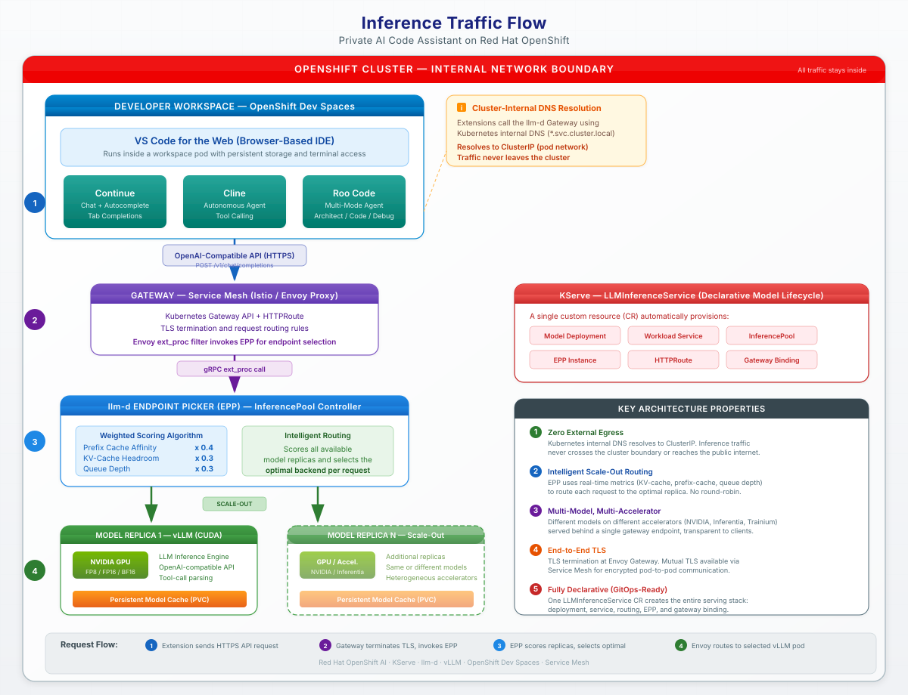

# Private AI Code Assistant on Red Hat OpenShift

Deploy a private self-hosted AI coding assistant on OpenShift so developers get AI-powered IDEs while no code leaves your environment

## Table of Contents

1. [Detailed description](#detailed-description)
   - [Architecture diagrams](#architecture-diagrams)
2. [Requirements](#requirements)
   - [Minimum hardware requirements](#minimum-hardware-requirements)
   - [Minimum software requirements](#minimum-software-requirements)
   - [Required user permissions](#required-user-permissions)
3. [Deploy](#deploy)
   - [Option 1: ROSA (AWS)](#option-1-rosa-aws)
   - [Option 2: ARO (Azure)](#option-2-aro-azure)
   - [Option 3: Existing OpenShift](#option-3-existing-openshift)
   - [Validating the deployment](#validating-the-deployment)
   - [Delete](#delete)
4. [Documentation](#documentation)
5. [References](#references)
6. [Tags](#tags)

## Detailed description

### The challenge

Teams want IDE-integrated AI coding help without sending proprietary source to public model APIs. They also need governance: who can call the model, which model is served, and where data resides.

### Our solution

This quickstart deploys:

- **OpenShift Dev Spaces** workspaces with OpenCode (Continue, Cline, Roo Code optional)
- **On-cluster inference** with vLLM behind **llm-d** intelligent routing — default model `Qwen/Qwen3.6-35B-A3B-FP8` (you can change it to any open-source model you want)
- An optional **RHCL AI Gateway** front door with per-developer API keys
- GitOps Helm charts (ROSA/ARO) or Helm-only install on an existing cluster

### Features

- Source and inference stay inside your OpenShift network boundary when configured that way
- OpenAI-compatible `/v1` API for IDE extensions
- Prefix-cache–aware routing via llm-d Endpoint Picker (EPP)
- Multi-developer namespaces with ConfigMap-prewired extensions
- Optional observability (Grafana; Langfuse/OTel), guardrails, and MCP

### Solution stack

| Layer | Technology |
|-------|------------|
| IDE | OpenShift Dev Spaces |
| Auth front door | RHCL AI Gateway (`pca-ai-gateway`) |
| Routing | llm-d + Gateway API + EPP |
| Serving | vLLM / KServe `LLMInferenceService` |
| Platform | Red Hat OpenShift AI, NVIDIA GPU Operator, NFD |
| Delivery | Unified Helm charts in `charts/` (ArgoCD or `make`) |

### Architecture diagrams

Developers → Dev Spaces → RHCL AI Gateway → llm-d → EPP → vLLM on NVIDIA GPU.



Full diagrams: [docs/architecture.md](docs/architecture.md).

## Requirements

### Minimum hardware requirements

- GPU: 1× NVIDIA GPU with enough VRAM for the model at FP8 (e.g. L40S 48 GB, A100 80 GB, or H100 NVL)
- Storage: PVC for model cache, typically 50–100+ Gi
- CPU / memory: enough for Dev Spaces workspaces plus platform operators (size for team concurrency)

Details: [docs/requirements.md](docs/requirements.md), [docs/benchmarks.md](docs/benchmarks.md).

### Minimum software requirements

Pick **one** path.

**All paths**
- OpenShift 4.20+
- Red Hat OpenShift AI 3.4 (3.3 minimum)
- OpenShift Dev Spaces
- NVIDIA GPU Operator + NFD
- Hugging Face token
- `oc` CLI

**Existing OpenShift** — operators above already installed, plus RHCL, `helm` v3. See [deploy_existing_openshift/README.md](deploy_existing_openshift/README.md).

**ROSA** — Terraform >= 1.4.6, AWS CLI, `rosa` CLI, ROSA entitlement. See [PCA_Deployment_ROSA/README.md](PCA_Deployment_ROSA/README.md).

**ARO** — Terraform >= 1.4.6, Azure CLI, ARO + GPU quota. See [PCA_Deployment_ARO/README.md](PCA_Deployment_ARO/README.md).

### Required user permissions

- **ROSA / ARO:** Cloud admin to create the cluster, then OpenShift `cluster-admin` to install operators and sync GitOps.
- **Existing OpenShift:** OpenShift `cluster-admin` to deploy AI serving, DevSpaces, and (optional) the demo IDP.

## Deploy

Choose one path. Do not mix ArgoCD GitOps (ROSA/ARO) with the existing-OpenShift Helm flow on the same cluster unless you know how ownership overlaps.

### Option 1: ROSA (AWS)

Terraform provisions ROSA HCP and a GPU pool; ArgoCD syncs `charts/` with `values-rosa.yaml`.

→ **[PCA_Deployment_ROSA/README.md](PCA_Deployment_ROSA/README.md)**

### Option 2: ARO (Azure)

Terraform provisions ARO and a GPU MachineSet; ArgoCD syncs `charts/` with `values-aro.yaml`.

→ **[PCA_Deployment_ARO/README.md](PCA_Deployment_ARO/README.md)**

### Option 3: Existing OpenShift

Cluster already has RHOAI, GPU Operator, and Dev Spaces. Install RHCL first, then:

```bash
# AI serving once
make ai-serving-deploy-existing-openshift HF_TOKEN=hf_xxx

# Each developer workspace
make devspace-deploy-existing-openshift DEV_NAMESPACE=<dev-ns>
# 2nd+ developers: HELM_ARGS='--set devspacesGlobalConfig.enabled=false'
```

→ **[deploy_existing_openshift/README.md](deploy_existing_openshift/README.md)**

### Validating the deployment

After deploy, run cluster smoke tests (not CI):

```bash
make smoke
make smoke AI_NAMESPACE=ai-serving DEV_NAMESPACE=<dev-ns>
```

→ **[tests/cluster-smoke/README.md](tests/cluster-smoke/README.md)**

### Delete

**Existing OpenShift** — remove with make:

```bash
make devspace-undeploy-existing-openshift DEV_NAMESPACE=<dev-ns>
make ai-serving-undeploy-existing-openshift
```

**ARO** — follow [Destroying the Cluster](PCA_Deployment_ARO/README.md#destroying-the-cluster).

**ROSA** — follow [Destroying the Cluster](PCA_Deployment_ROSA/README.md#destroying-the-cluster).

## Documentation

| Doc | Topic |
|-----|--------|
| [docs/architecture.md](docs/architecture.md) | Stack, traffic path, diagrams |
| [docs/requirements.md](docs/requirements.md) | Hardware, software, permissions |
| [docs/ide-and-extensions.md](docs/ide-and-extensions.md) | Dev Spaces, Continue / Cline / Roo |
| [docs/models-and-routing.md](docs/models-and-routing.md) | vLLM, llm-d, RHCL |
| [docs/benchmarks.md](docs/benchmarks.md) | Performance highlights + links |
| [docs/customization.md](docs/customization.md) | Prompts, rules, MCP, quality gates |
| [AGENTS.md](AGENTS.md) | Maintainer chart / wave map |

## References

- [Red Hat OpenShift AI](https://www.redhat.com/en/technologies/cloud-computing/openshift/openshift-ai)
- [OpenShift Dev Spaces](https://developers.redhat.com/products/openshift-dev-spaces)
- [llm-d](https://github.com/llm-d/llm-d)
- [vLLM](https://github.com/vllm-project/vllm)
- [Kuadrant / RHCL](https://docs.kuadrant.io/)

## Tags

- **Title:** Private AI Code Assistant on Red Hat OpenShift
- **Description:** Deploy a private self-hosted AI coding assistant on OpenShift so developers get AI-powered IDEs while no code leaves your environment
- **Industry:** Media and IT services
- **Product:** OpenShift AI
- **Use case:** AI coding assistant, private inference
