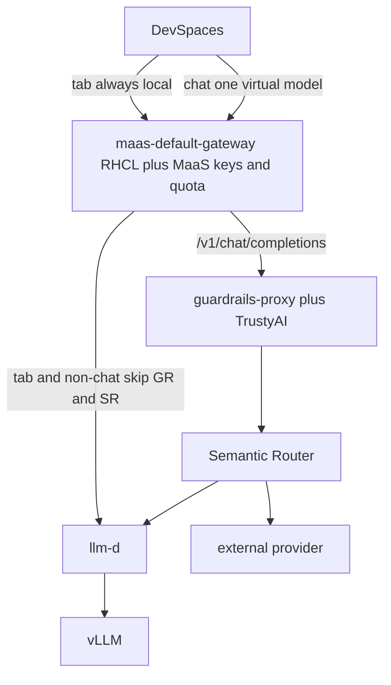

# Architecture

Private AI Code Assistant runs on OpenShift: developers use OpenShift Dev Spaces; inference stays on-cluster via an OpenAI-compatible MaaS / RHCL gateway in front of vLLM (llm-d).

## Request path

1. **Developer workspace** — Continue, Cline, Roo Code, or OpenCode in a Dev Spaces pod call `maas-default-gateway` over cluster-internal HTTPS with a per-namespace API key.
2. **MaaS / RHCL** — AuthPolicy validates the API key. HTTPRoute `pca-maas-front-door` sends chat to guardrails (when enabled), tab `/local/v1` and other `/v1` to llm-d. RHCL is the policy engine on this Gateway, not a second hop.
3. **Guardrails** — TrustyAI detectors, then llm-d HTTP :80 (or Semantic Router when `semanticRouter.enabled`). Streaming chat is an input-only probe then llm-d SSE; output secret scans run on non-stream JSON only.
4. **Semantic Router** — optional official vLLM SR + Envoy behind Service `pca-semantic-router`. Helm injects local Qwen; extras are optional OpenAI-compatible backends. Keyword `code` or complexity `hard` → strongest extra; easy non-code → local Qwen. Not an OpenShift AI component.
5. **llm-d / vLLM** — `LLMInferenceService` (KServe). EPP is off by default.

See [maas-attachment.md](maas-attachment.md) for why PCA owns the HTTPRoute instead of `MaaSModelRef.endpointOverride`.

## Platform stack

| Layer | Typical components |
|-------|--------------------|
| IDE | OpenShift Dev Spaces (che-code), AI extensions / OpenCode |
| Front door | `maas-default-gateway` in `openshift-ingress` + AuthPolicy on `pca-maas-front-door` |
| Routing | llm-d gateway, Gateway API HTTPRoute, optional Semantic Router |
| Serving | vLLM via `LLMInferenceService` (KServe RawDeployment) |
| Platform | RHOAI (MaaS Managed), NVIDIA GPU Operator, NFD, cert-manager, LWS, RHCL |
| Cloud | ROSA (AWS), ARO (Azure), or an existing OpenShift cluster |

Cloud-specific versions and GPU SKUs are documented in the deploy guides:

- [ROSA](../PCA_Deployment_ROSA/README.md)
- [ARO](../PCA_Deployment_ARO/README.md)
- [Existing OpenShift](../deploy_existing_openshift/README.md)

## GitOps chart waves

ArgoCD (ROSA/ARO) syncs charts from `charts/` via `pca-app-of-apps`:

| Chart | Wave | Role |
|-------|------|------|
| `pca-app-of-apps` | root | AppProject + child Applications |
| `pca-operators` | 1 | Operator Subscriptions (RHOAI, GPU, Dev Spaces, NFD, RHCL, …) |
| `pca-platform-config` | 2 | Namespaces, DSC/DSCI (`modelsAsService: Managed`), secrets, CheCluster, locked MaaS Gateway + TLS |
| `pca-ai-serving` | 3 | PVC, HardwareProfile, LLMInferenceService, llm-d, MaaS HTTPRoute, optional guardrails/SR, observability |
| `pca-devspaces` | 4 | Per-developer DevWorkspaces + extension ConfigMaps |
| `pca-benchmarks` | 5 | Optional GuideLLM Job (opt-in) |

Existing OpenShift deploys only `pca-platform-config`, `pca-ai-serving`, and `pca-devspaces` via Helm. Patch DSC `kserve.modelsAsService` to `Managed`. `pca-platform-config` owns Gateway+TLS when `maas.gateway.create` is true (chart default; independent of `clusterConfig.enabled`). See the existing-OpenShift README.

## Diagrams

> Open each file in a browser or IDE for full resolution.

SVG sources for the same views live alongside the PNGs in [`docs/images/`](images/).

## Related

- [Models and routing](models-and-routing.md)
- [Semantic Router](semantic-router.md)
- [IDE and extensions](ide-and-extensions.md)
- [MaaS attachment spike](maas-attachment.md)
