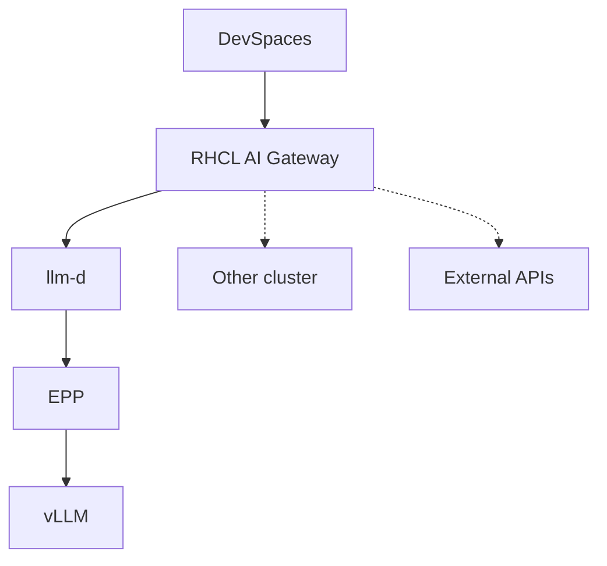
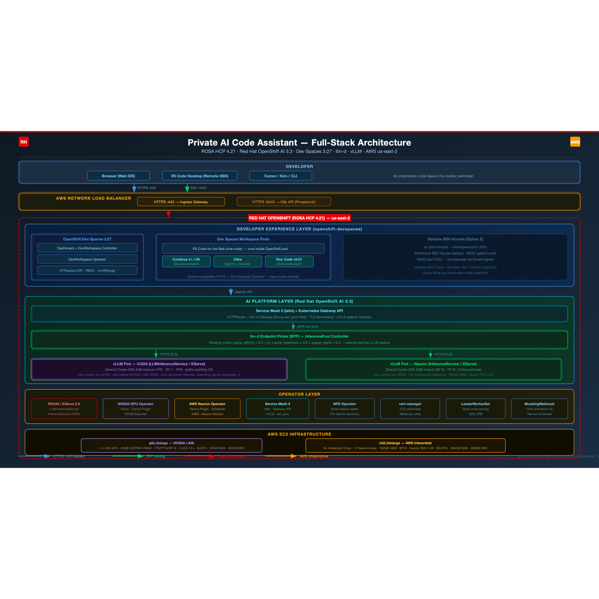
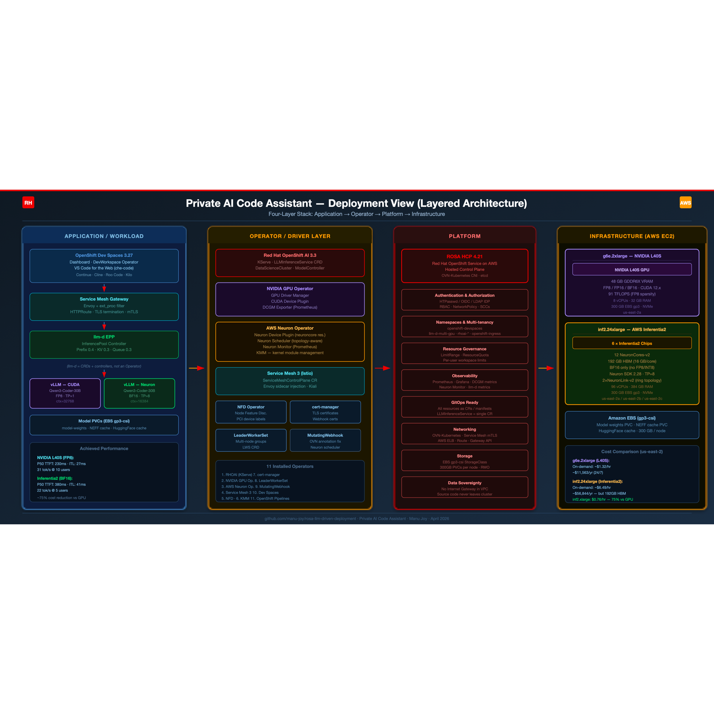
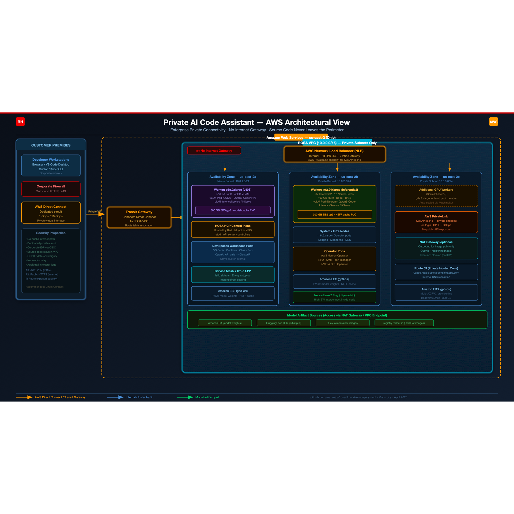
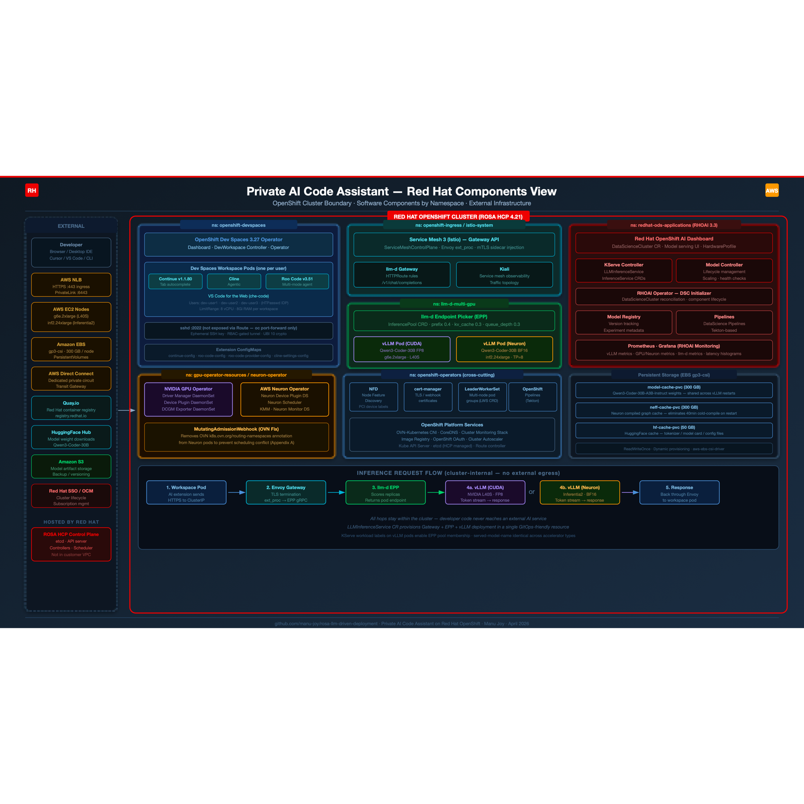

# Architecture

Private AI Code Assistant runs on OpenShift: developers use OpenShift Dev Spaces; inference stays on-cluster via an OpenAI-compatible gateway in front of vLLM (llm-d).

## Request path (RHCL + llm-d)

1. **Developer workspace** — Continue, Cline, Roo Code, or OpenCode in a Dev Spaces pod call the RHCL AI Gateway (`pca-ai-gateway`) over cluster-internal HTTPS with a per-namespace API key.
2. **RHCL AI Gateway** — AuthPolicy validates the API key; traffic is forwarded to the local llm-d gateway (or optionally other backends).
3. **llm-d Endpoint Picker (EPP)** — Scores replicas (prefix-cache affinity, KV-cache headroom, queue depth) and returns the chosen pod to Envoy.
4. **vLLM** — Serves the model on NVIDIA GPU via `LLMInferenceService` (KServe).

## Platform stack

| Layer | Typical components |
|-------|--------------------|
| IDE | OpenShift Dev Spaces (che-code), AI extensions / OpenCode |
| Front door | RHCL AI Gateway (`pca-ai-gateway`) + AuthPolicy |
| Routing | llm-d gateway, Gateway API HTTPRoute, EPP |
| Serving | vLLM via `LLMInferenceService` (KServe RawDeployment) |
| Platform | RHOAI, NVIDIA GPU Operator, NFD, cert-manager, LWS, Service Mesh |
| Cloud | ROSA (AWS), ARO (Azure), or an existing OpenShift cluster |

Cloud-specific versions and GPU SKUs are documented in the deploy guides:

- [ROSA](../PCA_Deployment_ROSA/README.md)
- [ARO](../PCA_Deployment_ARO/README.md)
- [Existing OpenShift](../deploy_existing_openshift/README.md)

## GitOps chart waves

ArgoCD (ROSA/ARO) syncs charts from `charts/` via `pca-app-of-apps`:

| Chart | Wave | Role |
|-------|------|------|
| `pca-app-of-apps` | root | AppProject + child Applications |
| `pca-operators` | 1 | Operator Subscriptions (RHOAI, GPU, Dev Spaces, NFD, RHCL, …) |
| `pca-platform-config` | 2 | Namespaces, DSC/DSCI, secrets, CheCluster, optional guardrails/MCP |
| `pca-ai-serving` | 3 | PVC, HardwareProfile, LLMInferenceService, llm-d, RHCL gateway, observability |
| `pca-devspaces` | 4 | Per-developer DevWorkspaces + extension ConfigMaps |
| `pca-benchmarks` | 5 | Optional GuideLLM Job (opt-in) |

Existing OpenShift deploys only `pca-platform-config`, `pca-ai-serving`, and `pca-devspaces` via Helm.

## Diagrams

> Open each file in a browser or IDE for full resolution.

SVG sources for the same views live alongside the PNGs in [`docs/images/`](images/).

## Related

- [Models and routing](models-and-routing.md)
- [IDE and extensions](ide-and-extensions.md)
- Maintainer chart map: [AGENTS.md](../AGENTS.md)
