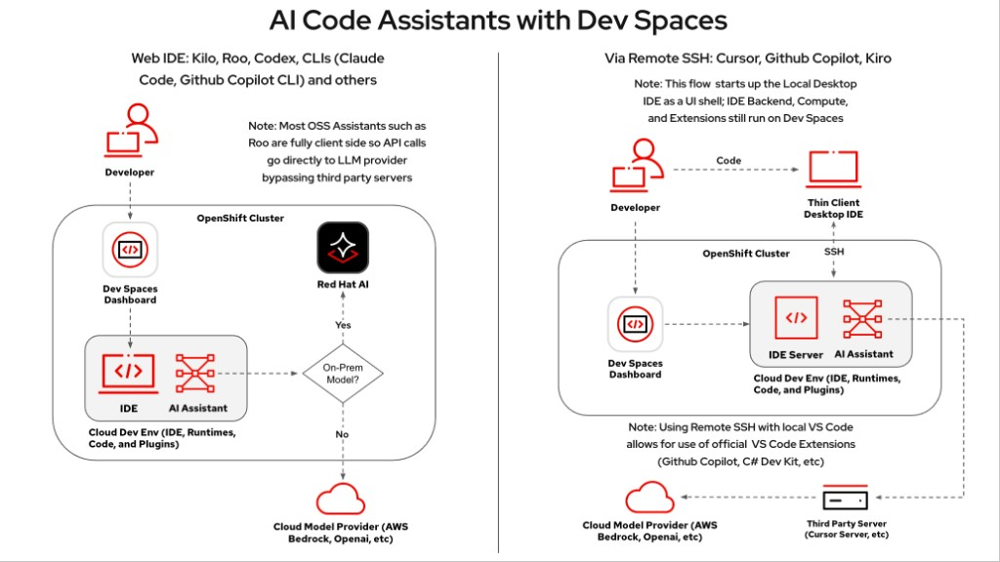
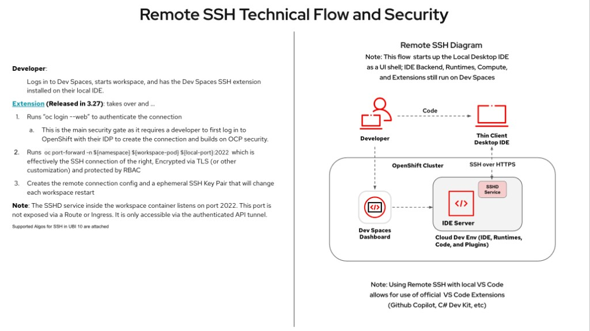

# IDE and extensions

Developers use **OpenShift Dev Spaces**. AI extensions call the cluster-internal RHCL AI Gateway (OpenAI-compatible `/v1`), which forwards to llm-d / vLLM. Source code and inference stay on the cluster when configured that way.

## Access modes

### Web IDE (default)

Open the Dev Spaces dashboard in a browser. The default workspace runs **OpenCode** (custom `devspaces-opencode` image with Web UI on port 4096). No desktop install required.



### Remote SSH (optional)

Desktop IDEs can attach to the workspace over an authenticated `oc` tunnel (SSHD on port 2022 is not exposed via Route). See Dev Spaces docs for the SSH flow.



## Extension comparison

**OpenCode** is the default IDE on ROSA, ARO, and existing OpenShift (custom Dev Spaces image + Web UI). Continue, Cline, and Roo Code remain available as an opt-in (`type: continue` / `TYPE=continue`) on che-code; they are Apache 2.0, speak OpenAI-compatible APIs, and are installable on Open VSX. The charts pre-wire them via ConfigMaps in `pca-devspaces` when that type is selected.

| Capability | Continue | Cline | Roo Code |
|------------|----------|-------|----------|
| Primary UX | Chat, edit, agent, **tab autocomplete** | Autonomous agent sidebar | Multi-mode agent (Code, Architect, Ask, Debug, …) |
| Tab autocomplete | Yes | No | No |
| File / terminal | Yes | Yes | Yes |
| MCP | Yes | Yes | Yes |
| Config delivery | `config.yaml` ConfigMap | Settings ConfigMap + one-time UI fields | `settings.json` + provider profiles ConfigMaps |
| Self-hosted vLLM | `apiBase` + model | OpenAI-compatible base URL | Needs native `tool_calls` from the model |

**Practical split:** OpenCode for the default agentic UX; Continue for autocomplete; Cline/Roo for agentic workflows on che-code. See [deploy_existing_openshift/README.md](../deploy_existing_openshift/README.md) and [PCA_Deployment_ARO/README.md](../PCA_Deployment_ARO/README.md).

## Gateway URL (in-cluster)

Default IDE endpoint (RHCL front door):

```text
https://pca-ai-gateway-data-science-gateway-class.<AI_NAMESPACE>.svc.cluster.local/v1
```

Each Dev Spaces namespace gets an API key Secret (`pca-ai-gw-apikey`). Break-glass (no API key): point IDEs at llm-d directly with `aiGateway.escapeHatchToLlmd=true`.

## Tool calling (Roo Code / agents)

Agent modes need the model to return OpenAI-style `tool_calls`. For Qwen3 / Qwen3.6 families, vLLM must set the correct `--tool-call-parser` and `--reasoning-parser` (values live in cloud `values-*.yaml` / ServingRuntime args). Wrong parsers show up as “model did not call any of the required tools.”

See the ARO deploy guide section on tool calling for the current parser matrix.

## Related

- [Architecture](architecture.md)
- [Models and routing](models-and-routing.md)
- [Customization](customization.md)
